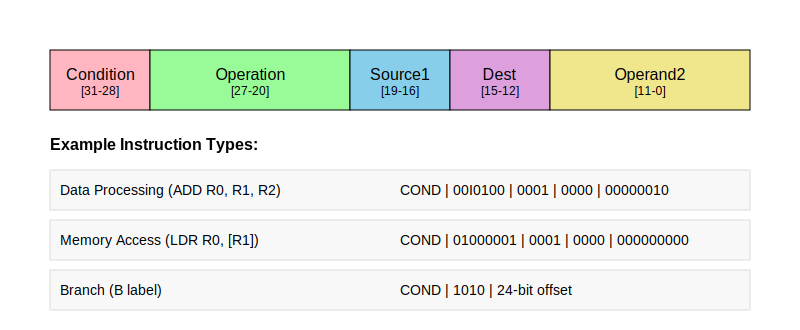
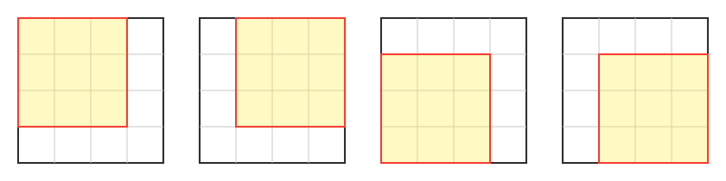
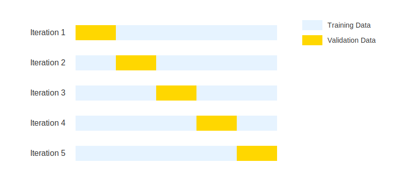

# Background

TODO: Introduce section

## Computer software

### Binary executables

All computer software boils down to a series of bytes readable by the CPU. The bytes are organized in _instructions_. An instruction always includes an _opcode_ (Operation Code), which tells the CPU what operation should be executed. Depending on the opcode, the instruction often contains one or more _operands_, which provides the CPU with the data that should be operated on. The operands can be immediate values (values specified directly in the instruction), registers (a small, very fast memory located physically on the CPU), or memory addresses. Figure \ref{fig:arm-instruction} illustrates the instruction format of the ARM \ac{ISA}, which uses 32-bit instructions.

<!-- Assembly? -->

### Instruction set architectures

An instruction set architecture (ISA) is a contract between hardware and software on how binary code should be run a given computer. In the early days, every new computer system were created with a new ISA, meaning programs had to be custom-written for each specific machine. IBM and their System/360 series, introduced in 1964, were the first to use the ISA as an abstraction layer between hardware and software. This new approach meant that despite having different internal architectures, all System/360 computers could run the same programs as they shared a common ISA. The commercial success of this approach set an industry standard that continues to define modern computing, where hardware manufacturers can implement already established ISAs, ensuring cross generational program compatibility.

#### CISC vs RISC

ISAs today generally fall into two camps: \ac{CISC} and \ac{RISC}. CISC architectures, like x86, provide many specialized instructions that can perform complex operations in a single instruction. CISC can simplify complex operations at the programming level as well as potentially reduce code size, but at the cost of requiring more complex hardware. RISC architectures, like ARM and RISC-V, favor simplicity with a smaller set of fixed-length instructions that execute in a single cycle, making them potentially more energy-efficient and easier to implement.

#### Instruction Set

An important part of all ISAs is the instruction set, which defines the binary encoding of different instructions, providing a mapping of which bits and bytes translates to which instructions. Each instruction typically has a human‐readable keyword (like 'ADD' or 'MOV'), forming an assembly language that allows programmers to understand and write code at the machine level.

#### Wordsize and endianness

Another fundamental characteristic of any ISA is its word size, which defines the natural unit of data the processor works with - typically 32 or 64 bits in modern architectures. This affects everything from register sizes to memory addressing capabilities. Another crucial aspect is endianness, which determines how multibyte values are stored in memory: little-endian architectures store the least significant byte first (like x86), while big-endian stores the most significant byte first.

<!-- maybe too much detail (paragraph below), could move examples of architectures to beginning -->

In addition to defining an instruction set, the ISA gives a complete specification about how software interfaces with hardware, including how instructions can be combined, memory organization and addressing, supported data types, memory consistency models, and interrupt handling. Examples of well‐known ISA families are x86, ARM, and RISC-V. Compilers can typically target multiple ISAs, allowing the same high‐level source code to be executed on different architectures through appropriate translation to the target instruction set.

### Compilers

Software developers employ tools like compilers and interpreters to convert programs from human-readable programming languages to executable machine code. In the very early days of computer programming, software had to be written in assembly languages that mapped instructions directly to binary code for execution. Growing hardware capabilities allowed for more complex applications, however, the lack of human readability of assembly languages made software increasingly difficult and expensive to maintain. In order to overcome this challenge, compilers were created to translate human-readable higher-level languages into executable programs. In the early 1950s, there were successful attempts at translating symbolically heavy mathematical language to machine code. The language FORTRAN, developed at IBM in 1957, is generally considered the first complete compiled language, being able to achieve efficiency near that of hand-coded applications. While languages like FORTRAN were primarily used for scientific computing needs, the growing complexity of software applications drove the development of more advanced operating systems and compilers. One such advancement was the creation of the C programming language and its compiler in the early 1970s. Modern compilers (like the C compiler) are able to analyze the semantic meaning of the program, usually through some form of intermediate representation. The \ac{ISA} of the target system provides the compiler with the recipe to translate the intermediate representation into executable code. The intermediate representation is usually language- and system architecture-agnostic, which has the added benefit of allowing a compiler to translate the same program to many different computer architectures.

The evolution of compilers brought significant advantages in code portability and development efficiency. Programming languages' increasing abstraction away from machine code was necessary to achieve efficient development and portability across different computer architectures. By separating the program's logic from its hardware-specific implementation, developers could write code once, compile, and run it on every platform they wanted.

<!--
As portabilitiy increased, so did abstraction away from executables. without access to the original source code, it is dificult to understand waht a binary program does. Hint at motivation behind reverse engineering.
 -->

## Machine learning

### Deep learning

Modern machine learning has roots all the way back to the 1950s, when the first artificial neural network was implemented. The term machine learning was introduced around the same time. The development of neural networks continued during the 60s and 70s alongside statistical learning methods such as the nearest neighbor and decision tree methods. However, advances in neural networks faced challenges due to research that demonstrated fundamental limitations of single-layer networks. In the 1980s, the backpropagation algorithm (which is still widely used today) was popularized, and solved the problem of training multi-layer networks. This put neural networks back on the map, and the field continued advancing through the 90s and 2000s. Significant breakthroughs such as parallelized training pipelines, generational leaps in computing power, and utilization of GPUs for machine learning tasks accelerated deep learning developments. This led up to a turning point in 2012, when AlexNet, a deep convolutional neural network, won the annual ImageNet competition. Since then, deep learning approaches have dominated the field of machine learning.

### Convolutional neural networks

\acp{CNN} is a deep learning technique designed for processing grid-based data. It is most commonly applied to visual tasks such as image classification and object detection. The main invention of \acp{CNN} is the concept of convolution layers. These layers scan across the input using _kernels_. The kernels detect features such as edges, textures, and patterns in the input data, and each output a feature map that is passed to the next layer. Each kernel has parameters that are trained based on the entire input grid. Figure \ref{fig:sliding-kernel} shows an example of a kernel sliding over the input.

Most \ac{CNN} architectures also use pooling layers, which are static, non-trainable layers that reduce the spatial dimensions of the data. Activation layers, usually ReLU, are used to introduce non-linearity into the network. Finally, fully-connected layers at the end of the network are used for final classification. Figure \ref{fig:cnn-architecture} shows an example of a basic \ac{CNN} architecture.

\acp{CNN} provide several advantages over competing approaches:

- Where traditional computer vision methods usually require significant feature engineering efforts, a \ac{CNN} is able to automatically detect and learn features from the input data without manual feature extraction. This saves time and effort, and even enables models to detect patterns that human intuition would be unable to.

- \ac{CNN} is more computationally efficient than fully-connected neural networks. Where fully-connected networks need parameters for every single connection between neurons, a \ac{CNN} uses the same kernels across the entire input, which dramatically reduces the number of trainable parameters. Additionally, the nature of \acp{CNN} make them more feasible for parallelization, better utilizing specialized hardware such as GPUs.

- \ac{CNN} models are _translation invariant_. This means that they can recognize objects, patterns, and textures regardless of their spatial position in the input. This makes the models more versatile and generalizable than fully-connected neural networks.

### Leave-one-group-out cross validation

_Cross validation_ is a technique used to assess performance and generalizability of a machine learning model. It involves partitioning data into subsets, where the model is trained on certain subsets while validated using the remaining ones. The process is repeated, making sure the model is trained and validated using different splits. This helps reduce overfitting on a fixed validation set, with the trade-off of requiring more computation since the model needs to be trained multiple times. Figure \ref{fig:cross-validation} illustrates how the data can be split in a 5-fold cross validation. Each fold serves as validation data once while remaining data is used for training.

It is worth noting that cross validation is used only when verifying the model architecture and hyperparameters, not when training the actual model that will be deployed. After performance is assessed using cross validation techniques, the final model is trained on all available training data without holding out a validation set.

\ac{LOGO CV} is a variation used in cases where the data is grouped into distinct clusters or categories. The purpose is to ensure that the trained model is tested on data independent of the groups it was trained on. Instead of partitioning the data into random subsets, it is split into groups based on a predefined variable. For each iteration, one group is left out as the validation set, and the model is trained on the remaining groups. This technique assesses how well the model generalizes to completely unseen groups, which is especially useful in case the final model will be used with data that does not belong to any of the groups present in the training data.
