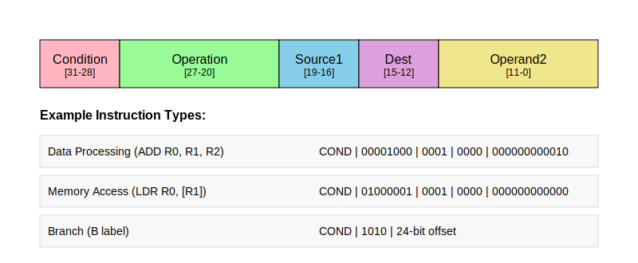
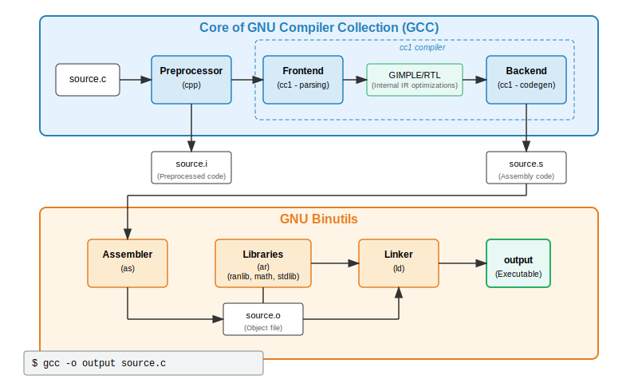
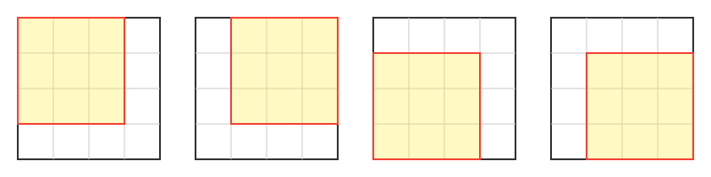
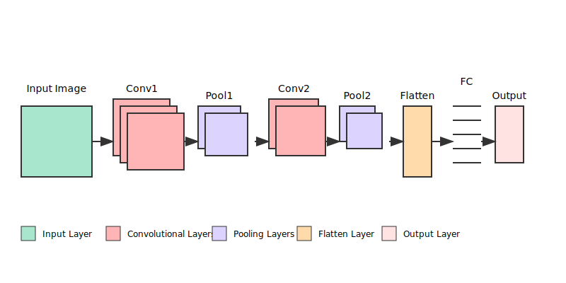
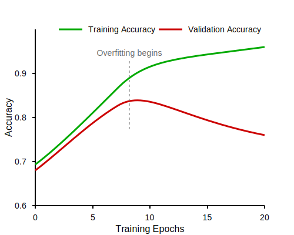
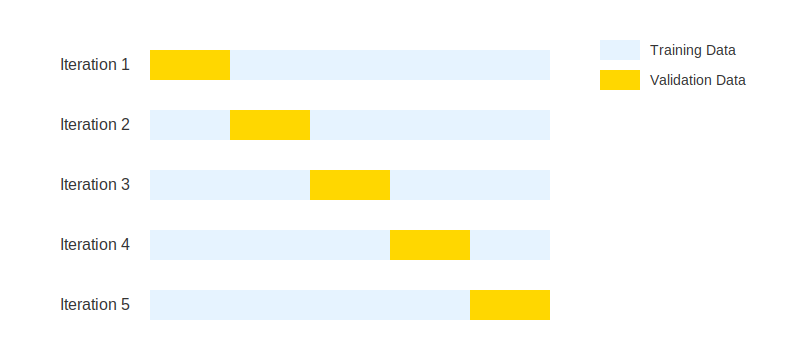

\acresetall

# Background

This chapter presents the theoretical foundation required to understand the rest of the thesis. Starting with \autoref{computer-software}, we look at the basic, low-level concepts of computer software, instruction sets, and compilers. \autoref{software-reverse-engineering} then introduces software reverse engineering, which is the overarching topic of this thesis. \autoref{machine-learning} introduces the necessary concepts from the field of machine learning, with a focus on \acp{CNN}. Finally, \autoref{related-work} reviews some prior work related to the topic.

## Computer software

### Binary executables

All computer software boils down to a series of bytes readable by the CPU. The bytes are organized in _instructions_. An instruction always includes an _opcode_ (Operation Code), which tells the CPU what operation should be executed. Depending on the opcode, the instruction often contains one or more _operands_, which provides the CPU with the data that should be operated on. The operands can be immediate values (values specified directly in the instruction), registers (a small, very fast memory located physically on the CPU), or memory addresses. \autoref{fig:arm-instruction} illustrates the instruction format of ARM, which uses 32-bit instructions.



### Instruction set architectures

An \acf{ISA} is a contract between hardware and software on how binary code should be run on a given computer. In the early days computer programming, every new computer system was created with a new \ac{ISA}, meaning programs had to be custom-written for each specific machine. IBM and their System/360 series, introduced in 1964, were the first to use the \ac{ISA} as an abstraction layer between hardware and software. This new approach meant that despite having different internal architectures, all variations of the System/360 computers could run the same programs as they shared a common \ac{ISA}. The commercial success of this approach set an industry standard that continues to define modern computing, where hardware manufacturers can implement already established \acp{ISA}, ensuring cross generational program compatibility.

In addition to defining an instruction set, the \ac{ISA} gives a complete specification about how software interfaces with hardware, including how instructions can be combined, memory organization and addressing, supported data types, memory consistency models, and interrupt handling. Examples of well‐known \ac{ISA} families are x86, ARM, and RISC-V. Compilers can typically target multiple \acp{ISA}, allowing the same high‐level source code to be executed on different architectures through appropriate translation to the target instruction set.

#### CISC and RISC

\acp{ISA} today generally fall into two camps: _\ac{CISC}_ and _\ac{RISC}_. \ac{CISC} architectures, like x86, provide many specialized instructions that can perform complex operations in a single instruction. \ac{CISC} can simplify complex operations at the programming level as well as potentially reduce code size, but at the cost of requiring more complex hardware. \ac{RISC} architectures, like ARM and RISC-V, favor simplicity with a smaller set of fixed-length instructions that execute in a single cycle, potentially making them more energy efficient and easier to implement.

#### Instruction set

An important part of all \acp{ISA} is the instruction set, which defines the binary encoding of different instructions, providing a mapping of which bits and bytes translates to which instructions. Each instruction typically has a human‐readable keyword (like 'ADD' or 'MOV'), forming an assembly language that allows programmers to understand and write code at the machine level.

#### Word size

A fundamental characteristic of any \ac{ISA} is its _word size_, which defines the natural unit of data the processor works with – typically 32 or 64 bits in modern architectures. This affects everything from register sizes to memory addressing capabilities. However, there is not a standardized definition of what word size is referring to. One natural way to define it is the size of the registers in the CPU. For instance, this is why x86-64 is referred to as a 64-bit architecture. Even so, some software and documentation for the x86 family – such as the Microsoft Windows API – still define a single word to be 16 bits, even though the registers are 64 bits wide. Other definitions include the addressable memory space size, the data bus width, or the ALU input width, all of which may or may not be the equal to the register size.

#### Endianness {#background-endianness}

The _endianness_ determines how multi-byte values are stored in memory: _little-endian_ architectures (like the x86 family) store the least significant byte first, while _big-endian_ architectures stores the most significant byte first. This is illustrated in \autoref{table:endianness}. Endianness is a rudimentary characteristic of an \ac{ISA}, but when analyzing and running a program, which order the bytes are stored in memory is crucial to understand. The endianness is typically determined by the \ac{ISA}, but some architectures support both big-endian and little-endian modes. This is often referred to as _bi-endian_, and is encountered in MIPS, PowerPC, and some modern versions of ARM. Even though these architectures support endianness mode switching during runtime, programs are typically compiled for a single specific endianness, making the software binaries themselves either big-endian or little-endian. In other words, even though an \ac{ISA} is classified as bi-endian, the endianness of a binary program is typically fixed at compile time.

```{=latex}
\begin{table}[h]

\vspace{0.2cm}

\begin{center}

\strong{(a) Big endian}
\vspace{0.1cm}

\begin{tabular}{|c|c|c|c|c|}
\hline
Address & 0x1000 & 0x1001 & 0x1002 & 0x1003 \\
\hline
Byte & 0x12 & 0x34 & 0x56 & 0x78 \\
\hline
\end{tabular}

\vspace{0.4cm}

\strong{(b) Little endian}
\vspace{0.1cm}

\begin{tabular}{|c|c|c|c|c|}
\hline
Address & 0x1000 & 0x1001 & 0x1002 & 0x1003 \\
\hline
Byte & 0x78 & 0x56 & 0x34 & 0x12 \\
\hline
\end{tabular}

\end{center}

\caption{Comparison of how a 32-bit integer is stored in big endian and little endian.}
\label{table:endianness}

\end{table}
```

#### Instruction width

The _instruction width_ refers to the size, typically measured in bits, of a single CPU instruction. Some architectures, such as ARM64, have _fixed-width instructions_, where each instruction has the same size. Others, such as most \ac{CISC} instruction sets, have _variable-width instructions_, where the size of each instruction can vary based on factors such as the opcode and the addressing mode. For instance, x86-64 programs can contain instructions ranging from 8 to 120 bits. A comparison between fixed width and variable width instruction sets is displayed in \autoref{fig:assembly_comparison}. The degree of variability in instruction widths differs: some architectures, such as x86, support a wide range of sizes. Others, such as Blackfin and Epiphany, are limited to specific combinations, where instructions are either 16 bits or 32 bits. Instruction width has implications for binary program alignment in terms of analysis. Binaries from fixed-width \acp{ISA} are in theory easier to analyze, since instructions are consistently aligned to specific byte boundaries, while variable-width \acp{ISA} complicate the identification of the beginning and end of instructions.

```{=latex}
\lstdefinestyle{assembly}{
    basicstyle=\ttfamily\footnotesize,
    numbers=none,
    breaklines=true,
    breakatwhitespace=false,
    tabsize=4,
    showspaces=false,
    showstringspaces=false,
    frame=single,
    rulecolor=\color{black!30},
    backgroundcolor=\color{gray!5},
    commentstyle=\color{green!60!black},
    keywordstyle=\color{blue},
    stringstyle=\color{red},
    xleftmargin=0.5em,
    xrightmargin=0.5em
}
\begin{figure}[htbp]
\centering
\begin{minipage}[t]{0.49\textwidth}
\centering
\textbf{x86-64 Architecture}
\lstset{style=assembly}
\begin{lstlisting}
4156           pushq %r14
4155           pushq %r13
4154           pushq %r12
55             pushq %rbp
53             pushq %rbx
4883ec60       subq  $0x60, %rsp
4889442458     movq  %rax, 0x58(%rsp)
31c0           xorl  %eax, %eax
83ff01         cmpl  $0x1, %edi
0f8f32020000   jg    0x400d87 <.text+0x257>
488d6c2454     leaq  0x54(%rsp), %rbp
4c8d64243c     leaq  0x3c(%rsp), %r12
41be01000000   movl  $0x1, %r14d
0f1f8000000000 nopl  (%rax)
488d5c2430     leaq  0x30(%rsp), %rbx
\end{lstlisting}
\end{minipage}%
\hfill
\begin{minipage}[t]{0.49\textwidth}
\centering
\textbf{ARM64 (AArch64) Architecture}
\lstset{style=assembly}
\begin{lstlisting}
d14007ff    sub   sp, sp, #0x1, lsl #12
d11843ff    sub   sp, sp, #0x610
a9b67bfd    stp   x29, x30, [sp, #-0xa0]!
910003fd    mov   x29, sp
a90363f7    stp   x23, x24, [sp, #0x30]
6d0627e8    stp   d8, d9, [sp, #0x60]
2a0003f8    mov   w24, w0
f0000080    adrp  x0, 0x414000
91066000    add   x0, x0, #0x198
6d072fea    stp   d10, d11, [sp, #0x70]
a90573fb    stp   x27, x28, [sp, #0x50]
6d0837ec    stp   d12, d13, [sp, #0x80]
aa0103fc    mov   x28, x1
f9400001    ldr   x1, [x0]
f90b57a1    str   x1, [x29, #0x16a8]
\end{lstlisting}
\end{minipage}
\caption{Comparison of disassmbly of binary programs between x86-64 and ARM64 architectures. The binary encoding of the instructions on the left side of the assembly illustrates the variable width of x86-64 instructions compared to the fixed width of ARM64 instructions.}
\label{fig:assembly_comparison}
\end{figure}
```

### Compilers

Software developers employ tools like compilers and interpreters to convert programs from human-readable programming languages to executable machine code. In the very early days of computer programming, software had to be written in assembly languages that mapped instructions directly to binary code for execution. Growing hardware capabilities allowed for more complex applications, however, the lack of human readability of assembly languages made software increasingly difficult and expensive to maintain. In order to overcome this challenge, compilers were created to translate human-readable higher-level languages into executable programs. In the early 1950s, there were successful attempts at translating symbolically heavy mathematical language to machine code. The language FORTRAN, developed at IBM in 1957, is generally considered the first complete compiled language, being able to achieve efficiency near that of hand-coded applications. While languages like FORTRAN were primarily used for scientific computing needs, the growing complexity of software applications drove the development of more advanced operating systems and compilers. One such advancement was the creation of the C programming language and its compiler in the early 1970s. Modern compilers (like \ac{GCC} and Clang) are able to analyze the semantic meaning of the program, usually through some form of intermediate representation. The \ac{ISA} of the target system provides the compiler with the recipe to translate the intermediate representation into executable code. The intermediate representation is usually language- and system architecture-agnostic, which has the added benefit of allowing a compiler to translate the same program to many computer architectures.

The evolution of compilers brought significant advantages in code portability and development efficiency. Programming languages' increasing abstraction away from machine code was necessary to achieve efficient development and portability across different computer architectures. However, this combined with other transformations done by compilers increasingly widened the gap between the original source code and the binary executable. By separating the program's logic from its hardware-specific implementation, developers could write code once, compile, and run it on every platform they wanted, at the cost of making it more difficult to understand what a binary program does.

### Embedded targets and cross-compilation

_Embedded systems_ are specialized computing devices integrated within larger systems to perform specific and dedicated functions. Thus, unlike general-purpose computers, embedded systems designed for specific tasks are typically optimized for reliability, power efficiency, and cost-effectiveness. Embedded systems power everything from household appliances like refrigerators and washing machines to networking equipment like routers, and a vast array of \ac{IoT} devices. Most embedded systems are characterized by resource constraints, including limited memory, processing power, and energy capacity. In order for these systems to perform in such environments, embedded platforms typically incorporate specialized hardware with custom processors and peripherals optimized for specific tasks. As a result, many embedded systems feature limited or no user interface and can only be controlled programmatically.

Since these specialized systems frequently use custom hardware with \acp{ISA} different from standard desktop or server computers, they present unique challenges for software development. Unlike general-purpose computers, which are often used to create programs for the same platform it is built on, it's often impractical or impossible to compile code directly on the target device. Developers typically have to use a technique called _cross-compilation_ to build software for embedded systems.

#### Cross-compilation

Cross-compilation is the process of generating executable code for a platform (target) different from the one running the compiler (host). This approach allows developers to use more powerful development systems to create software for resource-constrained target devices.

In cross-compilation terminology, three distinct systems are involved in the process. The host system is the computer system where compilation of programs occurs, providing the computational resources needed for the build process. The target system is where the compiled code will eventually run, often with limited resources that would make direct compilation impractical. The build system refers to the system where the compiler itself was built, which is often the same as the host system in most development scenarios.

A _cross-compiler toolchain_ is the collection of software tools necessary to build executables for a target system. A complete toolchain consists of several key components working together. The compiler, such as \ac{GCC} or Clang, serves as the core tool that converts source code to machine code appropriate for the target architecture. Binary utilities (like Binutils) provide essential tools for creating and managing binary files across different architectures. The C/C++ standard library supplies standard functions and data structures optimized for the target system, while a debugger helps identify and fix issues in the compiled program, often supporting remote debugging capabilities for target hardware.

#### GNU Compiler Collection and GNU Binutils

The \acf{GCC} is a comprehensive compiler system supporting various programming languages including C, C++, and Fortran. \ac{GCC} started out as the GNU C Compiler in 1987, but was later renamed as it expanded to support more languages. \ac{GCC} is designed to be highly portable, and can be built to run on various operating systems and hardware architectures. It features a modular design, using internal intermediate representations that are largely host and target system agnostic. This lets much of the optimization logic and transformation to work with different frontends for different programming languages and different backends to generate code for a wide range of \acp{ISA}. \ac{GCC} by itself takes in an input file in supported languages like C and outputs assembly for the target architecture. Each instance of a \ac{GCC} compiler is configured to target a specific architecture, and this flexibility allows developers compile versions of \ac{GCC} to build software for different platforms.

\ac{GCC} is not able to create working executables by itself. However, behind the scenes, \ac{GCC} sets up a pipeline consisting of different tools in order to create executable programs. A common pairing to set up this pipeline with \ac{GCC} is GNU Binutils, which is a collection of binary program tools that is designed to work alongside compilers to create and manage executables. Some key components of Binutils include:

- **as**: The GNU assembler, which converts assembly language to machine code
- **ld**: The GNU linker, which combines machine code files into executables or libraries
- **ar**: Creates, modifies, and extracts from archive files (static libraries)
- **objcopy**: Copies and translates object files between formats
- **objdump**: Displays information about object files, including disassembly
- **readelf**: Displays information about \ac{ELF} files

When invoking \ac{GCC} to create a final executable, the compiler automatically calls the appropriate Binutils tools to create the final executable, and an illustration of this pipeline can be seen in \autoref{fig:gcc-binutils-pipeline}. Since the final executable depends on the target system, the \ac{GCC} compiler and Binutils tools must be configured to target the same architecture. This is typically done by specifying the target architecture when building the toolchain, after which the \ac{GCC} compiler will use the appropriate Binutils tools to generate the final executable for that architecture.



All of the GNU projects are distributed under the \ac{GPL}, which allows users to freely use, modify, and distribute the software. This has made \ac{GCC} and Binutils widely adopted in open-source projects and embedded systems development.

#### Binary file formats and structures

Binary files come in different formats, each with its own structure and purpose, and understanding these formats is necessary for working with compiled code. In order for a program to be interpreted or executed by a computer it must be stored in a way that the CPU can read and understand. One way of doing this in to include a header at the beginning of the file that contains metadata about the executable. While different file formats exist, like Portable Executable for Windows and Mach Object for macOS, the most common binary file format for Unix-like systems and many embedded devices is the \acf{ELF}. Since \ac{ELF} is the most commonly seen file format in cross-compilation environments and embedded systems, it is the focus of this section.

\ac{ELF} is a flexible and extensible binary file format that can be used for executables, object code, shared libraries et cetera. The \ac{ELF} header contains information about the file type, \ac{ISA}, entry point address for where to start execution, and section headers. It also includes support for debugging information, symbol tables, and relocation entries, making it easier to analyze and debug programs.

\ac{ELF} files are organized into what is called sections, which are contiguous blocks of information within the binary file serving different purposes. The section names are conventionally prefixed with a period, and common sections in \ac{ELF} files include:

- **.text**: Contains the executable code (machine instructions). Sometimes referred to as the code section.
- **.data**: Contains initialized global variables
- **.bss**: Contains space for uninitialized global variables
- **.rodata**: Contains read-only data like strings
- **.symtab**: Symbol table with function and variable names and their locations

File formats like \ac{ELF} provides a standardized way to represent the structure of a binary file, including sections for code, data, and metadata. When cross-compiling using the \ac{GCC}/Binutils suite, \ac{ELF} is often the default file format when targeting embedded targets. Therefore, \ac{ELF} headers are typically found in binary files that serve different purposes in the creation of an executable program:

- **Object files**: Compiled source code files that contain machine code but are not yet executable. They must be linked together to create complete programs, as illustrated in \autoref{fig:gcc-binutils-pipeline}.

- **Executable files**: The final output of the compilation process that can be directly run by the operating system. These files contain the complete program with all dependencies resolved by the linker.

- **Archive files/Static libraries**: Static libraries are bundled as archive files, which are collections of object files grouped together for easy reuse and distribution. Archive files have a global header with additional metadata, followed by the \ac{ELF}-formatted object files. When a program is linked against a static library, the necessary object code is copied into the final executable.

## Software reverse engineering

_Software reverse engineering_ is a systematic process of analyzing and understanding how a program works without access to its original source code or internal documentation. At its core, reverse engineering involves working backwards from a compiled program to comprehend its functionality, architecture, and behavior – the opposite direction of traditional software development. Reverse engineering has its origins in hardware reverse engineering, where analysis of competitors' designs was used to gain a competitive advantage. Today, software reverse engineering is primarily used for understanding program behavior, not for replicating it. Whether investigating potentially malicious code or maintenance of legacy systems, software reverse engineering provides insights when source code and documentation are unavailable [@Chikofsky1990; @Fauzi2017; @Muller2009; @Qasem2022].

Software reverse engineering serves many purposes in the digital landscape of today. In the domain of cybersecurity, it enables many types of vulnerability detection, where security researchers and bug hunters identify exploitable pieces of code. It can also be used to identify and analyze malware, protecting critical systems from infected executables and preventing cyberattacks [@Ding2019; @Subedi2018; @Votipka2020; @Qasem2022]. Beyond cybersecurity, reverse engineering enables software interoperability by allowing engineers to understand how systems interact when documentation is unavailable. It can play a vital role in software maintenance, especially for legacy systems where original documentation or development expertise has been lost. Software reverse engineering also serves important legal and compliance functions, helping organizations verify adherence to security standards and licensing requirements. It can also support digital forensics through code similarity detection and ownership attribution [@Votipka2020; @Muller2009; @Qasem2022; @Shoshitaishvili2016; @Fauzi2017; @Luo2014; @Popov2007].

While software reverse engineering encompasses a broad range of activities beyond the scope of this thesis, understanding the complete process provides context for our research contribution. Although we focus specifically on binary reverse engineering at the lowest level, presenting more of the reverse engineering workflow helps position our work within the larger field. The reverse engineering landscape can be viewed through two perspectives: the cognitive strategies and approaches reverse engineers employ when analyzing programs, and the practical tools and transformations they use to facilitate this analysis. In the following sections, we explore both the methodical process reverse engineers follow and some of the tools that enable their work at different levels of code abstraction.

### The reverse engineering process

The thought process of a reverse engineer is often iterative and exploratory, as they try to understand the program's behavior and functionality [@Muller2009; @Qasem2022]. Votipka et al. conducted a survey of reverse engineers and found that the most common high level steps in the reverse engineering process can be grouped into 3 phases [@Votipka2020]:

1. **Overview** \
   The reverse engineer try to establish a high-level understanding of the program. Some reverse engineers report that programs subject for analysis comes with some information, which help point the analysis in the right direction. A common strategy is to list strings used by the programs, often available in clear text in the data section of an executable. These strings often give hints about the domain and environment and might also point to external API calls. They also look at loaded resources and libraries, and try to identify important functions and code segments.
2. **Subcomponent Scanning** \
   In this phase, the reverse engineer scans through prioritized functions and code sections identified in the Overview step. In this scan the reverse engineer looks for so-called beacons; important nuggets of information like API-calls, strings, left over symbol-names from compilation, control-flow structures, et cetera. If a function outline is found, the reverse engineer will try to identify the input and output of the function, and how it interacts with other subroutines. Some common algorithms, loops and data structures can be recognized from experience, and marked for future analysis.
3. **Focused Experimentation** \
   Here, the reverse engineer tests specific hypotheses through program execution. This can be done by running the program in a debugger to examine memory states, manipulating the execution environment (like registry values or binary patching), comparing to known implementations of suspected algorithms, and, when necessary, reading code line-by-line for detailed understanding. Another valuable strategy is fuzzing: varying inputs to subcomponents and test against expected changes to the output. The results from this phase are then fed back into the subcomponent scanning phase for iterative refinement.

Reverse engineers differs their approach depending on the problem. The strategies used often come from experience and intuition, and the reverse engineer has to adapt their strategy to the specific program. This makes it difficult to create a one-size-fits-all approach to reverse engineering. The process is often not linear, and the frequently reverse engineer jumps between phases and tasks [@Votipka2020; @Muller2009]. However, a key theme across the sources is the need to separate the program into bite-sized blocks, hypothesize how they work, and test that hypothesis with experimentation. Another important strategy is to visualize the program flow, like drawing out the control flow graph or how different subcomponents connect to each other. This helps the reverse engineer understand how different components interact and how data flows through the program [@Muller2009; @Qasem2022].

### Tools and challenges

In order for reverse engineers to analyze a program, the code needs to be in a human-readable format. Software reverse engineering is reliant on tools that transform programs into digestible forms, like binary code to assembly, or assembly to source languages like C. Each level of abstraction comes with unique challenges that might need to be overcome in order to apply the tools and reverse engineer the program.

#### Binary reverse engineering and disassemblers

At the lowest level, when presented with a binary of unknown origin, reverse engineers use _disassemblers_ like objdump, angr and IDA Pro along with obtained knowledge of the \ac{ISA} to translate the binary into assembly instructions [@idapro; @angr; @GorkeSteensland2024]. Metadata about the \ac{ISA} and target system is usually present in binary file headers like \ac{ELF}, making disassembly quite simple for known architectures. Some of these tools are also able to recognize the \ac{ISA} from a closed set of known architectures based on the binary code directly.

The primary challenge in binary disassembly arises when the target uses an unknown or undocumented \ac{ISA}. Without existing disassembler support, reverse engineers must discover the instruction encoding through statistical analysis and pattern recognition, which is a significantly more complex task. However, this approach is only feasible by knowing fundamental architectural properties first, like endianness, instruction encoding format and width, word size, and whether the architecture is stack-based or register-based. Chernov & Troshina demonstrate this process systematically, beginning with statistical frequency analysis to identify return instructions, then using correlation patterns to discover call and jump instructions, before progressing to arithmetic and memory operations [@Chernov2012]. In addition to instruction identification, unknown \acp{ISA} present additional challenges in determining structural elements such as code sections, program entry points, and function boundaries, which are all essential for meaningful execution flow analysis. Binaries can also be compressed or encrypted, all of which inhibits disassembly and reverse engineering [@GorkeSteensland2024; @Kairajarvi2020; @Nicolao2018; @Qasem2022].

#### Decompilers and higher level analysis

While assembly captures the semantic meaning of a program in a more human-readable manner and smaller pieces of code can be analyzed by reverse engineers, larger software systems are often too complex for meaningful information to be extracted purely through disassembly. _Decompilers_ are one such tool to aid in obtaining higher level understanding of the software. Decompilers like IDA Pro, angr and Ghidra use assembly to reconstruct the program in a higher level language like C to improve human readability and make program semantics easier to understand [@idapro; @angr; @ghidra]. However, inherent limitations with information loss during compilation makes it virtually impossible to reconstruct the original source from assembly. Software developers rely on variable names and code comments to document data structures and code, which are often lost during release builds of the software. Modern compilers also perform performance or memory optimizations like loop unrolling, function inlining, changing arithmetic operands and control flow optimizations that can significantly transform the original code structure, making it even more challenging to map between source code and the resulting assembly [@GorkeSteensland2024; @Qasem2022; @Votipka2020].

In addition to disassembly, some tools are able to lift binaries into higher level representations with semantic analysis or like language-invariant intermediate representations such as LLVM IR. BinJuice is one such semantic analysis, which tries to capture program state changes performed by code blocks [@BinJuice2013]. While intermediate representations are typically used as a stepping stone in compilation and decompilation, their language-agnostic nature makes them valuable for large-scale program analysis. By also comparing code at the intermediate representation level, analysts enhance code similarity detection and semantic analysis, which can help enable understanding of program behavior and structure [@GorkeSteensland2024; @Qasem2022].

#### Obfuscation

Obfuscation is a technique that aims to make reverse engineering more difficult, by transforming the code in a way that preserves its functionality but makes it harder to understand. This can be achieved through various methods, such as manipulating the control flow of the program in order to make execution harder to follow, alter common data structure layouts and strings, and changing the layout of the file itself and order of instructions. Tools like Tigress and Obfuscator-LLVM can take in a working program and apply these transformations automatically [@tigress; @ollvm2015].

Another advanced obfuscation technique involves creating custom virtual machines that execute programs using proprietary or random instruction sets incompatible with standard CPUs. This process requires two compilation steps: first, the original program is compiled to target the custom virtual machine's instruction set, and then the virtual machine itself is compiled for the host platform. The host system can then execute the obfuscated code only through this intermediary virtual machine layer, essentially letting a CPU execute code from any arbitrarily constructed \ac{ISA}. These virtual machines are sometimes referred to as an emulator or interpreter, and execution of the virtualized program is similar to the execution pipeline of interpreted and bytecode based languages like Python, Java and JavaScript. The custom instruction set makes it very difficult to disassemble the program, as the custom \ac{ISA} based executed code can be constructed in ways that do not match the binary encoding of other known architectures. Static analysis of the program is often impossible without first reverse engineering the custom virtual machine or by reverse engineering the custom instruction set from scratch like described in \autoref{binary-reverse-engineering-and-disassemblers} [@Liang2018; @Chernov2012; @Kinder2012].

Obfuscation serves multiple purposes: protecting intellectual property, hindering bug discovery and exploitation, and generally deterring reverse engineering efforts. However, it can also be employed maliciously to evade malware detection systems. While obfuscation complicates reverse engineering, the underlying program semantics remain unchanged, meaning that the obfuscated code is functionally equivalent to the original. This semantic equivalence ensures that with enough effort and appropriate techniques, reverse engineers can still decipher the program's behavior and functionality [@Ding2019; @Kinder2012; @Luo2014; @Popov2007; @Liang2018].

## Machine learning

### Deep learning

Modern machine learning has roots all the way back to the 1950s, when the first artificial neural network was implemented. The term machine learning was introduced around the same time. The development of neural networks continued during the 60s and 70s alongside statistical learning methods such as the nearest neighbor and decision tree methods. However, advances in neural networks faced challenges due to research that demonstrated fundamental limitations of single-layer networks. In the 1980s, the backpropagation algorithm (which is still widely used today) was popularized, and solved the problem of training multi-layer networks. This put neural networks back on the map, and the field continued advancing through the 90s and 2000s. Significant breakthroughs such as parallelized training pipelines, generational leaps in computing power, and utilization of \acp{GPU} for machine learning tasks accelerated deep learning developments. This led up to a turning point in 2012, when AlexNet, a deep convolutional neural network, won the annual ImageNet competition. Since then, deep learning approaches have dominated the field of machine learning.

### Convolutional neural networks

\acp{CNN} is a deep learning technique designed for processing grid-based data. It is most commonly applied to visual tasks such as image classification and object detection. The main invention of \acp{CNN} is the concept of convolution layers. These layers scan across the input using _kernels_. The kernels detect features such as edges, textures, and patterns in the input data, and each output a feature map that is passed to the next layer. Each kernel has parameters that are trained based on the entire input grid. \autoref{fig:sliding-kernel} shows an example of a kernel sliding over the input.



Most \ac{CNN} architectures also use pooling layers, which are static, non-trainable layers that reduce the spatial dimensions of the data. Activation layers, usually ReLU, are used to introduce non-linearity into the network. Finally, fully-connected layers at the end of the network are used for final classification. \autoref{fig:cnn-architecture} shows an example of a basic \ac{CNN} architecture.



\acp{CNN} provide several advantages over competing approaches:

- Where traditional computer vision methods usually require significant feature engineering efforts, a \ac{CNN} is able to automatically detect and learn features from the input data without manual feature extraction. This saves time and effort, and even enables models to detect patterns that human intuition would be unable to.

- \ac{CNN} is more computationally efficient than fully-connected neural networks. Where fully-connected networks need parameters for every single connection between neurons, a \ac{CNN} uses the same kernels across the entire input, which dramatically reduces the number of trainable parameters. Additionally, the nature of \acp{CNN} make them more feasible for parallelization, better utilizing specialized hardware such as \acp{GPU}.

- \ac{CNN} models are _translation invariant_. This means that they can recognize objects, patterns, and textures regardless of their spatial position in the input. This makes the models more versatile and generalizable than fully-connected neural networks.

Hundreds of different \ac{CNN} architectures have been proposed in previous literature. LeNet-5, which is considered the first modern CNN architecture, has around 60 000 trainable parameters [@Lecun98]. Today, large-scale \ac{CNN} architectures such as VGG-16 often have over 100 million trainable parameters [@Simonyan2015].

Choosing a \ac{CNN} architecture is often a trade-off between several factors:

- **Dataset size**: In general, more complex models require larger datasets. In cases where training data is limited, smaller architectures should be considered. Small dataset sizes combined with complex networks often lead to overfitting, meaning the model matches the training data so well that it fails to generalize to unseen data.

- **Training resources**: Larger models are more expensive to train in terms of computation power. Training deep learning models efficiently often requires use of powerful \acp{GPU}.

- **Inference resources**: Larger models do not only increase the cost of training, it also increases the cost of inference, i.e. making predictions using the trained model. Depending on where the model will be deployed, this may be a deciding factor.

### Overfitting and regularization

When training machine learning models, especially when model complexity is high, there is a risk of overfitting. Overfitting occurs when a model learns the training data too perfectly, including its noise and random fluctuations, rather than learning the true underlying patterns. A model that is overfit to the training data will fail to generalize to unseen data, which causes weak performance in real-world applications.

\autoref{fig:overfitting} shows an example of performance behavior of a model that is overfitting. We see that both training accuracy and validation accuracy improves initially, but after around 8 epochs, the validation accuracy stagnates while training accuracy keeps increasing.



Regularization is a set of techniques for reducing overfitting in machine learning models. In general, regularization penalizes models that are very complex, which incentivizes simpler models that likely generalize better to unseen data.

#### Ridge and Lasso regularization

Lasso (L1) regularization and Ridge (L2) regularization both work by appending a regularization term to the loss function. The standard loss function for Mean Squared Error (MSE) is:

$$
L_{MSE} = \frac{1}{n}\sum_{i=1}^{n}(y_i - \hat{y_i})^2
$$

Lasso (L1) regularization sums up the absolute value of all model weights, multiplies it by a regularization strength $\lambda$, and adds this term to the loss function:

$$
L_{lasso} = \underbrace{\frac{1}{n}\sum_{i=1}^n(y_i - \hat{y}_i)^2}_{\text{MSE}} + \underbrace{\lambda\sum_{j=1}^p|w_j|}_{\text{L1 penalty}}
$$

Ridge (L2) regularization sums up the squared value of all model weights, multiplies it by a regularization strength $\lambda$, and adds this term to the loss function:

$$
L_{ridge} = \underbrace{\frac{1}{n}\sum_{i=1}^n(y_i - \hat{y}_i)^2}_{\text{MSE}} + \underbrace{\lambda\sum_{j=1}^pw_j^2}_{\text{L2 penalty}}
$$

Since the training process tries to update the model parameters in such a way that the loss function is minimized, both these regularization techniques result in models that balance fitting on the training data with maintaining simplicity.

#### Weight decay

Where L1 and L2 regularization add a regularization term to the loss function, weight decay instead modifies the weight update rule to include a decay factor. The standard weight update rule for gradient descent is:

$$
w_t = w_{t-1} - \eta\frac{\partial L}{\partial w}
$$

Weight decay scales down the previous parameter value by a factor of $(1 - \eta\lambda)$, where $\eta$ is the learning rate and $\lambda$ is the weight decay coefficient:

$$
w_t = w_{t-1}\underbrace{(1 - \eta\lambda)}_{\text{Decay factor}} - \eta\frac{\partial L}{\partial w}
$$

This causes the weights to gradually decay unless the gradient update is large enough to counteract it, leading to simpler models with smaller weights.

When using standard gradient descent for training, weight decay is mathematically equivalent to Ridge (L2) regularization. However, with adaptive optimizers such as Adam, L2 regularization gets scaled by the adaptive learning rates. Weight decay avoids this issue by applying the penalty directly to the weights, which makes it preferable to L2 regularization for these optimizers.

#### Dropout

Dropout is a regularization technique that randomly deactivates a subset of neurons during each training iteration. During training, each neuron has a probability $p$ of being temporarily removed from the network along with its connections. For the next iteration, all neurons are restored before randomly dropping a new subset.

During testing and inference, no neurons are dropped. Instead, all neuron outputs are scaled by $p$ to maintain the same expected magnitude of activations:

$$
h_{\text{test}} = p \cdot h
$$

By forcing the network to function without access to all neurons during training, dropout prevents any neuron from relying too heavily on a specific subset of other neurons. This encourages the network to learn redundant representations, which improves robustness. The technique is particularly effective for very deep networks, where common dropout probabilities range from 0.2 to 0.5.

### Cross-validation

_Cross-validation_ is a technique used to assess performance and generalizability of a machine learning model. It involves partitioning data into subsets, where the model is trained on certain subsets while validated using the remaining ones. The process is repeated, making sure the model is trained and validated using different splits. This helps reduce overfitting on a fixed validation set, with the trade-off of requiring more computation since the model needs to be trained multiple times.

It is worth noting that cross-validation is used only when verifying the model architecture and hyperparameters, not when training the actual model that will be deployed. After performance is assessed using cross-validation techniques, the final model is trained on all available training data without holding out a validation set.

#### K-fold cross-validation

In K-fold cross-validation, the data is randomly split into $K$ equal-sized subsets called _folds_. Then, the model is trained $K$ times, once for each fold. In each run, one fold is used for validating the model performance, while the remaining $K-1$ folds are used as the training data. The model performance is typically aggregated across the runs to provide metrics for overall cross-validated performance. \autoref{fig:cross-validation} illustrates how the data can be split in a 5-fold cross-validation. Each fold serves as validation data once while remaining data is used for training.



#### Leave-one-group-out cross-validation

\ac{LOGO CV} is a variation used in cases where the data is naturally grouped into distinct clusters or categories. The purpose is to ensure that the trained model is tested on data independent of the groups it was trained on. Instead of partitioning the data into random subsets, it is split into groups based on a predefined variable. For each iteration, one group is left out as the validation set, and the model is trained on the remaining groups. This technique assesses how well the model generalizes to completely unseen groups, which is especially useful in case the final model will be used with data that does not belong to any of the groups present in the training data.

### Embeddings

Embeddings are a way a to convert discrete data like words, categories, or items into continuous vectors of numbers that capture semantic relationships or patterns. These vectors are part of the model's trainable parameters, which allows the model to discover semantics from categorical input data during training. It is common to include an embedding layer as the first layer of a deep learning model, essentially creating a mathematical representation of arbitrary categorical data.

Word embeddings serve as the foundation for many natural language processing tasks. When trained on massive English datasets, these embeddings often capture sophisticated semantic relationships. A classic example in the literature demonstrates this through vector arithmetic: starting with the vector of "king", subtracting "man", and adding "woman", we end up with a vector that is very close to that of "queen" [@Mikolov2013].

### Statistical evaluation and hypothesis testing

Statistical evaluation is a crucial part of machine learning, as it helps us understand and draw conclusions on how well our model performs. Due to the stochastic nature of machine learning, since with many models the training process involves random initialization and sampling, it is important to use statistical methods to ensure that our results are not just due to chance. This is especially important when comparing different models or hyperparameters, as we want to be able to draw conclusions on whether the differences in performance are statistically significant. In this thesis we tackle binary classification problems, where the model predicts which of two classes the input belongs to. In this section we will focus on common statistical methods used to evaluate machine learning models on binary classification problems.

There are several statistical methods that can be used to evaluate machine learning models. The most common ones are accuracy, precision, recall, and F1-score. These metrics are often used to evaluate classification models, and they are defined as follows:

- **Accuracy**: The proportion of correct predictions out of all predictions made.
  $$
  \text{Accuracy} = \frac{\text{True Positives} + \text{True Negatives}}{\text{Total Predictions}}
  $$
- **Precision**: The proportion of true positive predictions out of all positive predictions made.
  $$
  \text{Precision} = \frac{\text{True Positives}}{\text{True Positives} + \text{False Positives}}
  $$
- **Recall**: The proportion of true positive predictions out of all actual positive instances.
  $$
  \text{Recall} = \frac{\text{True Positives}}{\text{True Positives} + \text{False Negatives}}
  $$
- **F1-score**: The harmonic mean of precision and recall, which balances the two metrics.
  $$
  \text{F1-score} = 2 \cdot \frac{\text{Precision} \cdot \text{Recall}}{\text{Precision} + \text{Recall}}
  $$

While accuracy is a simple and intuitive metric, precision, recall and F1-score requires a definition of a positive and negative class. When classifying a binary file as malware or benign, diagnosing disease, or detecting fraud, the positive class is the one we are interested in detecting, and the negative is the one we want to avoid misclassifying. However, in some scenarios there are no clear positive and negative class, such as when detecting \ac{ISA} features in binary files. In these cases, precision, recall, and F1-score can be less meaningful, and accuracy is often the preferred metric.

Accuracy still does not account for the stochastic nature of machine learning, and it is important to use statistical methods to ensure that the measured accuracy is not just due to chance. In binary classification problems without a clear positive class, evaluating estimating confidence intervals for accuracy and running paired t-tests gives a better understanding of the model performance.

#### Confidence intervals for binary classification

Confidence intervals provide a range of values within which the true value is likely to be found, with a specified probability. For example, a 95% confidence interval for the average accuracy across multiple runs with different random initializations means that if we were to repeat the entire experiment many times and compute a confidence interval each time, approximately 95% of those intervals would contain the true average accuracy.

In binary classification tasks, accuracy can be modeled as a binomial process, where each prediction is an independent Bernoulli trial with a probability of successful classification $p$. The confidence interval is impacted by sources of variability, and when evaluation model performance across multiple seeds, we encounter two sources of uncertainty which needs to be modeled: within-run variance and between-run variance.

##### Within-run variance

For a single run of a binary classification model with $n$ samples, the accuracy follows a binomial distribution. The variance of the accuracy can be estimated as:

$$
\text{Var}_{\text{within\_run}} = \frac{p(1-p)}{n}
$$

where $p$ is the observed accuracy and $n$ is the number of test samples.

##### Between-run variance

Due to random initialization of models between runs and stochastic training processes, different runs with different seeds will yield different accuracies on the same dataset. This introduces additional variance where we need to take all accuracies from multiple runs into account. The variance of the accuracy across $k$ runs can be estimated as:

$$
\text{Var}_{\text{models}} = \frac{1}{k-1}\sum_{i=1}^{k}(p_i - \bar{p})^2
$$

where $p_i$ is the accuracy of run $i$, $\bar{p}$ is the average accuracy across all runs, and $k$ is the number of runs. We use $k-1$ in the denominator instead of $k$ to account for the degrees of freedom in the sample (Bessel's correction).

##### Combined variance and confidence interval construction

The total variance combines both sources of uncertainty, the within-run variance and the between-run variance. We are interested in the variance of the average accuracy across $k$ runs. Since we are averaging $k$ independent runs, and the variance of an average of independent random variables decreases by a factor of $k$, the total variance can be expressed as:

$$
\text{Var}_{\text{total}} = \frac{E[\text{Var}_{\text{within\_run}}]}{k} + \frac{\text{Var}_{\text{models}}}{k}
$$

This formulation assumes that the within-run and between-run sources of variance are independent, which is reasonable since different random seeds ensure that the stochastic training processes across runs are uncorrelated. The expected value of the within-run variance based on previous assumptions is just the average within-run variance across all runs.

With this combined variance, we can construct a confidence interval for the average accuracy for a given confidence level $(1-\alpha)$. While the central limit theorem states that the distribution of the sample mean approaches a normal distribution as the sample size increases, a more conservative approach for smaller number of runs (less than 30) is to use the t-distribution. The confidence interval for $k$ runs can then be constructed as:

$$
\text{CI} = \bar{p} \pm t_{\alpha/2, k-1} \cdot \sqrt{\text{Var}_{\text{total}}}
$$

where $t_{\alpha/2, k-1}$ is the critical value from the t-distribution for a given confidence level $(1-\alpha)$ and $(k-1)$ degrees of freedom.

##### Extension to cross-validation {#confidence-interval-logocv}

When using cross-validation, the accuracy is calculated for each fold, and the confidence interval can be constructed similarly as in a normal train-test suite. While K-fold cross-validation suites typically have balanced groups of samples, in \ac{LOGO CV} scenarios the number of test samples within each fold might vary from fold to fold. In this case, the accuracy for each run is calculated as a weighted average of the accuracies across all folds:

$$
p_\text{run} = \frac{\sum_{j=1}^{f} n_j \cdot p_j }{\sum_{j=1}^{f} n_j}
$$

where $p_j$ is the accuracy for fold $j$, $n_j$ is the number of samples in fold $j$, and $f$ is the total number of folds. The variance within runs for use in confidence interval construction is then similarly weighted:

$$
\text{Var}_{\text{within\_run}}
= \frac{\sum_{j=1}^{f} n_j \cdot \frac{p_j(1-p_j)}{n_j}}{\sum_{j=1}^{f} n_j }
= \frac{\sum_{j=1}^{f} p_j(1-p_j)}{\sum_{j=1}^{f} n_j}
$$

#### Paired t-test for comparing models

A paired t-test provides a statistical approach to determine whether observed differences in performance are statistically significant or could have occurred by chance. When comparing the performance of two models, simply looking at their mean accuracies can be misleading due to the variance inherent in machine learning evaluation. Non-overlapping confidence intervals between two models does give a good indication that the models are statistically different, but overlapping confidence intervals requires further analysis to determine whether the difference is statistically significant for a given significance level. The paired t-test is a statistical test that is well suited for model comparison because it can account for correlation between the two models' performance on the same dataset/data splits. For this test we have the following null and alternative hypotheses:

$H_0$: There is no difference in mean performance between the two models $(\mu_{\text{diff}} = 0)$ \
$H_1$: There is a difference in mean performance between the two models $(\mu_{\text{diff}} \neq 0)$

##### Statistical procedure

For $k$ paired runs with the same data splits, we calculate the differences in mean accuracy between the two models we want to compare:

$$
d_i = p_{i,B} - p_{i,A}
$$

where $p_{i,A}$ is the accuracy of model A on run $i$ and $p_{i,B}$ is the accuracy of model B on run $i$. For the paired t-test, we assume that the differences in performance $d_i = p_{i,B} - p_{i,A}$ are normally distributed. If the number of paired runs is small, we can use the Shapiro-Wilk test to check for normality of the differences. If the differences are not normally distributed, non-parametric alternatives like the Wilcoxon signed-rank test are more suitable. However, the normality assumption is often justified because the differences are computed from the same data splits, reducing variability. The Central Limit Theorem also supports normality when the number of test samples is sufficiently large.

$$
d_i \sim N(\mu_{\text{diff}}, \sigma_{\text{diff}}^2)
$$

Using the normally distributed $d_i$'s, we calculate the paired t-test statistic $t$ which then follows a t-distribution, and is calculated as:

$$
t = \frac{\bar{d}}{s_d / \sqrt{k}}
$$

where $\bar{d}$ is the mean of the differences, $s_d$ is the standard deviation of the differences, and $k$ is the number of paired runs. The degrees of freedom for the t-distribution is $k-1$.

We can then calculate the p-value for the t-statistic, which tells us _the probability of observing a difference as extreme as the one we observed, assuming the null hypothesis is true_. We compare the t-value to the t-distribution and calculate the p-value using:

$$
\text{p-value} = 2 \cdot P(T_{k-1} \geq |t|)
$$

where $T_{k-1}$ represents the t-distribution with $k-1$ degrees of freedom. The factor of 2 accounts for the two-sidedness of the test, since we are interested in whether the difference is significantly different in either direction. If the p-value is below a predefined significance level $\alpha$, we reject the null hypothesis and conclude that there is a statistically significant difference between the two models. The significance level is typically set to 0.05, meaning that we are willing to accept a 5% chance of incorrectly rejecting the null hypothesis when it is actually true.

##### Extension to cross-validation

When using cross-validation, the paired t-test comparisons need an additional aggregation step. For each fold, just like in \autoref{confidence-interval-logocv}, we calculate the accuracy for each model in each run as a weighted average of the accuracies across all folds:

$$
p_{i,A} = \frac{\sum_{j=1}^{f} n_{j} \cdot p_{i,j,A}}{\sum_{j=1}^{f} n_{j}}
,\quad\quad
p_{i,B} = \frac{\sum_{j=1}^{f} n_{j} \cdot p_{i,j,B}}{\sum_{j=1}^{f} n_{j}}
$$

where $p_{i,j,A}$ and $p_{i,j,B}$ is the accuracy of model A and B respectively on fold $j$ in run $i$, and $n_j$ is the number of samples in fold $j$. The differences in mean accuracy between the two models are then calculated as:

$$
d_i = p_{i,B} - p_{i,A}
$$

and the rest of the statistical procedure follows as in the non-cross-validation case described in \autoref{statistical-procedure}.

## Related work

In a specialization project completed prior to this thesis [@Preproject], we conducted a systematic literature review exploring two avenues of existing research:

1. Applying machine learning techniques for \ac{ISA} detection
2. Applications of \ac{CNN} for binary machine code

Sections \ref{machine-learning-for-isa-detection} and \ref{cnn-applications-for-binary-machine-code} summarize our findings from this systematic literature review. Note that parts of the specialization project is revised and reused in these subsections.

Finally, in \autoref{classifying-isa-features-with-machine-learning}, we describe a master thesis by Andreassen & Morrison from 2024 researching traditional (non-deep) machine learning for detecting specific architectural features from unknown or undocumented \acp{ISA} [@Andreassen_Morrison_2024].

### Machine learning for ISA detection

The goal of the machine learning for \ac{ISA} detection part of the review was to document previous work that applies machine learning techniques on binaries where the specific \ac{ISA} of the binaries were unknown. The part of the process we targeted was before knowledge of the \ac{ISA} could be used to disassemble or infer other information about the binary. Our search yielded 74 results, which after applying our exclusion and inclusion criteria were filtered down to 6 relevant papers [@Clemens2015; @Nicolao2018; @Beckman2020; @Kairajarvi2020; @Ma2019; @Sahabandu2023].

The existing research we discovered focused on full \ac{ISA} detection, which is different from our approach. They attempt to classify the \ac{ISA} of the binary files from a list of known architectures, while we detect individual \ac{ISA} features independently of the architecture. The existing research also focuses on traditional machine learning techniques and feature engineering, and we found no prior work using deep learning for this task.

#### Feature engineering and feature extraction

The most commonly seen approach to feature engineering for \ac{ISA} detection relies on byte-level statistical features, with Byte Frequency Distribution (BFD) being the most notable technique. BFD was first introduced by Clemens and adopted by multiple subsequent studies including ELISA, Beckman & Haile, and ISAdetect [@Clemens2015; @Nicolao2018; @Beckman2020; @Kairajarvi2020]. The technique involves counting occurrences of each possible byte value in a 256-dimensional feature vector and normalizing by binary size to account for different program sizes. This approach achieved up to 94.02% accuracy in 10-fold cross-validation, demonstrating that BFD preserves sufficient \ac{ISA}-specific information for classification. However, BFD struggles when distinguishing architectures that differ only in endianness, such as MIPS and MIPSEL, where F1-scores dropped to ~0.47 compared to over 0.98 for other architectures. To address this, Clemens developed endianness heuristics based on common immediate value patterns (increment/decrement operations encoded as 0x0001/0xFFFE in big endian versus 0x0100/0xFEFF in little endian), expanding the feature vector to 260 dimensions and improving overall accuracy from ~93% to ~98% [@Clemens2015].

Other approaches include Sahabandu et al.'s N-gram TF-IDF method inspired by natural language processing, which uses term frequency-inverse document frequency for all 1-grams, 2-grams, and the top 5000 3-grams. This results in a much larger feature vector of 70,792 dimensions compared to Clemens' 260, but achieving accuracies of 99% and 98% on different datasets [@Sahabandu2023]. Ma et al. took a domain-specific approach for grid device firmware, leveraging the knowledge that most such devices use RISC instruction sets with 4-byte instruction widths, dividing binaries into 4-byte chunks and applying text classification techniques [@Ma2019]. While some studies like ELISA and ISAdetect expand on Clemens's work by incorporating architecture-specific features such as function prologues, epilogues, and known signatures from the angr binary analysis platform to improve accuracy, this approach requires manual feature definitions for each target \ac{ISA}, potentially limiting scalability to new or custom architectures commonly found in IoT and embedded systems [@Nicolao2018; @Kairajarvi2020].

#### Machine learning techniques

The machine learning approaches in the literature for \ac{ISA} detection rely on traditional, non-deep learning algorithms, with Support Vector Machines (SVM) standing out as the best-performing classifier across studies. SVM was evaluated in five out of six reviewed papers and achieved the highest accuracies like the 98.35% score in Clemens' study, closely followed by Decision Tree and Logistic Regression models [@Clemens2015; @Sahabandu2023; @Beckman2020; @Ma2019; @Kairajarvi2020]. Ma et al. attribute SVM performance to its ability to separate complex non-linear boundaries efficiently while remaining less prone to overfitting [@Ma2019]. SVM's capacity to achieve high accuracy with relatively small amounts of training data is also noted by multiple researchers. While ISAdetect found Random Forest slightly more accurate on expanded feature sets [@Kairajarvi2020], and ELISA used only Logistic Regression without detailed justification [@Nicolao2018], the overall trend shows linear classifiers like SVM work well for this task. However, the reviewed studies spent little time on model selection or hyperparameter optimization details, instead focusing on feature engineering approaches. This suggests that the effectiveness of these methods largely stems from their ability to capture \ac{ISA} information from engineered features, rather than from new machine learning inventions.

#### Datasets and classification targets

All six reviewed papers focused on multi-class classification of instruction set architectures from predefined sets of known \acp{ISA}, ranging from 3 to 23 different architectures, rather than attempting to detect specific \ac{ISA} features in isolation. The most commonly targeted architectures were RISC-based \acp{ISA} including ARM32, ARM64, MIPS, and PowerPC (represented in all studies), along with the well known CISC-based architecture X86_amd64. The widest architecture coverage was found in studies by Clemens (20 \acp{ISA}), ELISA (21), ISAdetect (23), and Sahabandu et al. (12-23 across datasets) [@Clemens2015; @Nicolao2018; @Kairajarvi2020; @Sahabandu2023]. In these studies, byte-level N-gram approaches show no significant differences in accuracy when comparing different architecture types, such as 32-bit versus 64-bit word sizes or RISC versus CISC instruction sets. The primary classification difficulties appeared to come from architectures with similar opcodes but different endianness configurations, leading researchers to develop specific endianness detection features mentioned in \autoref{feature-engineering-and-feature-extraction}. Even though these endianness features were developed, none evaluated endianness detection in isolation or across architectures supporting multiple endianness configurations.

An important limitation identified across the studies relates to their approaches to training and evaluation on code sections versus whole binary files, which has implications for real-world applicability. While some studies like Clemens used ELF headers to identify and train exclusively on code sections [@Clemens2015], others like Ma et al. acknowledged the potential absence of header information in real-world scenarios but failed to specify their testing methodology in regard to this [@Ma2019]. Interestingly, ISAdetect's more comprehensive evaluation on this revealed a large performance degradation when testing on whole binaries compared to code-only sections, with SVM accuracy dropping from 99.7% to 73.2% [@Kairajarvi2020]. This indicates that data and other non-code sections introduced detrimental noise to byte-level N-gram features. To address this challenge, ELISA developed a two-phase approach using Conditional Random Fields for code section identification, though this required correct \ac{ISA} classification first [@Nicolao2018]. Beckman & Haile introduced an "architectural agreement" method using sliding windows to identify code sections based on consistent architectural predictions [@Beckman2020]. The different approaches of addressing code-only sections versus full binaries highlight the difficulties in automatically analyzing binaries without reliable section information.

### CNN applications for binary machine code

Although \acp{CNN} are traditionally applied to vision tasks such as image classification or object recognition, prior research has also used \acp{CNN} for analyzing binary machine code. Notably, research on malware detection and classification has proven that \acp{CNN} can perform well on raw binary code.

#### Malware classification

The \ac{MMCC} dataset was published as part of a research competition in 2015, and contains malware binaries from 9 different malware families [@MMCC]. Multiple researchers have used this dataset and developed \ac{CNN} architectures for distinguishing the different classes of malware. A summary of said literature and their classification performance is shown in \autoref{table:mmcc-results}.

Table: Microsoft Malware dataset classification performance. \label{table:mmcc-results}

| Paper (year published)                  | Accuracy   | Precision  | Recall     | F1-score   |
| --------------------------------------- | ---------- | ---------- | ---------- | ---------- |
| Rahul et al. [@Rahul2017] (2017)        | 0.9491     | -          | -          | -          |
| Kumari et al. [@Kumari2017] (2017)      | 0.9707     | -          | -          | -          |
| Yang et al. [@Yang2018] (2018)          | 0.987      | -          | -          | -          |
| Khan et al. [@Khan2020] (2020)          | 0.9780     | 0.98       | 0.97       | 0.97       |
| Sartoli et al. [@Sartoli2020] (2020)    | 0.9680     | 0.9624     | 0.9616     | 0.9618     |
| Bouchaib & Bouhorma [@Prima2021] (2021) | 0.98       | 0.98       | 0.98       | 0.98       |
| Liang et al. [@Liang2021] (2021)        | 0.9592     | -          | -          | -          |
| SREMIC [@Alam2024] (2024)               | **0.9972** | **0.9993** | **0.9971** | **0.9988** |

Malimg is another dataset containing malware from 25 different families [@Malimg]. As opposed to \ac{MMCC}, this dataset contains binaries pre-encoded to an image format, using each byte in the file as a single pixel value. A summary of identified research applying \acp{CNN} to this dataset is shown in \autoref{table:malimg-results}.

Table: Malimg dataset classification performance. \label{table:malimg-results}

| Paper (year published)                   | Accuracy   | Precision  | Recall     | F1-score   |
| ---------------------------------------- | ---------- | ---------- | ---------- | ---------- |
| Cervantes et al. [@Garcia2019] (2019)    | 0.9815     | -          | -          | -          |
| El-Shafai et al. [@El-Shafai2021] (2021) | **0.9997** | 0.9904     | 0.9901     | 0.9902     |
| Li et al. [@Li2021] (2021)               | 0.97       | -          | -          | -          |
| Son et al. [@Son2022] (2022)             | 0.97       | -          | -          | -          |
| Hammad et al. [@Hammad2022] (2022)       | 0.9684     | -          | -          | -          |
| S-DCNN [@Parihar2022] (2022)             | 0.9943     | 0.9944     | 0.9943     | 0.9943     |
| SREMIC [@Alam2024] (2024)                | 0.9993     | **0.9992** | **0.9987** | **0.9987** |
| DCMN [@Al-Masri2024] (2024)              | 0.9989     | 0.9971     | 0.9984     | 0.9977     |

The existing literature differs in their approach to data encoding and model architecture. Certain studies used a one-dimensional vector encoding of the binary data, where each byte in the binary file is converted to a decimal value between 0 and 255. The encoded bytes were then passed to a one-dimensional \ac{CNN} for classification [@Rahul2017; @Li2021]. However, the most common approach was to encode the binary data as a two-dimensional image, where each byte in the binary file is converted to a pixel value. These grayscale images are then used for input to traditional two-dimensional \ac{CNN} architectures [@Prima2021; @Kumari2017; @Hammad2022; @Al-Masri2024; @Yang2018; @El-Shafai2021; @Alvee2021; @Liang2021; @Son2022].

#### Compiler optimization detection

Compilers such as \ac{GCC} allow the user to choose between five general optimization levels: -O0, -O1, -O2, -O3, and -Os. Knowing which of these levels was used for compilation can be useful in areas such as vulnerability discovery. We identified two prior studies that attempt detecting a binary's compiler optimization level.

Yang et al. achieved an overall accuracy of 97.24% on their custom dataset, with precision for each class ranging from 96% to 98% [@Yang2019]. This was a significant improvement compared to previous research on detecting compiler optimization levels. Pizzolotto & Inoue elaborated on this work by using binaries compiled across 7 different CPU architectures, as well as compiling with both \ac{GCC} and Clang for the x86-64 and AArch64 architectures [@Pizzolotto2021]. They showed a 99.95% accuracy in distinguishing between \ac{GCC} and Clang, while the optimization level accuracy varies from 92% to 98% depending on the CPU architecture. However, we note that Pizzolotto & Inoue treated -O2 and -O3 as separate classes, whereas Yang et al. considered these as the same class, making the comparison slightly unfair.

Both studies used a one-dimensional vector encoding of the binary data, where each byte in the binary file is converted to a decimal value between 0 and 255. The encoded bytes were then passed to a one-dimensional \ac{CNN} for classification.

### Classifying ISA features with machine learning

Joachim Andreassen's master's thesis from 2024 explored the detection of architectural features from binary programs where the \ac{ISA} is unknown or undocumented [@Andreassen_Morrison_2024]. Unlike the studies discussed in \autoref{machine-learning-for-isa-detection}, which applied machine learning techniques to \ac{ISA} detection, Andreassen attempted to detect endianness and instruction width from binaries that come from previously unseen \acp{ISA}.

The methods applied in this thesis are traditional, non-deep machine learning models such as random forests, k-nearest neighbors, and logistic regression. It makes heavy use of feature engineering, using both existing features from prior literature as well as engineering novel features, particularly for detecting instruction width. Some of these custom features use signal processing techniques such as autocorrelation and Fourier transformation.

Using \acf{LOGO CV} on the ISAdetect dataset, training on only the code section part of the binary file, the best-performing models achieve an average accuracy of 92.0% on endianness detection and 86.0% in distinguishing between fixed and variable instruction width. We will use Andreassen's thesis as a comparison for determining whether our \ac{CNN} approach can eliminate the need for manual feature engineering, without sacrificing model performance.
