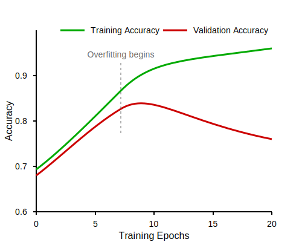

# Background

This chapter presents the theoretical foundation required to understand the rest of the thesis. Starting with \autoref{computer-software}, we look at the basic, low-level concepts of computer software, instruction sets, and compilers. \autoref{software-reverse-engineering} then introduces software reverse engineering, which is the overarching topic of this thesis. Finally, \autoref{machine-learning} introduces the necessary concepts from the field of machine learning, with a focus on \acp{CNN}.

## Computer software

### Binary executables

All computer software boils down to a series of bytes readable by the CPU. The bytes are organized in _instructions_. An instruction always includes an _opcode_ (Operation Code), which tells the CPU what operation should be executed. Depending on the opcode, the instruction often contains one or more _operands_, which provides the CPU with the data that should be operated on. The operands can be immediate values (values specified directly in the instruction), registers (a small, very fast memory located physically on the CPU), or memory addresses. \autoref{fig:arm-instruction} illustrates the instruction format of ARM, which uses 32-bit instructions.


<!-- Assembly? -->

### Instruction set architectures

An \ac{ISA} is a contract between hardware and software on how binary code should be run a given computer. In the early days, every new computer system were created with a new \ac{ISA}, meaning programs had to be custom-written for each specific machine. IBM and their System/360 series, introduced in 1964, were the first to use the \ac{ISA} as an abstraction layer between hardware and software. This new approach meant that despite having different internal architectures, all System/360 computers could run the same programs as they shared a common \ac{ISA}. The commercial success of this approach set an industry standard that continues to define modern computing, where hardware manufacturers can implement already established \acp{ISA}, ensuring cross generational program compatibility.

In addition to defining an instruction set, the \ac{ISA} gives a complete specification about how software interfaces with hardware, including how instructions can be combined, memory organization and addressing, supported data types, memory consistency models, and interrupt handling. Examples of well‐known \ac{ISA} families are x86, ARM, and RISC-V. Compilers can typically target multiple \acp{ISA}, allowing the same high‐level source code to be executed on different architectures through appropriate translation to the target instruction set.

#### CISC and RISC

\acp{ISA} today generally fall into two camps: \ac{CISC} and \ac{RISC}. \ac{CISC} architectures, like x86, provide many specialized instructions that can perform complex operations in a single instruction. \ac{CISC} can simplify complex operations at the programming level as well as potentially reduce code size, but at the cost of requiring more complex hardware. \ac{RISC} architectures, like ARM and RISC-V, favor simplicity with a smaller set of fixed-length instructions that execute in a single cycle, making them potentially more energy-efficient and easier to implement.

#### Instruction set

An important part of all \acp{ISA} is the instruction set, which defines the binary encoding of different instructions, providing a mapping of which bits and bytes translates to which instructions. Each instruction typically has a human‐readable keyword (like 'ADD' or 'MOV'), forming an assembly language that allows programmers to understand and write code at the machine level.

#### Word size

A fundamental characteristic of any \ac{ISA} is its word size, which defines the natural unit of data the processor works with – typically 32 or 64 bits in modern architectures. This affects everything from register sizes to memory addressing capabilities.

#### Endianness {#background-endianness}

The endianness determines how multi-byte values are stored in memory: little-endian architectures store the least significant byte first (like x86), while big-endian stores the most significant byte first, as illustrated in \autoref{tab:endianness}.

```{=latex}
\begin{table}[h]

\vspace{0.2cm}

\begin{center}

\strong{(a) Big endian}
\vspace{0.1cm}

\begin{tabular}{|c|c|c|c|c|}
\hline
Address & 0x1000 & 0x1001 & 0x1002 & 0x1003 \\
\hline
Byte & 0x12 & 0x34 & 0x56 & 0x78 \\
\hline
\end{tabular}

\vspace{0.4cm}

\strong{(b) Little endian}
\vspace{0.1cm}

\begin{tabular}{|c|c|c|c|c|}
\hline
Address & 0x1000 & 0x1001 & 0x1002 & 0x1003 \\
\hline
Byte & 0x78 & 0x56 & 0x34 & 0x12 \\
\hline
\end{tabular}

\end{center}

\caption{Comparison of how a 32-bit integer is stored in big endian and little endian.}
\label{tab:endianness}

\end{table}
```

### Instruction width

TODO

### Compilers

Software developers employ tools like compilers and interpreters to convert programs from human-readable programming languages to executable machine code. In the very early days of computer programming, software had to be written in assembly languages that mapped instructions directly to binary code for execution. Growing hardware capabilities allowed for more complex applications, however, the lack of human readability of assembly languages made software increasingly difficult and expensive to maintain. In order to overcome this challenge, compilers were created to translate human-readable higher-level languages into executable programs. In the early 1950s, there were successful attempts at translating symbolically heavy mathematical language to machine code. The language FORTRAN, developed at IBM in 1957, is generally considered the first complete compiled language, being able to achieve efficiency near that of hand-coded applications. While languages like FORTRAN were primarily used for scientific computing needs, the growing complexity of software applications drove the development of more advanced operating systems and compilers. One such advancement was the creation of the C programming language and its compiler in the early 1970s. Modern compilers (like the C compiler) are able to analyze the semantic meaning of the program, usually through some form of intermediate representation. The \ac{ISA} of the target system provides the compiler with the recipe to translate the intermediate representation into executable code. The intermediate representation is usually language- and system architecture-agnostic, which has the added benefit of allowing a compiler to translate the same program to many different computer architectures.

The evolution of compilers brought significant advantages in code portability and development efficiency. Programming languages' increasing abstraction away from machine code was necessary to achieve efficient development and portability across different computer architectures. By separating the program's logic from its hardware-specific implementation, developers could write code once, compile, and run it on every platform they wanted.

<!--
As portabilitiy increased, so did abstraction away from executables. without access to the original source code, it is dificult to understand waht a binary program does. Hint at motivation behind reverse engineering.
 -->

## Software reverse engineering

<!-- What is it, why is it useful -->
<!-- An Observational Investigation of Reverse Engineers’ Processes (veldig nice paper) -->

Software reverse engineering is a systematic process of analyzing and understanding how a program works without access to its original source code or internal documentation. At its core, reverse engineering involves working backwards from a compiled program to comprehend its functionality, architecture, and behavior - the opposite direction of traditional software development. Reverse engineering has its origins in hardware reverse engineering, where analysis of competitors designs was used to gain a competitive advantage. Software reverse engineering is primarily used today for understanding program behavior instead of replication. Whether investigating potentially malicious code or maintenance of legacy systems, software reverse engineering provides insights when source code and documentation are unavailable [@Chikofsky1990] [@Qasem2022].

Software reverse engineering serves many purposes in the digital landscape of today. In the domain of cybersecurity, it enables many types of vulnerability detection, where security researchers and bug hunters identify exploitable pieces of code. It can also be used to identify and analyze malware, protecting critical systems from infected executables and preventing cyberattacks. Beyond cybersecurity, reverse engineering enables software interoperability by allowing engineers to understand how systems interact when documentation is unavailable. It can play a vital role in software maintenance, especially for legacy systems where original documentation or development expertise has been lost. Software reverse engineering also serves important legal and compliance functions, helping organizations verify adherence to security standards and licensing requirements while supporting digital forensics through code similarity detection and ownership attribution [@Votipka2020] [@Qasem2022].

### Tools and challenges

Software targeted by reverse engineers can come in different levels, like raw binaries, assembler-code, decompiled code etc. and reverse engineers use a multitude of different tools to overcome the challenges at each level. At the lowest level, when presented with a binary of unknown origin, REs use _disassemblers_ like objdumb, angr and IDA Pro along with obtained knowledge of the ISA to translate the binary into assembly instructions. The main challenges at this level is figuring out the ISA if it is unknown or undocumented, as well as identifying code sections, program entry point and function boundaries so that execution can be followed. Some binaries are also be compressed or encrypted, also inhibiting disassembly [@GorkeSteensland2024] [@Kairajarvi2020] [@Nicolao2018] [@Qasem2022].

While assembly captures the semantic meaning of a program in a more human-readable manner and smaller pieces of code can be analyzed by REs, larger software systems are often too complex for meaningful information to be extracted purely through disassembly. _Decompilers_ are one such tool to aid in obtaining higher level understanding of the software. Decompilers like IDA Pro and Ghidra use assembly to reconstruct the program in a higher level language like C to improve human readability and make program semantics easier to understand. However, inherent limitations with information loss during compilation makes it virtually impossible to reconstruct the original source from assembly. Software developers rely on variable names and code comments to document data structures and code, which are lost during compilation. Modern compilers also perform performance or memory optimizations like loop unrolling, function inlining, changing arithmetic operands and control flow optimizations that can significantly transform the original code structure, making it even more challenging to map between source code and the resulting assembly [@GorkeSteensland2024; @Qasem2022; @Votipka2020].

In addition to disassembly, some tools are able to lift binaries into higher level representations with semantic analysis or like language-invariant intermediate representations such as LLVM IR. BinJuice is one such semantic analysis, which tries to capture program state changes performed by code blocks [@BinJuice2013]. While intermediate representations are typically used as a steppingstone in compilation and decompilation, their language-agnostic nature makes them valuable for large-scale program analysis. By also comparing code at the IR level, analysts enhance code similarity detection and semantic analysis, which can help enable understanding of program behavior and structure [@GorkeSteensland2024; @Qasem2022].

### Typical RE process

<!--
Automatic Vulnerability Detection in Embedded Devices and Firmware: Survey and Layered Taxonomies
An Observational Investigation of Reverse Engineers’ Processes (veldig nice paper)

Helping Johnny to Analyze Malware A Usability-Optimized Decompiler and Malware Analysis User Study
 -->

### What is needed to reverse engineer

- Explain what ISA features are needed for reverse engineering

## Machine learning

### Deep learning

Modern machine learning has roots all the way back to the 1950s, when the first artificial neural network was implemented. The term machine learning was introduced around the same time. The development of neural networks continued during the 60s and 70s alongside statistical learning methods such as the nearest neighbor and decision tree methods. However, advances in neural networks faced challenges due to research that demonstrated fundamental limitations of single-layer networks. In the 1980s, the backpropagation algorithm (which is still widely used today) was popularized, and solved the problem of training multi-layer networks. This put neural networks back on the map, and the field continued advancing through the 90s and 2000s. Significant breakthroughs such as parallelized training pipelines, generational leaps in computing power, and utilization of GPUs for machine learning tasks accelerated deep learning developments. This led up to a turning point in 2012, when AlexNet, a deep convolutional neural network, won the annual ImageNet competition. Since then, deep learning approaches have dominated the field of machine learning.

### Convolutional neural networks

\acp{CNN} is a deep learning technique designed for processing grid-based data. It is most commonly applied to visual tasks such as image classification and object detection. The main invention of \acp{CNN} is the concept of convolution layers. These layers scan across the input using _kernels_. The kernels detect features such as edges, textures, and patterns in the input data, and each output a feature map that is passed to the next layer. Each kernel has parameters that are trained based on the entire input grid. \autoref{fig:sliding-kernel} shows an example of a kernel sliding over the input.


Most \ac{CNN} architectures also use pooling layers, which are static, non-trainable layers that reduce the spatial dimensions of the data. Activation layers, usually ReLU, are used to introduce non-linearity into the network. Finally, fully-connected layers at the end of the network are used for final classification. \autoref{fig:cnn-architecture} shows an example of a basic \ac{CNN} architecture.


\acp{CNN} provide several advantages over competing approaches:

- Where traditional computer vision methods usually require significant feature engineering efforts, a \ac{CNN} is able to automatically detect and learn features from the input data without manual feature extraction. This saves time and effort, and even enables models to detect patterns that human intuition would be unable to.

- \ac{CNN} is more computationally efficient than fully-connected neural networks. Where fully-connected networks need parameters for every single connection between neurons, a \ac{CNN} uses the same kernels across the entire input, which dramatically reduces the number of trainable parameters. Additionally, the nature of \acp{CNN} make them more feasible for parallelization, better utilizing specialized hardware such as GPUs.

- \ac{CNN} models are _translation invariant_. This means that they can recognize objects, patterns, and textures regardless of their spatial position in the input. This makes the models more versatile and generalizable than fully-connected neural networks.

Hundreds of different \ac{CNN} architectures have been proposed in previous literature. LeNet-5, which is considered the first modern CNN architecture, has around 60 000 trainable parameters [@Lecun98]. Today, large-scale \ac{CNN} architectures such as VGG-16 often have over 100 million trainable parameters [@Simonyan2015].

Choosing a \ac{CNN} architecture is often a trade-off between several factors:

- **Dataset size**: In general, more complex models require larger datasets. In cases where training data is limited, smaller architectures should be considered. Small dataset sizes combined with complex networks often lead to overfitting, meaning the model matches the training data so well that it fails to generalize to unseen data.

- **Training resources**: Larger models are more expensive to train in terms of computation power. Training deep learning models efficiently often requires use of powerful \acp{GPU}.

- **Inference resources**: Larger models do not only increase the cost of training, it also increases the cost of inference, i.e. making predictions using the trained model. Depending on where the model will be deployed, this may be a deciding factor.

### Overfitting and regularization

When training machine learning models, especially when model complexity is high, there is a risk of overfitting. Overfitting occurs when a model learns the training data too perfectly, including its noise and random fluctuations, rather than learning the true underlying patterns. A model that is overfit to the training data will fail to generalize to unseen data, which causes weak performance in real-world applications.

\autoref{fig:overfitting} shows an example of performance behavior of a model that is overfitting. We see that both training accuracy and validation accuracy improves initially, but after 7 epochs, the validation accuracy stagnates while training accuracy keeps increasing.



Regularization is a set of techniques for reducing overfitting in machine learning models. In general, regularization penalizes models that are very complex, which incentivizes simpler models that likely generalize better to unseen data.

#### Ridge and Lasso regularization

Lasso (L1) regularization and Ridge (L2) regularization both work by appending a regularization term to the loss function. The standard loss function for Mean Squared Error (MSE) is:

$$
L_{MSE} = \frac{1}{n}\sum_{i=1}^{n}(y_i - \hat{y_i})^2
$$

Lasso (L1) regularization sums up the absolute value of all model weights, multiplies it by a regularization strength $\lambda$, and adds this term to the loss function:

$$
L_{lasso} = \underbrace{\frac{1}{n}\sum_{i=1}^n(y_i - \hat{y}_i)^2}_{\text{MSE}} + \underbrace{\lambda\sum_{j=1}^p|w_j|}_{\text{L1 penalty}}
$$

Ridge (L2) regularization sums up the absolute value of all model weights, multiplies it by a regularization strength $\lambda$, and adds this term to the loss function:

$$
L_{ridge} = \underbrace{\frac{1}{n}\sum_{i=1}^n(y_i - \hat{y}_i)^2}_{\text{MSE}} + \underbrace{\lambda\sum_{j=1}^pw_j^2}_{\text{L2 penalty}}
$$

Since the training process tries to update the model parameters in such a way that the loss function is minimized, both these regularization techniques result in models that balance fitting on the training data with maintaining simplicity.

#### Weight decay

Where L1 and L2 regularization add a regularization term to the loss function, weight decay instead modifies the weight update rule to include a decay factor. The standard weight update rule for gradient descent is:

$$
w_t = w_{t-1} - \eta\frac{\partial L}{\partial w}
$$

Weight decay scales down the previous parameter value by a factor of $(1 - \eta\lambda)$, where $\eta$ is the learning rate and $\lambda$ is the weight decay coefficient:

$$
w_t = w_{t-1}\underbrace{(1 - \eta\lambda)}_{\text{Decay factor}} - \eta\frac{\partial L}{\partial w}
$$

This causes the weights to gradually decay unless the gradient update is large enough to counteract it, leading to simpler models with smaller weights.

When using standard gradient descent for training, weight decay is mathematically equivalent to Ridge (L2) regularization. However, with adaptive optimizers such as Adam, L2 regularization gets scaled by the adaptive learning rates. Weight decay avoids this issue by applying the penalty directly to the weights, which makes it preferable to L2 regularization for these optimizers.

#### Dropout

Dropout is a regularization technique that randomly deactivates a portion of neurons during each training iteration. During training, each neuron has a probability $p$ of being temporarily removed from the network along with its connections. For the next iteration, all neurons are restored before randomly dropping a new subset.

During testing and inference, no neurons are dropped. Instead, all neuron outputs are scaled by $p$ to maintain the same expected magnitude of activations:

$$
h_{\text{test}} = p \cdot h
$$

By forcing the network to function without access to all neurons during training, dropout prevents any neuron from relying too heavily on a specific subset of other neurons. This encourages the network to learn redundant representations, which improves robustness. The technique is particularly effective for very deep networks, where common dropout probabilities range from 0.2 to 0.5.

### Leave-one-group-out cross validation

_Cross validation_ is a technique used to assess performance and generalizability of a machine learning model. It involves partitioning data into subsets, where the model is trained on certain subsets while validated using the remaining ones. The process is repeated, making sure the model is trained and validated using different splits. This helps reduce overfitting on a fixed validation set, with the trade-off of requiring more computation since the model needs to be trained multiple times. \autoref{fig:cross-validation} illustrates how the data can be split in a 5-fold cross validation. Each fold serves as validation data once while remaining data is used for training.

It is worth noting that cross validation is used only when verifying the model architecture and hyperparameters, not when training the actual model that will be deployed. After performance is assessed using cross validation techniques, the final model is trained on all available training data without holding out a validation set.


\ac{LOGO CV} is a variation used in cases where the data is grouped into distinct clusters or categories. The purpose is to ensure that the trained model is tested on data independent of the groups it was trained on. Instead of partitioning the data into random subsets, it is split into groups based on a predefined variable. For each iteration, one group is left out as the validation set, and the model is trained on the remaining groups. This technique assesses how well the model generalizes to completely unseen groups, which is especially useful in case the final model will be used with data that does not belong to any of the groups present in the training data.

### Embeddings

Embeddings are a way a to convert discrete data like words, categories, or items into continuous vectors of numbers that capture semantic relationships or patterns. These vectors are part of the model's trainable parameters, which allows the model to discover semantics from the input data during training. It is common to include an embedding layer as the first layer of a deep learning model, essentially creating a mathematical representation of arbitrary categorical data.

Word embeddings serve as the foundation for many natural language processing tasks. When trained on massive English datasets, these embeddings often capture sophisticated semantic relationships. A classic example in the literature demonstrates this through vector arithmetic: starting with the vector of "king", subtracting "man", and adding "woman", we end up with a vector that is very close to that of "queen" [@Mikolov2013].

### Transfer learning

Transfer learning is the concept of training a model for one purpose, and then re-using some or all of the trained weights for a different application. For instance, CNN models trained on ImageNet – a large dataset of 3.2 million images – are readily available online [@ImageNet]. Transfer learning is useful in cases where there is not enough training data to train a model from scratch, or when there are limited amounts of time or computational resources available.

#### Fine-tuning

Fine-tuning involves taking a pre-trained model and then training it further on a new but related task. The model's weights are updated to work with the new task, while retaining knowledge from pre-training. Common approaches include full fine-tuning (updating all parameters), partial fine-tuning (updating certain layers while others reming frozen), and gradual fine-tuning (progressively increasing the learning rate across layers).

#### Feature extraction

Instead of updating the model's weights, we can use the pre-trained model as a feature extractor. In this case, we typically remove the final classification layers of the pre-trained model, and feed the remaining layers into a new classifier that is trained on our own data. The pre-trained layers remain completely frozen during training.

## Related work
