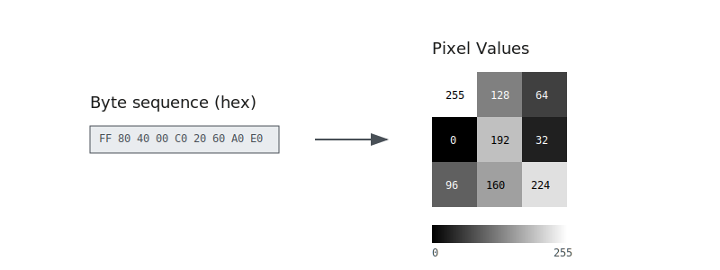

\acresetall

# Methodology

This chapter describes the methodology used in this thesis. We start by describing the experimental setup, including the system configuration and the datasets used in the thesis in \autoref{experimental-setup}. We then describe the machine learning models, target features, and data preprocessing used in the experiments in \autoref{experiments}. Finally, we describe our evaluation strategy and metrics in \autoref{evaluation-strategies}.

## Experimental setup

### Datasets

This thesis utilizes three primary datasets: BuildCross, ISAdetect and CpuRec. The BuildCross dataset is built by us as part of this thesis' contribution to the field and its development is discussed in \autoref{developing-a-custom-dataset}. ISAdetect and CpuRec datasets on the other hand are both sourced from previous work in software reverse engineering. These datasets contain samples of binary programs from a variety of different \acp{ISA}. Architectures vary in similarity in terms of features like endianness, word- and instruction size, and our model development focuses on the ability to reliably detect architectural features independent of the specific \ac{ISA}. The choice of datasets is therefore mostly motivated by architectural diversity, in order to reduce the potential correlation between the groups of \acp{ISA} and the features we aim to detect. In addition, binary programs are not human-readable, and errors and inconsistencies in the data are difficult to uncover. We are reliant on accurate labeling in datasets to ensure proper results. From our search, we have found that the combination of datasets ISAdetect and CpuRec strikes a good balance between the number of present architectures and volume of training data. They complement each other in a way that fits our research criteria, and have been validated in previous research.

#### ISADetect

The ISAdetect dataset is the product of a masters thesis by Sami Kairajärvi and the resulting paper: "ISAdetect: Usable Automated Detection of CPU Architecture and Endianness for Executable Binary Files and Object Code" [@Kairajarvi2020]. A part of their contributions is providing, to our knowledge, the most comprehensive publicly available dataset of binary programs from different \acp{ISA} to date. All of their program binaries are collected from Debian Linux repositories, selected due to the Debian distribution being a trusted project and ported to a wide variety of \acp{ISA}. This resulted in a dataset consisting of 23 different architectures. Kairajärvi et al. also focused on tackling the dataset imbalances seen in Clemens' work, and each architecture contains around 3000 binary program samples [@Kairajarvi2020; @Clemens2015]. \autoref{table:isadetect} lists the \acp{ISA} present in ISADetect and their architectural features.

Table: \acp{ISA} present in ISADetect dataset \label{table:isadetect}

| ISA        | Endianness | Word size | Instruction width |
| ---------- | ---------- | --------- | ----------------- |
| alpha      | little     | 64        | 32                |
| amd64      | little     | 64        | variable          |
| arm64      | little     | 64        | 32                |
| armel      | little     | 32        | 32                |
| armhf      | little     | 32        | 32                |
| hppa       | big        | 32        | 32                |
| i386       | little     | 32        | variable          |
| ia64       | little     | 64        | variable          |
| m68k       | big        | 32        | variable          |
| mips       | big        | 32        | 32                |
| mips64el   | little     | 64        | 32                |
| mipsel     | little     | 32        | 32                |
| powerpc    | big        | 32        | 32                |
| powerpcspe | big        | 32        | 32                |
| ppc64      | big        | 64        | 32                |
| ppc64el    | little     | 64        | 32                |
| riscv64    | little     | 64        | 32                |
| s390       | big        | 32        | variable          |
| s390x      | big        | 64        | variable          |
| sh4        | little     | 32        | 16                |
| sparc      | big        | 32        | 32                |
| sparc64    | big        | 64        | 32                |
| x32        | little     | 32        | variable          |

The ISAdetect dataset is publicly available through etsin.fairdata.fi [@Kairajarvi_dataset2020]. Our study utilizes the most recent version, Version 6, released March 29th 2020. The dataset is distributed as a compressed archive (new_new_dataset/ISAdetect_full_dataset.tar.gz) containing both complete program binaries and code-only sections for each architecture. Additionally, all of \ac{ISA} folder contains a JSON file with detailed metadata for each individual binary, including properties such as endianness and wordsize. This dataset was used for the same purpouse by Andressaen in his masters thesis, and we referred to his table in Appendix A for additional labeling of instruction width type (fixed/variable) and instruction width ranges [@Andreassen_Morrison_2024].

#### CpuRec

The CpuRec dataset is a collection of executable code-only sections extracted from binaries of 72 different architectures, developed by Louis Granboulan for use with the cpu_rec tool. The cpu_rec uses Markov-chains and Kullback-Leibler divergence with the dataset in order to classify the ISA of an input binary [@Granboulan_paper2020]. Even though only one binary per architecture is provided, which is likely insufficient for training a deep learning model on its own, the diversity of ISAs represented makes the dataset an excellent test set for evaluating our model. \autoref{table:cpurec} lists the \acp{ISA} present in CpuRec and their architectural features.

Table: \acp{ISA} present in CpuRec dataset \label{table:cpurec}

| architecture | endianness | wordsize | instruction width |
| ------------ | ---------- | -------- | ----------------- |
| X86          | little     | 32       | variable          |
| X86-64       | little     | 64       | variable          |
| ARM64        | little     | 64       | 32                |
| Alpha        | little     | 64       | 32                |
| ARMel        | little     | 32       | 32                |
| ARMhf        | little     | 32       | 32                |
| MIPSeb       | big        | 32       | 32                |
| MIPSel       | little     | 32       | 32                |
| PPCeb        | big        | 32       | 32                |
| PPCel        | little     | 64       | 32                |
| HP-PA        | big        | 32       | 32                |
| IA-64        | little     | 64       | variable          |
| M68k         | big        | 32       | variable          |
| RISC-V       | little     | 64       | 32                |
| S-390        | big        | 64       | variable          |
| SuperH       | little     | 32       | 16                |
| SPARC        | big        | unknown  | 32                |
| ARC32el      | little     | 32       | variable          |
| AxisCris     | little     | 32       | 16                |
| Epiphany     | little     | 32       | variable          |
| M88k         | big        | 32       | 32                |
| MMIX         | big        | 64       | 32                |
| PDP-11       | middle     | 16       | variable          |
| Stormy16     | bi         | 32       | variable          |
| V850         | little     | 32       | variable          |
| Xtensa       | bi         | 32       | variable          |
| 6502         | little     | 8        | variable          |
| ARcompact    | little     | 32       | variable          |
| Blackfin     | little     | 32       | variable          |
| FR30         | big        | 32       | 16                |
| i860         | bi         | 32       | 32                |
| MCore        | big        | 32       | 16                |
| MN10300      | little     | 32       | unknown           |
| PIC10        | n/a        | 8        | 12                |
| RL78         | little     | unknown  | unknown           |
| VAX          | little     | 32       | variable          |
| XtensaEB     | big        | 32       | variable          |
| 68HC08       | big        | 8        | variable          |
| Cell-SPU     | bi         | 64       | unknown           |
| FR-V         | unknown    | 32       | 32                |
| Mico32       | big        | 32       | 32                |
| Moxie        | bi         | 32       | variable          |
| PIC16        | n/a        | 8        | 14                |
| ROMP         | big        | 32       | variable          |
| TILEPro      | unknown    | 32       | variable          |
| Visium       | unknown    | unknown  | unknown           |
| Z80          | little     | 8        | variable          |
| 68HC11       | big        | 8        | variable          |
| ARMeb        | big        | 32       | 32                |
| CLIPPER      | little     | 32       | variable          |
| FT32         | unknown    | 32       | unknown           |
| IQ2000       | big        | 32       | unknown           |
| MicroBlaze   | big        | 32       | 32                |
| MSP430       | little     | 16       | variable          |
| PIC18        | n/a        | 8        | 16                |
| RX           | little     | 32       | variable          |
| TLCS-90      | n/a        | 8        | variable          |
| 8051         | n/a        | 8        | variable          |
| CompactRISC  | little     | 16       | variable          |
| H8-300       | n/a        | 8        | variable          |
| M32C         | little     | 32       | variable          |
| MIPS16       | bi         | 16       | 16                |
| NDS32        | little     | 32       | variable          |
| PIC24        | little     | 16       | 24                |
| TMS320C2x    | unknown    | 16/32    | variable          |
| WE32000      | n/a        | 32       | unknown           |
| Cray         | n/a        | 64       | variable          |
| H8S          | unknown    | 16       | variable          |
| M32R         | bi         | 32       | variable          |
| NIOS-II      | little     | 32       | 32                |
| TMS320C6x    | bi         | 32       | 32                |
| ARC32eb      | little     | 32       | variable          |
| AVR          | n/a        | 8        | variable          |
| HP-Focus     | n/a        | 32       | variable          |
| STM8         | n/a        | 8        | variable          |
| TriMedia     | unknown    | 32       | unknown           |

The cpu_rec tool-suite is available on GitHub, and the binaries used in the thesis are available as under cpu_rec_corpus directory [@Granboulan_cpu_rec_dataset2024]. The dataset was curated from multiple sources. A significant portion of the binaries were sourced from Debian distributions, where more common architectures like x86, x86_64, m68k, PowerPC, and SPARC are available. For less common architectures, binaries were collected from the Columbia University Kermit archive, which provided samples for architectures like M88k, HP-Focus, Cray, VAX, and PDP-11. The remaining samples were obtained through compilation of open-source projects using \ac{GCC} cross-compilers [@Granboulan_paper2020]. Unlike ISAdetect, the CpuRec dataset provides only architecture names without additional feature labels. To fill this gap, we referenced Appendix A of Andreassen's thesis [@Andreassen_Morrison_2024] to obtain architectural features including endianness, wordsize, and instruction width specifications for each architecture in the dataset.

<!-- TODO: Dataset quality
While many of the more common ISAs were packaged using standard file-headers, some of the binaries had undocumented .text sections, where the author had to make educated guesses in order to identify code [source].  -->

### Technical configuration

For all experiments, we use the Idun cluster at \ac{NTNU}. This \ac{HPC} cluster is equipped with 230 NVIDIA Data Center \acp{GPU} [@Idun]. The following hardware configuration was used for all experiments:

- CPU: Intel Xeon E5-2695 v4 (12 cores enabled)
- \ac{GPU}: NVIDIA A100 40GB
- RAM: 16 GB

We use the PyTorch framework for building and training our models. The following software versions were used:

- Python 3.12.3
- PyTorch 2.2.2
- torchvision 0.17.2
- CUDA 12.1
- cuDNN 8.9.2

### Hyperparameters

Unless specified otherwise, we use the training hyperparameters specified in \autoref{table:hyperparameters} for our experiments.

Table: Hyperparameter selection \label{table:hyperparameters}

| Hyperparameter | Value         |
| :------------- | :------------ |
| Batch size     | 64            |
| Loss function  | Cross entropy |
| Optimizer      | AdamW         |
| Learning rate  | 0.0001        |
| Weight decay   | 0.01          |

We find that a batch size of 64 represents a good balance between computational efficiency and model performance. It is large enough to enable efficient \ac{GPU} utilization, while small enough to provide a regularization effect through noise in gradient estimation.

Cross entropy loss is the natural choice for classification tasks, as it tends to provide superior performance for classification tasks compared to mean squared error loss [@Golik2013].

The AdamW optimizer is an improved version of Adam that implements weight decay correctly, decoupling it from the learning rate. It also improves on Adam's generalization performance on image classification datasets [@Loshchilov2019].

A learning rate of 0.0001 is lower than Pytorch's default of 0.001 for AdamW. We make this conservative choice due to early observations showing that small learning rates still cause the AdamW optimizer to reach convergence rather quickly for our dataset. Considering our vast amounts of computational resources, we want to err on the side of slower training rather than risking convergence issues.

A weight decay of 0.01 provides moderate regularization strength, and provides a balance between underfitting and overfitting. It is Pytorch's default for the AdamW optimizer.

## Developing a custom dataset

This thesis introduces BuildCross, a toolset and dataset representing a significant contribution to the field. BuildCross compiles and extracts code sections from archive files of widely-used open source libraries (referenced in \autoref{table:buildcross-dataset-libraries}). The code sections in the binary files are extracted for use by our models, in addition to being disassembled for dataset labeling and quality control. We developed BuildCross with the goal of bridging the gap between ISAdetect and CpuRec datasets. While ISAdetect contains a large volume of binary programs, it consists mostly of architectures from more mainstream \acp{ISA}. We believe this dataset alone lacks sufficient diversity to develop truly architecture-agnostic models. CpuRec on the other hand contains binaries from a great variety of architectures, but the lack of significant volume and uncertainties with labeling of the dataset makes it unsuited to train larger ML models on. BuildCross strikes a balance aiming to generate a larger volume of binary code for the underrepresented less common architectures.

We have found that large consistent sources of already compiled binaries for embedded and bare metal systems are hard to come by, which are experiences also shared by the authors of ISAdetect and CpuRec [@Kairajarvi2020; @Granboulan_paper2020]. To overcome this limitation and produce a well-documented, correctly labeled dataset, we compiled binary programs for these exotic architectures using cross-compilation with \ac{GCC} and GNU Binutils. We developed a pipeline consisting of three steps: (1) creating containerized workable toolchains, (2) gathering sources and configuring these toolchains for binary compilation, and (3) extracting features and relevant data from the compiled libraries. With future expansion in mind, it is able to accommodate additional target toolchains and binary sources.

```{=latex}
\begin{longtable}[c]{p{2cm}p{1.5cm}p{12cm}}
\caption{Source libraries used to compile and generate the BuildCross dataset \label{table:buildcross-dataset-libraries}} \\
\toprule
Library & Version & Description \\
\midrule
\endfirsthead

\bottomrule
\endlastfoot

freetype & 2.13.3 & A software library for rendering fonts. It's widely used for high-quality text rendering in applications, providing support for TrueType, OpenType, and other font formats. \\

libgit2 & 1.9.0 & A portable, pure C implementation of the Git core methods. It provides a fast, linkable library for Git operations that can be used in applications to implement Git functionality without spawning a git process. \\

libjpeg-turbo & 3.1.0 & An optimized version of libjpeg that uses SIMD instructions to accelerate JPEG compression and decompression. It's significantly faster than the original libjpeg while maintaining compatibility. \\

libpng & 1.6.47 & The official PNG reference library that provides support for reading, writing, and manipulating PNG (Portable Network Graphics) image files. It's widely used in graphics processing applications. \\

libwebp & 1.5.0 & A library for encoding and decoding WebP images, Google's image format that provides superior lossless and lossy compression for web images, resulting in smaller file sizes than PNG or JPEG. \\

libyaml & 0.2.5 & A C library for parsing and emitting YAML (YAML Ain't Markup Language) data. It's commonly used in configuration files and data serialization applications. \\

pcre2 & 10.45 & Perl Compatible Regular Expressions library (version 2), which provides functions for pattern matching using regular expressions. It's used in many applications for text processing and search operations. \\

xzutils & 1 & A set of compression utilities based on the LZMA algorithm. The XZ format provides high compression ratios and is commonly used for software distribution and archiving. \\

zlib & 1.3 & A software library used for data compression. It provides lossless data-compression functions and is widely used in many software applications for compressing data, including PNG image processing. \\

\end{longtable}
```

### Pipeline for developing toolchains

<!-- TODO:
- Not all toolchains are publicly available
- Exists systems for building toolchains, our choice landed on BuildCross.
- containerized for portability, size optim and reproducibility -->

In order to generate binary programs for specific \ac{ISA}, we need a cross-compiler that can run on our host system and target that architecture. While common targets like x86, ARM and MIPS systems have readily available toolchains for multiple host platforms, the more exotic architectures not covered by the ISAdetect dataset are in our experience either not publicly available or cumbersome to configure properly. The best option in our case is to create/compile these toolchains ourselves, and we decided on the \ac{GCC} and GNU Binutils due to the GNU project's long history of supporting a large variety of architectures.

A full cross-compiler toolchain have a lot of moving parts, and since a lot of architectures are not supported on newer versions of \ac{GCC}, configuring compatible versions of Binutils, LIBC implementations, GMP, MPC, MPFR etc. would require a lot of trial and error. To get us started we employed the buildcross project by Mikael Pettersson on GitHub, as it contained a setup for building cross-compilers with documented version compatibility for deprecated architectures [@Mikpe2024]. The buildcross project was used as a base for our own toolchain building scripts, and expanded to support additional architectures.

The cross-compiler suite uses singularity images to create containerized, reproducible and portable cross-compilation environments for the supported architectures. The \ac{GCC} suite's source code with its extensions is ~15GB, and in order to reduce image space and build time, we created a builder image with the necessary dependencies and libraries for building the toolchains. This builder script is used to build the toolchain for each architecture, and the resulting toolchains are stored in a separate images of roughly 500MB in size.

### Configuring toolchains and gathering library sources (why libraries)

When using the compiled toolchains, we have to overcome the challenge of configuring each library for compilation to the target architecture. Instead of manually configuring each library for each architecture, we used the build system CMake and toolchain configuration files to automate the process. CMake is a widely used build system that simplifies the process of configuring and generating build files for different platforms and compilers. It allows us to specify the target architecture, compiler, linker, and other build options in a platform-independent way, only requiring one toolchain file per architecture. While most architectures could use a common template toolchain file, CMake made it straightforward to implement the specific configurations needed for architectures with unique requirements.

The libraries we selected for our dataset are widely used and have a large codebase, which provides a good representation of real-world code. By compiling these libraries, we can ensure that the generated binaries are representative of actual software applications. This is important for training and evaluating our models, as it allows us to assess their performance on realistic data. Additionally, using well-known libraries helps us avoid potential issues with licensing and distribution, as these libraries are commonly used in open-source projects. By compiling these libraries for the target architectures, we can create a diverse dataset that covers a wide range of instruction sets and architectural features. With the only requirement that the libraries support CMake, the BuildCross suite supports adding more libraries to the dataset in the future.

The toolchain configuration setup is not perfect though, as some of the libraries has dependencies that are not compatible with the target architecture. This is especially true for libraries that are not actively maintained, and the manual labor of patching libraries for each architecture does not scale well for this many architectures. The most common issues we encountered were the lack of libc intrinsic header file definitions for some of the targets. CMake could in some cases be used to disable some of the library features with missing dependencies, at the cost of in some cases reducing code size. We also compiled for most architectures with the linker flag -Wl,--unresolved-symbols=ignore-all, creating binaries that most likely would crash at runtime if the missing symbols were used. Ignoring missing symbols and similar shortcuts still produce valid binaries that are useful for our dataset, as the goal is to create a dataset that is representative of the architectures and their features. Despite this, not all libraries could be compiled for all architectures in time for this thesis, which explains the discrepancies in the amount of data between the architectures.

### Gathering results

The final stage of our pipeline involves extracting and labeling binary data from the compiled libraries. Using CMake's configuring, building and installing features, we generated install folders containing compiled archive files (.a) for each target architecture. These archive files are collections of compiled binaries (object-files) in \ac{ELF} format, providing functions and utilities other programs can link to.

Using the GNU Binutils toolkit from our compiled toolchains, we employed the archiver (ar) to extract individual object files, objcopy to isolate code sections from these objects, and objdump to generate disassembly. This process yielded our core dataset of compiled code sections across all target architectures.

For dataset labeling, we extracted the endianness and wordsize metadata directly from each architecture's \ac{ELF} headers. However, determining instruction width proved more challenging due to inconsistent documentation online across exotic architectures. We established a methodology by analyzing instruction patterns in the disassembly, using the hexidesimal mapping between instructions and assembly to infer the size of the instructions. The disassembly output is included in the dataset both for verification of our labeling and as an added utility for the use of BuildCross.

### Final dataset yields and structure

The final dataset spans 40 architectures with approximately 120 MB of binary code, and information on the included architectures can be found in \autoref{table:buildcross-dataset-labels}. The distribution across architectures varies, with more supported architectures like arc, loongarch64 and blackfin containing up to Z files, while more exotic architectures like xstormy16 and rl78 contain fewer samples due to compilation challenges mentioned in the previous section.

The source code for the cross-compiler suite is available under the masterproject/crosscompiler directory on the thesis GitHub page [@thesisgithub]. The dataset itself is published as a GitHub Release and distributed as a tar.gz file with the following structure:

```{=latex}
\begin{figure}[h]
\begin{minipage}{\textwidth}
\dirtree{%
.1 \textbf{buildcross\_dataset.tar.gz.}.
.2 library\_files/ (Full compiled libraries).
.3 arc/.
.3 bfin/.
.3 (\ldots).
.2 text\_asm/ (Decompiled code sections of libraries).
.3 arc/.
.3 bfin/.
.3 (\ldots).
.2 text\_bin/ (Raw binary of code sections).
.3 arc/.
.3 bfin/.
.3 (\ldots).
.2 labels.csv (Dataset labels for endianness, wordsize and instruction width).
.2 report.csv (Code section file-sizes for each library in csv format).
.2 report.txt (Code section file-sizes for each library in text format).
}
\end{minipage}
\end{figure}
```

The labels.csv file contains architecture metadata including endianness, wordsize and instruction width for each binary. The report files provide detailed statistics on code section sizes across libraries, with report.csv offering machine-readable format and report.txt providing human-readable summaries. The data from the labels.csv file is presented in \autoref{table:buildcross-dataset-labels}.

<!-- TODO: should this table be here or appendix? -->

Table: Labels for the \acp{ISA} in the BuildCross dataset, with documented feature values for endianness, wordsize, instructionswidth_type and instructionswidth. Also includes code section sizes extracted for each architecture \label{table:buildcross-dataset-labels}

| architecture | endianness | wordsize | instructionwidth_type | instructionwidth | total size (kb) |
| ------------ | ---------- | -------- | --------------------- | ---------------- | --------------- |
| arc          | little     | 32       | variable              | 16/32            | 3299            |
| arceb        | big        | 32       | variable              | 16/32            | 1729            |
| bfin         | little     | 32       | variable              | 16/32            | 2942            |
| c6x          | big        | 32       | fixed                 | 32               | 5271            |
| cr16         | little     | 32       | variable              | 16/32            | 1583            |
| cris         | little     | 32       | variable              | 16/32            | 4070            |
| csky         | little     | 32       | variable              | 16/32            | 4244            |
| epiphany     | little     | 32       | variable              | 16/32            | 334             |
| fr30         | big        | 32       | variable              | 16/32            | 2215            |
| frv          | big        | 32       | fixed                 | 32               | 5033            |
| ft32         | little     | 32       | fixed                 | 32               | 445             |
| h8300        | big        | 32       | variable              | 16/32            | 4396            |
| iq2000       | big        | 32       | fixed                 | 32               | 2459            |
| kvx          | little     | 64       | variable              | 16/32            | 5012            |
| lm32         | big        | 32       | fixed                 | 32               | 3392            |
| loongarch64  | little     | 64       | fixed                 | 64               | 4814            |
| m32r         | big        | 32       | fixed                 | 32               | 1997            |
| m68k-elf     | big        | 32       | variable              | 16/32/48         | 1866            |
| mcore        | little     | 32       | fixed                 | 16               | 1268            |
| mcoreeb      | big        | 32       | fixed                 | 16               | 1268            |
| microblaze   | big        | 32       | fixed                 | 64               | 5862            |
| microblazeel | little     | 32       | fixed                 | 64               | 5834            |
| mmix         | big        | 64       | fixed                 | 32               | 4305            |
| mn10300      | little     | 32       | variable              | na               | 1251            |
| moxie        | big        | 32       | variable              | 16/32            | 2236            |
| moxieel      | little     | 32       | variable              | 16/32            | 2229            |
| msp430       | little     | 32       | variable              | 16/32            | 223             |
| nds32        | little     | 32       | variable              | 16/32            | 2507            |
| nds32be      | big        | 32       | variable              | 16/32            | 1431            |
| nios2        | little     | 32       | fixed                 | 64               | 4299            |
| or1k         | big        | 32       | fixed                 | 64               | 5541            |
| pru          | little     | 32       | fixed                 | 32               | 2435            |
| rl78         | little     | 32       | variable              | na               | 338             |
| rx           | little     | 32       | variable              | na               | 1486            |
| rxeb         | big        | 32       | variable              | na               | 1300            |
| tilegx       | little     | 64       | fixed                 | 64               | 11964           |
| tilegxbe     | big        | 64       | fixed                 | 64               | 11970           |
| tricore      | little     | 32       | variable              | 16/32            | 1644            |
| v850         | little     | 32       | variable              | 16/32            | 3171            |
| visium       | big        | 32       | fixed                 | 32               | 3481            |
| xstormy16    | little     | 32       | variable              | 16/32            | 219             |
| xtensa       | big        | 32       | variable              | na               | 2671            |

## Experiments

This research primarily involves training, validating, and evaluating \ac{CNN} models using \ac{ISA} characteristics such as endianness, word size, and instruction length as the target features. This subsection outlines our approach to data preprocessing as well as the model architectures we use for our experiments.

### Data preprocessing

While most \ac{CNN} architectures are designed for image data, our datasets consist of compiled binary executables. Thus, how these are encoded into a format that can be consumed by a \ac{CNN} is a crucial part of our method. In our experiments, we use two different approaches for image encoding.

#### Two-dimensional byte-level encoding

We treat each byte value as an integer whose value range from 0 to 255. The values are placed in a two-dimensional array of a predetermined size. If the file is larger than the predetermined size, only the first bytes are used. If the file is smaller than the predetermined size, the remaining bytes are padded with zero values.

When applying two-dimensional \ac{CNN} on 2D grids of this format, the byte values will essentially be treated as pixel values, where the byte sequence forms a grayscale image. \autoref{fig:byte-encoding} shows an example of a 9-byte sequence encoded as a 3x3 pixel grayscale image.



This approach was chosen based on previous literature which successfully classified malware from binary executables using \acp{CNN} [@Kumari2017; @Prima2021; @Hammad2022; @Al-Masri2024; @El-Shafai2021; @Alvee2021; @Liang2021; @Son2022].

#### One-dimensional byte-level encoding

Similar to the 2D approach, we treat each byte as an integer. The values are placed in a one-dimensional array of a predetermined size. If the file is larger than the predetermined size, only the first bytes are used. If the file is smaller than the predetermined size, the remaining bytes are padded with zero values.

This approach was chosen based on previous literature which successfully detected compiler optimization levels in binary executables using 1D \acp{CNN} [@Yang2019; @Pizzolotto2021].

#### Input size and file splitting

Since the size of the files in our datasets vary greatly, we need a way to handle varying file sizes. When training our model, we want each data instance to be of a fixed size. We want to use an input size as small as possible for efficiency reasons, while being large enough to capture enough information. In addition, picking an input size as small as possible ensures that most of our files are large enough to fill the entire input vector without padding.

For the one-dimensional models, we pick an input size of 512 bytes. We choose this number based on preliminary testing, which revealed that input sizes larger than 512 bytes did not improve model performance.

For the small two-dimensional models, we use an input size of 32x16. This matches the 512-byte input size for the one-dimensional models. In addition, we hypothesize that using a width of 32 bytes might improve the models' ability to detect repeating patterns, since many programs use an instruction width of 32. For the models based on ResNet, we use an input size of 32x32 (which gives 1024 bytes), since this architecture is designed for square images.

For the few files that are smaller than the pre-determined input size, we choose to exclude them from training instead of padding them to fit the input size. For files larger than the input size $I$, only the first $I$ bytes from the file is used. For the custom dataset we developed, which contains few, but rather large files, we also use file splitting to increase the number of training instances. Given a file of size $F$ and a model input size of $I$, each file is divided into $\lfloor F/I \rfloor$ instances.

### Model architectures

In our experiments, we train, evaluate, and compare the model architectures outlined in this subsection.

#### Simple 1D CNN

This model is a small one-dimensional \ac{CNN}. The first layer is a convolution layer of size 1, bringing the filter space dimensionality from 1 to 128 while keeping the spatial dimensions. The rationale for this layer is to align the feature space with the embedding model introduced in \autoref{simple-1d-cnn-with-embedding-layer}. Then, the model consists of three convolutional blocks, each with two convolutional layers and a max pooling layer. After the convolutional blocks comes a global average pooling layer, and a fully-connected block with a single hidden layer for classification. Dropout with a rate of 0.3 is applied after each convolution blocks and between the two fully-connected layers. The full model specification is shown in \autoref{table:simple-1d-cnn}. The model has a total of 152,282 trainable parameters. This model is hereby referred to as _Simple1d_.

Table: Simple 1D CNN \label{table:simple-1d-cnn}

| Layer                | Hyperparameters | Output Shape | Parameters |
| -------------------- | --------------- | ------------ | ---------- |
| Input                | –               | (512,)       | –          |
|                      |                 |              |            |
| Convolution 1D       | k=1, s=1, p=0   | (512, 128)   | 256        |
| Dropout              | p=0.3           | (512, 128)   | –          |
|                      |                 |              |            |
| Convolution 1D       | k=3, s=1, p=1   | (512, 32)    | 12,320     |
| Convolution 1D       | k=5, s=2, p=2   | (256, 32)    | 5,152      |
| Max Pooling 1D       | k=2, s=2        | (128, 32)    | –          |
| Dropout              | p=0.3           | (8, 128)     | –          |
|                      |                 |              |            |
| Convolution 1D       | k=3, s=1, p=1   | (128, 64)    | 6,208      |
| Convolution 1D       | k=5, s=2, p=2   | (64, 64)     | 20,544     |
| Max Pooling 1D       | k=2, s=2        | (32, 64)     | –          |
| Dropout              | p=0.3           | (8, 128)     | –          |
|                      |                 |              |            |
| Convolution 1D       | k=3, s=1, p=1   | (32, 128)    | 24,704     |
| Convolution 1D       | k=5, s=2, p=2   | (16, 128)    | 82,048     |
| Max Pooling 1D       | k=2, s=2        | (8, 128)     | –          |
| Dropout              | p=0.3           | (8, 128)     | –          |
|                      |                 |              |            |
| Adaptive Avg Pool 1D | output=1        | (1, 128)     | –          |
| Reshape              | –               | (128,)       | –          |
|                      |                 |              |            |
| Fully Connected      | –               | (8,)         | 1,032      |
| ReLU                 | –               | (8,)         | –          |
| Dropout              | p=0.3           | (8,)         | –          |
| Fully Connected      | –               | (2,)         | 18         |
| Softmax              | –               | (2,)         | –          |

#### Simple 1D CNN with embedding layer

This model builds on the the simple 1D \ac{CNN} model in \autoref{simple-1d-cnn} by placing an embedding layer at the beginning of the model instead of the size 1 convolution layer. The embedding layer transforms the byte values into a vector of continuous numbers, allowing the model to learn the characteristics of each byte value and represent it mathematically. After the embedding layer, the model is identical to the _Simple1d_ model. The full model specification is shown in \autoref{table:1d-cnn-with-embedding-layer}. This model has a total of 184,794 trainable parameters. This model is hereby referred to as _Simple1d-E_.

Table: 1D CNN with embedding layer \label{table:1d-cnn-with-embedding-layer}

| Layer                | Hyperparameters | Output Shape | Parameters |
| -------------------- | --------------- | ------------ | ---------- |
| Input                | –               | (512,)       | –          |
|                      |                 |              |            |
| Embedding            | v=256, d=128    | (512, 128)   | 32,768     |
| Dropout              | p=0.3           | (512, 128)   | –          |
|                      |                 |              |            |
| Convolution 1D       | k=3, s=1, p=1   | (512, 32)    | 12,320     |
| Convolution 1D       | k=5, s=2, p=2   | (256, 32)    | 5,152      |
| Max Pooling 1D       | k=2, s=2        | (128, 32)    | –          |
| Dropout              | p=0.3           | (8, 128)     | –          |
|                      |                 |              |            |
| Convolution 1D       | k=3, s=1, p=1   | (128, 64)    | 6,208      |
| Convolution 1D       | k=5, s=2, p=2   | (64, 64)     | 20,544     |
| Max Pooling 1D       | k=2, s=2        | (32, 64)     | –          |
| Dropout              | p=0.3           | (8, 128)     | –          |
|                      |                 |              |            |
| Convolution 1D       | k=3, s=1, p=1   | (32, 128)    | 24,704     |
| Convolution 1D       | k=5, s=2, p=2   | (16, 128)    | 82,048     |
| Max Pooling 1D       | k=2, s=2        | (8, 128)     | –          |
| Dropout              | p=0.3           | (8, 128)     | –          |
|                      |                 |              |            |
| Adaptive Avg Pool 1D | output=1        | (1, 128)     | –          |
| Reshape              | –               | (128,)       | –          |
|                      |                 |              |            |
| Fully Connected      | –               | (8,)         | 1,032      |
| ReLU                 | –               | (8,)         | –          |
| Dropout              | p=0.3           | (8,)         | –          |
| Fully Connected      | –               | (2,)         | 18         |
| Softmax              | –               | (2,)         | –          |

#### Simple 2D CNN

This model is a small two-dimensional \ac{CNN}. The input size is 32x16x1, which is the result of the 2D encoding of a 512-byte sequence. The first layer is a 1x1 convolution layer, bringing the filter space dimensionality from 1 to 128 while keeping the spatial dimensions. The rationale for this layer is to align the feature space with the embedding model introduced in \autoref{simple-2d-cnn-with-embedding-layer}. Then, the model consists of two convolutional blocks, each with two convolutional layers and a max pooling layer. After the convolutional blocks comes a fully-connected block with a single hidden layer for classification. Dropout with a rate of 0.3 is applied after each convolution blocks and between the two fully-connected layers. The full model specification is shown in \autoref{table:simple-2d-cnn}. The model has a total of 184,794 trainable parameters. This model is hereby referred to as _Simple2d_.

Table: Simple 2D CNN \label{table:simple-2d-cnn}

| Layer           | Hyperparameters | Output Shape  | Parameters |
| --------------- | --------------- | ------------- | ---------- |
| Input           | –               | (32, 16, 1)   | –          |
|                 |                 |               |            |
| Convolution 2D  | k=1, s=1, p=0   | (32, 16, 128) | 256        |
| Dropout         | p=0.3           | (32, 16, 128) | –          |
|                 |                 |               |            |
| Convolution 2D  | k=3, s=1, p=1   | (32, 16, 32)  | 36,896     |
| Convolution 2D  | k=5, s=2, p=2   | (16, 8, 32)   | 25,632     |
| Max Pooling 2D  | k=2, s=2        | (8, 4, 32)    | –          |
| Dropout         | p=0.3           | (8, 4, 32)    | –          |
|                 |                 |               |            |
| Convolution 2D  | k=3, s=1, p=1   | (8, 4, 64)    | 18,496     |
| Convolution 2D  | k=5, s=2, p=2   | (4, 2, 64)    | 102,464    |
| Max Pooling 2D  | k=2, s=2        | (2, 1, 64)    | –          |
| Dropout         | p=0.3           | (2, 1, 64)    | –          |
|                 |                 |               |            |
| Reshape         | –               | (128,)        | –          |
|                 |                 |               |            |
| Fully Connected | –               | (8,)          | 1,032      |
| ReLU            | –               | (8,)          | –          |
| Dropout         | p=0.3           | (8,)          | –          |
| Fully Connected | –               | (2,)          | 18         |
| Softmax         | –               | (2,)          | –          |

#### Simple 2D CNN with embedding layer

This model builds on the the simple 2D \ac{CNN} model in \autoref{simple-2d-cnn} by placing an embedding layer at the beginning of the model instead of the 1x1 convolution layer. The embedding layer transforms the byte values into a vector of continuous numbers, allowing the model to learn the characteristics of each byte value and represent it mathematically. After the embedding layer, the model is identical to the _Simple2d_ model. The full model specification is shown in \autoref{table:2d-cnn-with-embedding-layer}. This model has a total of 217,306 trainable parameters. This model is hereby referred to as _Simple2d-E_.

Table: 2D CNN with embedding layer \label{table:2d-cnn-with-embedding-layer}

| Layer           | Hyperparameters | Output Shape  | Parameters |
| --------------- | --------------- | ------------- | ---------- |
| Input           | –               | (512,)        | –          |
|                 |                 |               |            |
| Embedding       | v=256, d=128    | (512, 128)    | 32,768     |
| Dropout         | p=0.3           | (512, 128)    | –          |
| Reshape         | –               | (32, 16, 128) | –          |
|                 |                 |               |            |
| Convolution 2D  | k=3, s=1, p=1   | (32, 16, 32)  | 36,896     |
| Convolution 2D  | k=5, s=2, p=2   | (16, 8, 32)   | 25,632     |
| Max Pooling 2D  | k=2, s=2        | (8, 4, 32)    | –          |
| Dropout         | p=0.3           | (8, 4, 32)    | –          |
|                 |                 |               |            |
| Convolution 2D  | k=3, s=1, p=1   | (8, 4, 64)    | 18,496     |
| Convolution 2D  | k=5, s=2, p=2   | (4, 2, 64)    | 102,464    |
| Max Pooling 2D  | k=2, s=2        | (2, 1, 64)    | –          |
| Dropout         | p=0.3           | (2, 1, 64)    | –          |
|                 |                 |               |            |
| Reshape         | –               | (128,)        | –          |
|                 |                 |               |            |
| Fully Connected | –               | (8,)          | 1,032      |
| ReLU            | –               | (8,)          | –          |
| Dropout         | p=0.3           | (8,)          | –          |
| Fully Connected | –               | (2,)          | 18         |
| Softmax         | –               | (2,)          | –          |

#### ResNet50

ResNet is a common \ac{CNN} architecture that utilize _residual blocks_, which are groups of convolutional layers with skip connections [@ResNet]. ResNet comes in several variants, and we choose to use the variant with 50 weighted layers, commonly referred to as ResNet50.

The overall architecture of ResNet50 has:

- 1 convolutional layer
- 16 residual blocks, each containing 3 convolutional layers
- 1 average pooling layer
- 1 fully connected layer

To preprocess our data for ResNet50, we use the 2D image encoding described in \autoref{two-dimensional-byte-level-encoding}, with a 32x32 image size. However, since ResNet expects a three-channel (RGB) image, we duplicate the pixel values to all three channels, which essentially results in a grayscale image. The ResNet50 model from the PyTorch Torchvision library is used, and has a total of 23,512,130 parameters.

#### ResNet50 with embedding layer

This model architecture builds on the ResNet50 model described in \autoref{resnet50}, but modifies it to include an initial embedding layer. Specifically, the following modifications are made to the standard ResNet50 model:

- Added an embedding layer with vocabulary size 256 and dimension size 128 as the first layer

- Modified the first convolution layer to accept 128 channels instead of 3

The model takes a vector of length 1024 as input, which is reshaped to 32x32 after the embedding layer. The embedding layer increases the size of ResNet50 by a small factor, resulting in a model with 23,936,898 parameters. This model is hereby referred to as _ResNet50-E_.

### Target features

For every model architecture, we will separately train and evaluate model using these target features:

- **Endianness** – the ordering of bytes in a multi-byte value.
- **Instruction width type** – whether the length of each instruction is fixed or variable.

We choose these features due to their importance in a reverse engineering process – if the reverse engineer can predictably split up the file into instructions of fixed width, it provides a solid starting point for understanding the control flow. Knowing the endianness allows the reverse engineer to properly interpret numerical values such as memory addresses.

Additionally, these features have certain technical properties that make them suitable for deep learning models. Firstly, the features themselves have less ambiguous definitions than other \ac{ISA} characteristics such as word size. In addition, the chosen features exhibit consistent byte patterns across the entire binary, allowing for analyzing small segments of binary code at the time.

## Evaluation strategies

### K-fold cross-validation on ISAdetect dataset

As an initial experiment, we use K-fold cross-validation (as described in \autoref{k-fold-cross-validation}) on the ISAdetect dataset to evaluate the performance of our models. We pick a value of 5 folds, a common choice for K-fold cross-validation that balances between computational cost and robustness. It should be noted that this experiment does not provide an indication of how the model performs on previously unseen \acp{ISA}, since all 23 \acp{ISA} are present in the training data for each fold. However, we still include this experiment for the sake of interpreting the general behavior of the models.

### Leave-one-group-out cross-validation on ISAdetect dataset

The most common way to validate machine learning models is by leaving out a random subset of the data, training the model on the remaining data, and then measuring performance by making predictions on the left-out subset. K-fold cross-validation, as described in \autoref{k-fold-cross-validation-on-isadetect-dataset}, is a more robust variant of the train-test split that repeats this process multiple times with different splits. However, our goal is to develop a \ac{CNN} model that is able to discover features from binary executables of unseen \acp{ISA}.

To validate whether our model generalizes to \acp{ISA} not present in the training data, we use \acf{LOGO CV}, using the \acp{ISA} as the groups (see \autoref{leave-one-group-out-cross-validation} for a description of \ac{LOGO CV}). In other words, we train models for validation using binaries from 22 out of our 23 \acp{ISA} from the ISAdetect dataset, using the single held-out group as the validation set. Repeating this process for each group and aggregating the results, we get a strong indication of how the model performs on previously unseen \acp{ISA}.

### Testing on other datasets

To conduct further performance evaluation on \acp{ISA} not present in ISAdetect, we use the CpuRec dataset (described in \autoref{cpurec}) as well as BuildCross, the dataset we developed ourselves (described in \autoref{developing-a-custom-dataset}). These testing suites follow normal train-test format, where we train the models on allotted data from the training dataset, and run inference and test model performance on the evaluation dataset. Evaluating on additional datasets ensures comprehensive validation of model performance on a more diverse set of \acp{ISA} and our choice of testing suites are based on a couple of factors:

- Model requirements on the amount of data needed to train
- The quality of the datasets, in terms of labelling and size
- Focus on inference on \acp{ISA} not present in the testing set
- Limit the number of permutations of target features, model variations, and testing suites to ensure proper evaluation of the models within the scope of this thesis.

\autoref{table:evaluation-strategies} shows the three evaluation strategies in which we use the additional datasets. These train-test suites is referred to as _ISAdetect-CpuRec_, _ISAdetect-BuildCross_ and _Combined-CpuRec_ for ease of reference.

Table: Evaluation strategies using multiple datasets \label{table:evaluation-strategies}.

| #   | Training dataset       | Evaluation dataset |
| --- | ---------------------- | ------------------ |
| 1   | ISAdetect              | CpuRec             |
| 2   | ISAdetect              | BuildCross         |
| 3   | ISAdetect + BuildCross | CpuRec             |

### Cross-seed validation

To account for the stochastic nature of deep neural network training, we validate each architecture by training multiple times with different random seeds. The seed impacts factors such as weight initialization and data shuffling. By training using different random seeds and averaging the performance metrics, we achieve a more reliable assessment of model performance by mitigating fortunate or unfortunate random initializations. Furthermore, we quantify the stability of our model architecture by examining the standard deviation across different initializations.

For the cross-validation evaluation strategies, we repeat the experiments 10 times with different random seeds. For the experiments where we test on CpuRec and BuildCross, we repeat the experiments 20 times.

#### Confidence intervals

TODO

### Baseline

- Andreassen
  - Clemens endianness heuristic
