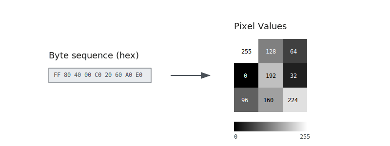

# Methodology

## Research strategy

## Experimental setup

### Datasets

This thesis utilizes two primary datasets: ISAdetect and CpuRec, both sourced from previous work in software reverse engineering. These datasets contain samples of binary programs from a variety of different \acp{ISA}. Architectures varies in similarity in terms of features like endianness, word- and instruction size, and our model development focuses on the ability to reliably detect architectural features independent of the specific \ac{ISA}. The choice of datasets is therefore mostly motivated by architectural diversity, in order to reduce the potential correlation between the groups of \acp{ISA} and the features we aim to detect. In addition, binary programs are not human-readable, and errors and inconsistencies in the data are difficult to detect. We are reliant on accurate labeling in datasets to ensure proper results. From our search, we have found that the combination of datasets ISAdetect and CpuRec strikes a good balance between the number of present architectures and volume of training data. They complement each other in a way that fits our research criteria, and have been validated in previous research.

#### ISADetect

The ISAdetect dataset is the product of a masters thesis by Sami Kairajärvi and the resulting paper: "Towards usable automated detection of CPU architecture and endianness for arbitrary binary files and object code sequences" [source]. A part of their contributions is providing, to our knowledge, the most comprehensive publicly available dataset of binary programs from different \acp{ISA} to date. All of their program binaries are collected from Debian Linux repositories, selected due to the Debian distribution being a trusted project and ported to a wide varity of \acp{ISA}. This resulted in a dataset consisting of 23 different architectures. Kairajärvi et al. also focused on tackling the dataset imbalances seen in Clemens' work, and each architecture contains roughly 3000 binary program samples [source].

The ISAdetect dataset is publicly available through etsin.fairdata.fi [source]. This study utilizes the most recent version, Version 6, released March 29. 2020. The dataset is distributed as a compressed archive (new_new_dataset/ISAdetect_full_dataset.tar.gz) containing both complete program binaries and code-only sections for each architecture. Additionally, all of \ac{ISA} folder contains a JSON file with detailed metadata for each individual binary, including properties such as endianness and wordsize.

#### CpuRec

The CpuRec dataset is a collection of executable code-only sections extracted from binaries of 72 different architectures, developed by Louis Granboulan for use with the cpu_rec tool [source]. The cpu_rec uses Markov-chains and Kullback-Leibler divergence with the dataset in order to classify the ISA of an input binary [source]. Even though only one binary per architecture is provided, which is likely insufficient for training a deep learning model on its own, the diversity of ISAs represented makes the dataset an excellent test set for evaluating our model.

The cpu_rec tool-suite is available on github, and the binaries used in the thesis are available as under cpu_rec_corpus directory [source]. The dataset was curated from multiple sources. A significant portion of the binaries were sourced from Debian distributions, where more common architectures like x86, x86_64, m68k, PowerPC, and SPARC are available. For less common architectures, binaries were collected from the Columbia University Kermit archive, which provided samples for architectures like M88k, HP-Focus, Cray, VAX, and PDP-11. The remaining samples were obtained through compilation open-source projects using a gcc cross-compiler. While many of the more common ISAs were packaged using standard file-headers, some of the binaries had undocumented .text sections, where the author had to make educated guesses in order to identify code [source].

#### Labeling

<!-- from Andressen master. own section or in both cpu-rec and isadetect  -->

### Technical configuration

## Machine learning models

This research will primarily involve training, validating, and evaluating \ac{CNN} models using ISA characteristics such as endianness, word size, and instruction length as the target features. This subsection outlines our approach to data preprocessing, model architecture selection, and validation techniques.

### Data preprocessing

While most \ac{CNN} architectures are designed for image data, our datasets consist of compiled binary executables. Thus, how these are encoded into a format that can be consumed by a \ac{CNN} is a crucial part of our method. In our experiments, we use two different approaches for image encoding.

#### Two-dimensional byte-level encoding

We treat each byte value as an integer whose value range from 0 to 255. The values are placed in a two-dimensional array of a predetermined size. If the file is larger than the predetermined size, only the first bytes are used. If the file is smaller than the predetermined size, the remaining bytes are padded with zero values.

When applying two-dimensional \ac{CNN} on 2D grids of this format, the byte values will essentially be treated as pixel values, where the byte sequence forms a grayscale image. Figure \ref{fig:byte-encoding} shows an example of a 9-byte sequence encoded as a 3x3 pixel grayscale image.

This approach was chosen based on previous literature which successfully classified malware from binary executables using \acp{CNN} [@Kumari2017] [@Prima2021] [@Hammad2022] [@Al-Masri2024] [@El-Shafai2021] [@Alvee2021] [@Liang2021] [@Son2022].

#### One-dimensional byte-level encoding

Similar to the 2D approach, we treat each byte as an integer. The values are placed in a one-dimensional array of a predetermined size. If the file is larger than the predetermined size, only the first bytes are used. If the file is smaller than the predetermined size, the remaining bytes are padded with zero values.

This approach was chosen based on previous literature which successfully detected compiler optimization levels in binary executables using 1D \acp{CNN} [@Yang2019] [@Pizzolotto2021].

### Model architectures

Our research will explore various \ac{CNN} architectures to determine the most effective approach for ISA detection. We will train and validate several models while experimenting with the following architectural choices.

#### CNN size and complexity

The size of the \ac{CNN} determines the amount of computation required to train the model. While we have significant amounts of computation power available, we will need to balance the computational complexity of the model with the available resources as well as the size and diversity of our dataset. We will also experiment with both one-dimensional and two-dimensional \ac{CNN} architectures to determine the most effective approach for our dataset.

#### Embedding layers

An embedding layer transforms categorical data into vectors of continuous numbers. We attempt treating each byte value as a category, and use an embedding layer at the beginning of the \ac{CNN}. Instead of treating the byte values as numbers, this allows the model to learn the characteristics of each byte value and represent it mathematically.

#### Transfer learning

Transfer learning is a machine learning technique where a model developed for one task is re-used for another task. Transfer learning is very useful when there is little training data available, as well as in cases of limited computation power or time. Using a transfer learning approach can allow for deep networks despite these constraints. We attempt using \acp{CNN} pre-trained on ImageNet [@TODO], and use fine-tuning and feature extraction techniques to create tailored models.

### Model training and validation

#### Leave-one-group-out cross validation

#### Hyperparameter tuning

#### Final models

## Evaluation

- CpuReq

### Baseline

- Andreassen
  - Clemens endianness heuristic
