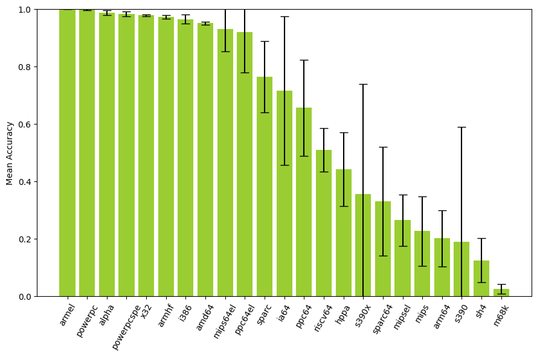

# Results

This chapter presents the results of the experiments described in \autoref{methodology}. In \autoref{endianness}, we present the results of applying our proposed model architectures to detecting endianness from a binary file. In \autoref{instruction-width-type}, we present the results of applying the same model architectures to detecting whether a binary file has fixed-length or variable-length instructions (hereby referred to as _instruction width type_).

Each section in this chapter is organized as followed: first, each subsection applies one of the proposed experiments from \autoref{experiments} and presents the performance numbers for each \ac{ISA} in the dataset. We present the results both for using \acf{LOGO CV} on the ISADetect dataset (described in \autoref{leave-one-group-out-cross-validation-on-isadetect-dataset}), and for using ISADetect for training and other datasets for testing (described in \autoref{testing-on-other-datasets}). Finally, a summary subsection aggregates the performance across \acp{ISA} and compares the different model architectures.

## Endianness

This section evaluates and compares the performance the proposed \ac{CNN} models in accurately identifying the endianness of binary files.

### Simple 1D CNN

TODO

### Simple 1D CNN with embedding layer

This subsection presents the results of applying the Simple1dEmbedding model specified in \autoref{simple-1d-cnn-with-embedding-layer} to endianness classification.

We run \acf{LOGO CV} on ISADetect, repeating the process 20 times with different random seeds. The per-\ac{ISA} results are aggregated across the 20 runs. The results are shown in \autoref{table:logo-endianness-simple1dembedding-results} and \autoref{fig:logo-endianness-simple1dembedding-results}. The bars represent the mean accuracy, and the error markers show one standard deviation above and below the mean. We observe an overall mean accuracy of 91.3% and a standard deviation of 1.9% across all \acp{ISA}.

Table: Classifying endianness with Simple1dEmbedding \label{table:logo-endianness-simple1dembedding-results}

| Architecture | Mean Accuracy | Standard Deviation |
| ------------ | ------------: | -----------------: |
| ppc64el      |         1.000 |              0.000 |
| powerpcspe   |         1.000 |              0.000 |
| s390x        |         1.000 |              0.000 |
| powerpc      |         1.000 |              0.000 |
| x32          |         1.000 |              0.000 |
| sparc        |         1.000 |              0.000 |
| mipsel       |         0.999 |              0.002 |
| s390         |         0.998 |              0.003 |
| amd64        |         0.997 |              0.007 |
| i386         |         0.994 |              0.008 |
| alpha        |         0.990 |              0.020 |
| armel        |         0.989 |              0.021 |
| sh4          |         0.980 |              0.026 |
| sparc64      |         0.969 |              0.017 |
| armhf        |         0.968 |              0.022 |
| riscv64      |         0.958 |              0.059 |
| ppc64        |         0.949 |              0.081 |
| mips64el     |         0.939 |              0.101 |
| mips         |         0.934 |              0.068 |
| ia64         |         0.885 |              0.036 |
| hppa         |         0.817 |              0.145 |
| arm64        |         0.645 |              0.310 |
| m68k         |         0.065 |              0.123 |
| **Overall**  |     **0.913** |          **0.019** |

### Simple 2D CNN

TODO

### Simple 2D CNN with embedding layer

TODO

| Architecture | Mean Accuracy | Standard Deviation |
| ------------ | ------------: | -----------------: |
| powerpc      |         1.000 |              0.000 |
| ppc64el      |         1.000 |              0.000 |
| powerpcspe   |         1.000 |              0.000 |
| s390x        |         1.000 |              0.000 |
| sparc        |         0.999 |              0.002 |
| x32          |         0.999 |              0.002 |
| mipsel       |         0.998 |              0.002 |
| amd64        |         0.997 |              0.003 |
| mips64el     |         0.996 |              0.007 |
| s390         |         0.996 |              0.006 |
| i386         |         0.996 |              0.005 |
| armel        |         0.993 |              0.009 |
| alpha        |         0.987 |              0.023 |
| armhf        |         0.975 |              0.022 |
| mips         |         0.969 |              0.054 |
| sparc64      |         0.952 |              0.020 |
| sh4          |         0.814 |              0.302 |
| ppc64        |         0.810 |              0.215 |
| hppa         |         0.662 |              0.212 |
| riscv64      |         0.636 |              0.340 |
| ia64         |         0.584 |              0.439 |
| arm64        |         0.539 |              0.328 |
| m68k         |         0.041 |              0.089 |
| **Overall**  |     **0.861** |          **0.041** |

### ResNet50

TODO

Table: Classifying endianness with ResNet50 \label{table:resnet50-endianness-results}

| Architecture | Mean Accuracy | Standard Deviation |
| ------------ | ------------: | -----------------: |
| armel        |         1.000 |              0.000 |
| powerpc      |         0.997 |              0.001 |
| alpha        |         0.987 |              0.008 |
| powerpcspe   |         0.982 |              0.007 |
| x32          |         0.978 |              0.003 |
| armhf        |         0.972 |              0.007 |
| i386         |         0.964 |              0.016 |
| amd64        |         0.950 |              0.005 |
| mips64el     |         0.929 |              0.078 |
| ppc64el      |         0.919 |              0.141 |
| sparc        |         0.764 |              0.124 |
| ia64         |         0.715 |              0.259 |
| ppc64        |         0.655 |              0.167 |
| riscv64      |         0.508 |              0.076 |
| hppa         |         0.441 |              0.129 |
| s390x        |         0.355 |              0.384 |
| sparc64      |         0.330 |              0.189 |
| mipsel       |         0.264 |              0.089 |
| mips         |         0.226 |              0.121 |
| arm64        |         0.200 |              0.098 |
| s390         |         0.188 |              0.400 |
| sh4          |         0.124 |              0.077 |
| m68k         |         0.024 |              0.017 |
| **Overall**  |     **0.622** |          **0.019** |

### ResNet50 with embedding layer

TODO

### Summary

## Instruction width type

This section evaluates and compares the performance the proposed \ac{CNN} models in accurately identifying the instruction width type of binary files.

### Simple 1D CNN

TODO

Table: Classifying instruction width type with Simple1dCNN \label{table:logo-instructionwidthtype-simple1d-results}

| Architecture | Mean Accuracy | Standard Deviation |
| ------------ | ------------: | -----------------: |
| armel        |         1.000 |              0.000 |
| powerpc      |         1.000 |              0.000 |
| powerpcspe   |         1.000 |              0.001 |
| mips         |         0.984 |              0.018 |
| mips64el     |         0.983 |              0.020 |
| armhf        |         0.983 |              0.023 |
| x32          |         0.978 |              0.008 |
| sparc        |         0.972 |              0.077 |
| m68k         |         0.944 |              0.218 |
| mipsel       |         0.934 |              0.055 |
| amd64        |         0.930 |              0.028 |
| i386         |         0.915 |              0.054 |
| alpha        |         0.879 |              0.203 |
| ppc64        |         0.872 |              0.131 |
| sparc64      |         0.866 |              0.147 |
| arm64        |         0.858 |              0.160 |
| sh4          |         0.848 |              0.214 |
| s390         |         0.430 |              0.375 |
| hppa         |         0.201 |              0.100 |
| s390x        |         0.185 |              0.256 |
| ppc64el      |         0.142 |              0.312 |
| riscv64      |         0.097 |              0.105 |
| ia64         |         0.009 |              0.002 |
| **Overall**  |     **0.730** |          **0.030** |

### Simple 1D CNN with embedding layer

This subsection presents the results of applying the model specified in \autoref{simple-1d-cnn-with-embedding-layer} to classifying the instruction width type of a binary file.

We run \acf{LOGO CV} on ISADetect using each \ac{ISA} as the left-out group, repeating the process 20 times with different random seeds. The per-\ac{ISA} results are aggregated across the 20 runs. The results are shown in \autoref{table:logo-instructionwidthtype-simple1dembedding-results} and \autoref{fig:logo-instructionwidthtype-simple1dembedding-results}. The bars represent the mean accuracy, and the error markers show one standard deviation above and below the mean. We observe an overall mean accuracy of 85.2% and a standard deviation of 5.8% across all \acp{ISA}.

Table: Classifying instruction width type with Simple1dEmbedding \label{table:logo-instructionwidthtype-simple1dembedding-results}

| Architecture | Mean Accuracy | Standard Deviation |
| ------------ | ------------: | -----------------: |
| powerpc      |         1.000 |              0.000 |
| powerpcspe   |         1.000 |              0.000 |
| amd64        |         0.999 |              0.001 |
| sparc        |         0.999 |              0.002 |
| x32          |         0.999 |              0.001 |
| i386         |         0.993 |              0.014 |
| mips64el     |         0.993 |              0.015 |
| armel        |         0.985 |              0.014 |
| riscv64      |         0.981 |              0.035 |
| armhf        |         0.964 |              0.017 |
| sparc64      |         0.959 |              0.061 |
| mips         |         0.959 |              0.030 |
| mipsel       |         0.938 |              0.075 |
| sh4          |         0.932 |              0.174 |
| s390x        |         0.925 |              0.125 |
| s390         |         0.892 |              0.195 |
| m68k         |         0.764 |              0.370 |
| ppc64el      |         0.737 |              0.384 |
| hppa         |         0.712 |              0.360 |
| ia64         |         0.621 |              0.384 |
| ppc64        |         0.438 |              0.298 |
| arm64        |         0.383 |              0.394 |
| alpha        |         0.209 |              0.048 |
| **Overall**  |     **0.852** |          **0.058** |

### Simple 2D CNN

TODO

Table: Classifying instruction width type with Simple2dCNN \label{table:logo-instructionwidthtype-simple2d-results}

| Architecture | Mean Accuracy | Standard Deviation |
| ------------ | ------------: | -----------------: |
| powerpc      |         1.000 |              0.000 |
| mips64el     |         0.999 |              0.001 |
| armel        |         0.999 |              0.003 |
| powerpcspe   |         0.998 |              0.004 |
| arm64        |         0.995 |              0.010 |
| mipsel       |         0.988 |              0.013 |
| x32          |         0.984 |              0.007 |
| alpha        |         0.983 |              0.054 |
| mips         |         0.979 |              0.064 |
| i386         |         0.951 |              0.050 |
| amd64        |         0.938 |              0.036 |
| armhf        |         0.926 |              0.037 |
| ppc64        |         0.903 |              0.133 |
| riscv64      |         0.794 |              0.173 |
| sh4          |         0.759 |              0.215 |
| sparc64      |         0.716 |              0.140 |
| ppc64el      |         0.713 |              0.294 |
| sparc        |         0.608 |              0.167 |
| hppa         |         0.436 |              0.253 |
| m68k         |         0.217 |              0.337 |
| s390         |         0.195 |              0.272 |
| s390x        |         0.086 |              0.173 |
| ia64         |         0.006 |              0.003 |
| **Overall**  |     **0.729** |          **0.036** |

### Simple 2D CNN with embedding layer

TODO

| Architecture | Mean Accuracy | Standard Deviation |
| ------------ | ------------: | -----------------: |
| powerpc      |         1.000 |              0.000 |
| sparc        |         1.000 |              0.000 |
| powerpcspe   |         1.000 |              0.000 |
| riscv64      |         1.000 |              0.000 |
| sh4          |         1.000 |              0.000 |
| x32          |         0.998 |              0.001 |
| amd64        |         0.998 |              0.002 |
| armel        |         0.991 |              0.014 |
| i386         |         0.991 |              0.009 |
| sparc64      |         0.985 |              0.010 |
| mips64el     |         0.984 |              0.034 |
| armhf        |         0.974 |              0.013 |
| m68k         |         0.947 |              0.091 |
| mips         |         0.912 |              0.080 |
| mipsel       |         0.895 |              0.156 |
| s390         |         0.869 |              0.267 |
| hppa         |         0.819 |              0.200 |
| ppc64el      |         0.767 |              0.336 |
| s390x        |         0.751 |              0.402 |
| arm64        |         0.345 |              0.342 |
| ppc64        |         0.297 |              0.310 |
| alpha        |         0.270 |              0.131 |
| ia64         |         0.233 |              0.406 |
| **Overall**  |     **0.837** |          **0.031** |

### ResNet50

TODO

| Architecture | Mean Accuracy | Standard Deviation |
| ------------ | ------------: | -----------------: |
| powerpc      |         0.999 |              0.000 |
| armel        |         0.997 |              0.002 |
| powerpcspe   |         0.992 |              0.012 |
| mipsel       |         0.986 |              0.001 |
| mips         |         0.985 |              0.011 |
| arm64        |         0.984 |              0.009 |
| ppc64el      |         0.970 |              0.027 |
| x32          |         0.968 |              0.003 |
| hppa         |         0.961 |              0.046 |
| armhf        |         0.950 |              0.013 |
| sh4          |         0.938 |              0.114 |
| sparc64      |         0.893 |              0.077 |
| mips64el     |         0.871 |              0.070 |
| amd64        |         0.866 |              0.006 |
| riscv64      |         0.859 |              0.057 |
| i386         |         0.838 |              0.040 |
| m68k         |         0.812 |              0.171 |
| ppc64        |         0.776 |              0.163 |
| sparc        |         0.756 |              0.172 |
| s390x        |         0.561 |              0.370 |
| alpha        |         0.332 |              0.314 |
| s390         |         0.326 |              0.393 |
| ia64         |         0.001 |              0.001 |
| **Overall**  |     **0.798** |          **0.040** |

### ResNet50 with embedding layer

TODO

### Summary
