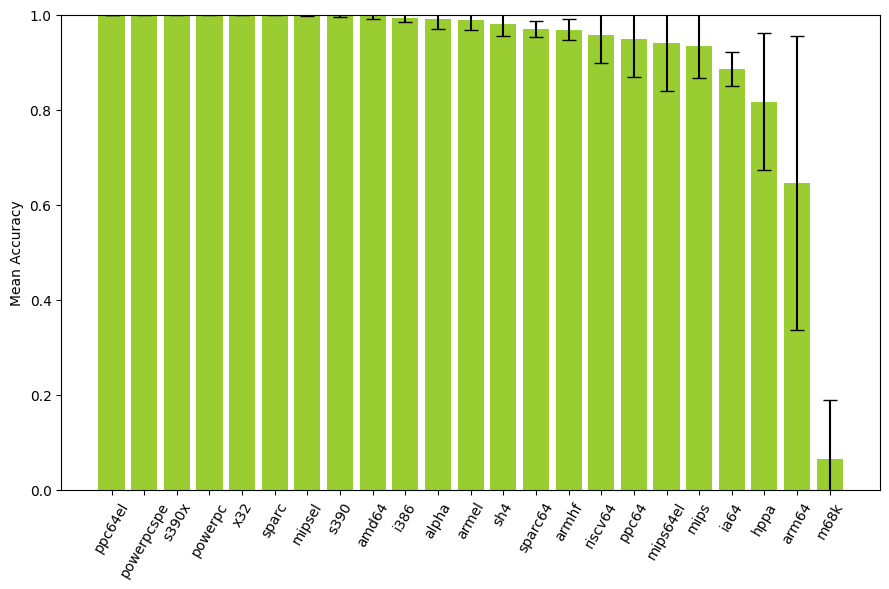
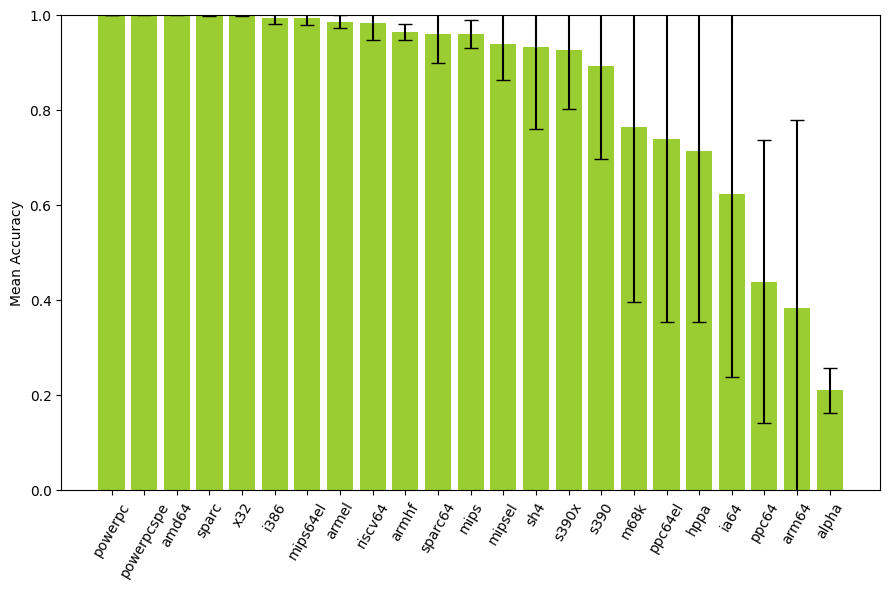

# Results

## Endianness

This section evaluates and compares the performance the various \ac{CNN} models in accurately identifying the endianness of binary files.

### 1D CNN with embedding layer

This subsection presents the results of applying the model specified in \autoref{simple-1d-cnn-with-embedding-layer} to endianness classification.

We run \acf{LOGO CV} on ISADetect using each \ac{ISA} as the left-out group, repeating the process 20 times with different random seeds. The per-\ac{ISA} results are aggregated across the 20 runs. The results are shown in \autoref{table:logo-endianness-1d-embedding-results} and \autoref{fig:logo-endianness-1d-embedding-results}. The bars represent the mean accuracy, and the error markers show one standard deviation above and below the mean. We observe an overall mean accuracy of 91.3% and a standard deviation of 1.9% across all \acp{ISA}.

Table: Classifying endianness with 1D CNN with embedding layer \label{table:logo-endianness-1d-embedding-results}

| Architecture | Mean Accuracy | Standard Deviation |
| ------------ | ------------: | -----------------: |
| ppc64el      |         1.000 |              0.000 |
| powerpcspe   |         1.000 |              0.000 |
| s390x        |         1.000 |              0.000 |
| powerpc      |         1.000 |              0.000 |
| x32          |         1.000 |              0.000 |
| sparc        |         1.000 |              0.000 |
| mipsel       |         0.999 |              0.002 |
| s390         |         0.998 |              0.003 |
| amd64        |         0.997 |              0.007 |
| i386         |         0.994 |              0.008 |
| alpha        |         0.990 |              0.020 |
| armel        |         0.989 |              0.021 |
| sh4          |         0.980 |              0.026 |
| sparc64      |         0.969 |              0.017 |
| armhf        |         0.968 |              0.022 |
| riscv64      |         0.958 |              0.059 |
| ppc64        |         0.949 |              0.081 |
| mips64el     |         0.939 |              0.101 |
| mips         |         0.934 |              0.068 |
| ia64         |         0.885 |              0.036 |
| hppa         |         0.817 |              0.145 |
| arm64        |         0.645 |              0.310 |
| m68k         |         0.065 |              0.123 |
| **Overall**  |     **0.913** |          **0.019** |

### Summary

## Instruction width type

This section evaluates and compares the performance the various \ac{CNN} models in accurately identifying whether the instructions in a binary file are of fixed or variable width (hereby referred to as "instruction width type").

### 1D CNN with embedding layer

This subsection presents the results of applying the model specified in \autoref{simple-1d-cnn-with-embedding-layer} to classifying the instruction width type of a binary file.

We run \acf{LOGO CV} on ISADetect using each \ac{ISA} as the left-out group, repeating the process 20 times with different random seeds. The per-\ac{ISA} results are aggregated across the 20 runs. The results are shown in \autoref{table:1d-cnn-with-embedding-layer-results} and \autoref{fig:logo-instruction-width-type-1d-embedding-results}. The bars represent the mean accuracy, and the error markers show one standard deviation above and below the mean. We observe an overall mean accuracy of 85.2% and a standard deviation of 5.8% across all \acp{ISA}.

Table: Classifying instruction width type with 1D CNN with embedding layer \label{table:1d-cnn-with-embedding-layer-results}

| Architecture | Mean Accuracy | Standard Deviation |
| ------------ | ------------: | -----------------: |
| powerpc      |         1.000 |              0.000 |
| powerpcspe   |         1.000 |              0.000 |
| amd64        |         0.999 |              0.001 |
| sparc        |         0.999 |              0.002 |
| x32          |         0.999 |              0.001 |
| i386         |         0.993 |              0.014 |
| mips64el     |         0.993 |              0.015 |
| armel        |         0.985 |              0.014 |
| riscv64      |         0.981 |              0.035 |
| armhf        |         0.964 |              0.017 |
| sparc64      |         0.959 |              0.061 |
| mips         |         0.959 |              0.030 |
| mipsel       |         0.938 |              0.075 |
| sh4          |         0.932 |              0.174 |
| s390x        |         0.925 |              0.125 |
| s390         |         0.892 |              0.195 |
| m68k         |         0.764 |              0.370 |
| ppc64el      |         0.737 |              0.384 |
| hppa         |         0.712 |              0.360 |
| ia64         |         0.621 |              0.384 |
| ppc64        |         0.438 |              0.298 |
| arm64        |         0.383 |              0.394 |
| alpha        |         0.209 |              0.048 |
| **Overall**  |     **0.852** |          **0.058** |

