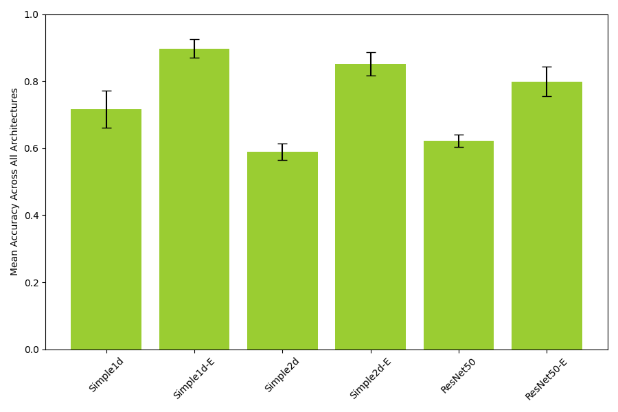
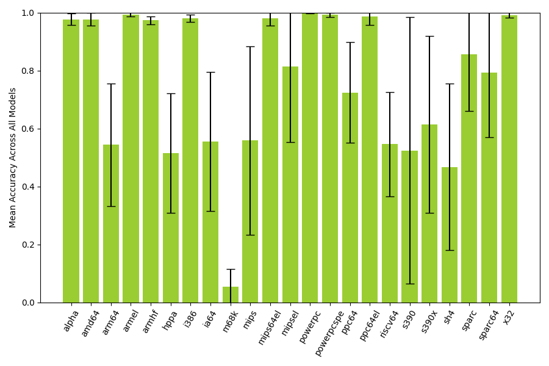
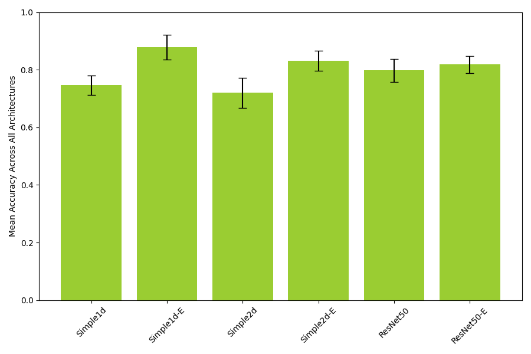
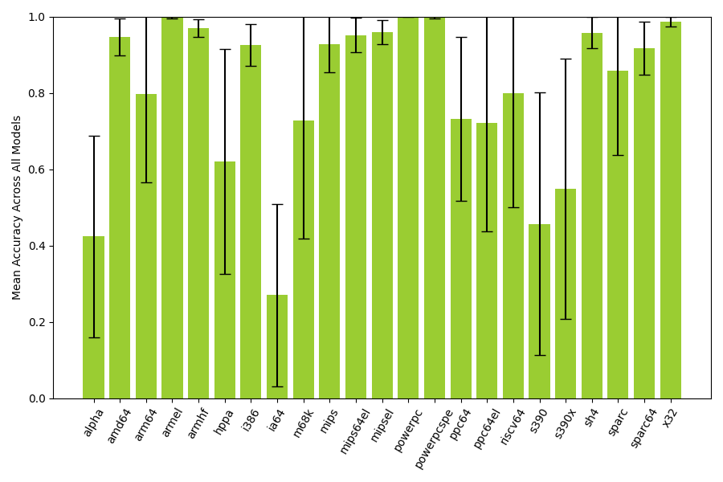

# Results

This chapter presents the results of the experiments described in \autoref{methodology}. In \autoref{endianness}, we present the results of applying our proposed model architectures to detecting endianness from a binary file. In \autoref{instruction-width-type}, we present the results of applying the same model architectures to detecting whether a binary file has fixed-length or variable-length instructions (hereby referred to as _instruction width type_).

## Endianness

This section evaluates and compares the performance of the proposed \ac{CNN} models (described in \autoref{model-architectures}) in detecting the endianness of binary files.

\small

Table: Endianness classification performance. \label{table:logo-endianness-results}

| ISA         |        Simple1d |      Simple1d-E |        Simple2d |      Simple2d-E |        ResNet50 |      ResNet50-E |
| ----------- | --------------: | --------------: | --------------: | --------------: | --------------: | --------------: |
| alpha       |     0.996±0.003 |     0.954±0.051 |     1.000±0.000 |     0.949±0.056 |     0.987±0.008 |     0.974±0.046 |
| amd64       |     0.979±0.016 |     0.995±0.010 |     0.944±0.015 |     0.998±0.004 |     0.950±0.005 |     0.995±0.005 |
| arm64       |     0.777±0.251 |     0.791±0.207 |     0.365±0.134 |     0.581±0.287 |     0.200±0.098 |     0.547±0.309 |
| armel       |     1.000±0.000 |     0.992±0.009 |     1.000±0.000 |     0.985±0.019 |     1.000±0.000 |     0.985±0.017 |
| armhf       |     0.946±0.023 |     0.985±0.015 |     0.981±0.013 |     0.978±0.020 |     0.972±0.007 |     0.976±0.018 |
| hppa        |     0.491±0.312 |     0.717±0.261 |     0.121±0.042 |     0.729±0.146 |     0.441±0.129 |     0.591±0.207 |
| i386        |     0.970±0.021 |     0.998±0.003 |     0.978±0.023 |     0.997±0.005 |     0.964±0.016 |     0.977±0.016 |
| ia64        |     0.604±0.488 |     0.792±0.283 |     0.060±0.070 |     0.662±0.423 |     0.715±0.259 |     0.494±0.327 |
| m68k        |     0.174±0.315 |     0.094±0.202 |     0.000±0.000 |     0.014±0.038 |     0.024±0.017 |     0.013±0.015 |
| mips        |     0.178±0.189 |     0.972±0.035 |     0.352±0.143 |     0.946±0.071 |     0.226±0.121 |     0.673±0.180 |
| mips64el    |     0.995±0.004 |     0.998±0.002 |     1.000±0.000 |     0.999±0.001 |     0.929±0.078 |     0.963±0.055 |
| mipsel      |     0.866±0.079 |     0.996±0.007 |     0.766±0.073 |     0.999±0.002 |     0.264±0.089 |     0.989±0.009 |
| powerpc     |     0.999±0.001 |     1.000±0.000 |     0.998±0.002 |     1.000±0.000 |     0.997±0.001 |     1.000±0.001 |
| powerpcspe  |     0.988±0.007 |     1.000±0.000 |     0.982±0.013 |     1.000±0.000 |     0.982±0.007 |     0.999±0.002 |
| ppc64       |     0.861±0.128 |     0.844±0.151 |     0.905±0.129 |     0.682±0.294 |     0.655±0.167 |     0.395±0.315 |
| ppc64el     |     1.000±0.000 |     1.000±0.000 |     1.000±0.000 |     1.000±0.000 |     0.919±0.141 |     0.998±0.004 |
| riscv64     |     0.426±0.165 |     0.777±0.287 |     0.246±0.182 |     0.585±0.346 |     0.508±0.076 |     0.730±0.359 |
| s390        |     0.010±0.030 |     0.997±0.005 |     0.004±0.001 |     0.995±0.008 |     0.188±0.400 |     0.951±0.032 |
| s390x       |     0.532±0.331 |     1.000±0.000 |     0.133±0.240 |     0.909±0.233 |     0.355±0.384 |     0.751±0.212 |
| sh4         |     0.243±0.281 |     0.861±0.221 |     0.199±0.221 |     0.729±0.357 |     0.124±0.077 |     0.644±0.165 |
| sparc       |     0.994±0.012 |     0.999±0.001 |     0.460±0.308 |     0.999±0.001 |     0.764±0.124 |     0.912±0.117 |
| sparc64     |     0.949±0.032 |     0.976±0.010 |     0.723±0.098 |     0.945±0.016 |     0.330±0.189 |     0.837±0.185 |
| x32         |     0.991±0.003 |     0.999±0.001 |     0.981±0.010 |     1.000±0.000 |     0.978±0.003 |     0.999±0.001 |
| **Overall** | **0.717±0.055** | **0.897±0.028** | **0.589±0.024** | **0.851±0.036** | **0.622±0.019** | **0.799±0.044** |

\normalsize

## Instruction width type

This section evaluates and compares the performance of the proposed \ac{CNN} models (described in \autoref{model-architectures}) in detecting the instruction width type of binary files.

\small

Table: Instruction width type classification performance. \label{table:logo-instructionwidthtype-results}

| ISA         |        Simple1d |      Simple1d-E |        Simple2d |      Simple2d-E |        ResNet50 |      ResNet50-E |
| ----------- | --------------: | --------------: | --------------: | --------------: | --------------: | --------------: |
| alpha       |     0.982±0.057 |     0.248±0.065 |     0.492±0.239 |     0.239±0.071 |     0.332±0.314 |     0.247±0.128 |
| amd64       |     0.928±0.023 |     0.995±0.008 |     0.912±0.036 |     0.999±0.001 |     0.866±0.006 |     0.978±0.014 |
| arm64       |     0.856±0.141 |     0.484±0.299 |     0.997±0.005 |     0.467±0.327 |     0.984±0.009 |     0.987±0.004 |
| armel       |     1.000±0.000 |     0.996±0.004 |     1.000±0.000 |     0.994±0.008 |     0.997±0.002 |     0.994±0.005 |
| armhf       |     0.994±0.008 |     0.980±0.012 |     0.928±0.022 |     0.981±0.013 |     0.950±0.013 |     0.984±0.012 |
| hppa        |     0.206±0.071 |     0.846±0.249 |     0.230±0.102 |     0.722±0.334 |     0.961±0.046 |     0.754±0.362 |
| i386        |     0.897±0.050 |     0.997±0.004 |     0.896±0.060 |     0.989±0.014 |     0.838±0.040 |     0.935±0.035 |
| ia64        |     0.011±0.003 |     0.556±0.398 |     0.603±0.477 |     0.164±0.345 |     0.001±0.001 |     0.284±0.318 |
| m68k        |     0.993±0.008 |     0.856±0.305 |     0.072±0.143 |     0.944±0.164 |     0.812±0.171 |     0.684±0.349 |
| mips        |     0.987±0.009 |     0.851±0.261 |     0.996±0.009 |     0.806±0.139 |     0.985±0.011 |     0.945±0.070 |
| mips64el    |     0.987±0.012 |     0.997±0.005 |     0.992±0.009 |     0.925±0.141 |     0.871±0.070 |     0.935±0.090 |
| mipsel      |     0.918±0.048 |     0.946±0.066 |     0.993±0.006 |     0.924±0.107 |     0.986±0.001 |     0.992±0.009 |
| powerpc     |     1.000±0.000 |     1.000±0.000 |     1.000±0.000 |     1.000±0.000 |     0.999±0.000 |     1.000±0.001 |
| powerpcspe  |     1.000±0.000 |     1.000±0.000 |     0.999±0.001 |     1.000±0.000 |     0.992±0.012 |     1.000±0.000 |
| ppc64       |     0.957±0.050 |     0.642±0.208 |     0.839±0.161 |     0.301±0.206 |     0.776±0.163 |     0.871±0.119 |
| ppc64el     |     0.144±0.308 |     0.823±0.366 |     0.708±0.386 |     0.682±0.419 |     0.970±0.027 |     0.999±0.001 |
| riscv64     |     0.161±0.125 |     1.000±0.000 |     0.774±0.280 |     1.000±0.000 |     0.859±0.057 |     0.997±0.004 |
| s390        |     0.427±0.342 |     0.983±0.034 |     0.094±0.135 |     0.833±0.341 |     0.326±0.393 |     0.078±0.118 |
| s390x       |     0.186±0.265 |     0.986±0.027 |     0.161±0.309 |     0.997±0.003 |     0.561±0.370 |     0.399±0.433 |
| sh4         |     0.897±0.206 |     0.920±0.165 |     0.993±0.020 |     1.000±0.001 |     0.938±0.114 |     0.998±0.003 |
| sparc       |     0.996±0.005 |     1.000±0.000 |     0.402±0.185 |     1.000±0.000 |     0.756±0.172 |     0.997±0.005 |
| sparc64     |     0.903±0.095 |     0.960±0.038 |     0.782±0.077 |     0.965±0.027 |     0.893±0.077 |     0.993±0.008 |
| x32         |     0.973±0.005 |     0.999±0.001 |     0.986±0.003 |     0.999±0.001 |     0.968±0.003 |     0.993±0.005 |
| **Overall** | **0.747±0.034** | **0.878±0.043** | **0.720±0.052** | **0.831±0.035** | **0.798±0.040** | **0.818±0.030** |

\normalsize

