# Results

This chapter presents the results of the experiments described in \autoref{methodology}. In \autoref{endianness}, we present the results of applying our proposed model architectures to detecting endianness from a binary file. In \autoref{instruction-width-type}, we present the results of applying the same model architectures to detecting whether a binary file has fixed-length or variable-length instructions (hereby referred to as _instruction width type_).

Each section in this chapter is organized as followed: first, each subsection applies one of the proposed experiments from \autoref{experiments} and presents the performance numbers for each \ac{ISA} in the dataset. We present the results both for using \acf{LOGO CV} on the ISADetect dataset (described in \autoref{leave-one-group-out-cross-validation-on-isadetect-dataset}), and for using ISADetect for training and other datasets for testing (described in \autoref{testing-on-other-datasets}). Finally, a summary subsection aggregates the performance across \acp{ISA} and compares the different model architectures.

## Endianness

This section evaluates and compares the performance the proposed \ac{CNN} models in accurately identifying the endianness of binary files.

### Simple 1D CNN

Table: Classifying endianness with Simple1d \label{table:logo-endianness-simple1d-results}

| Architecture | Mean Accuracy | Standard Deviation |
| ------------ | ------------: | -----------------: |
| ppc64el      |         1.000 |              0.000 |
| armel        |         1.000 |              0.000 |
| powerpc      |         0.999 |              0.001 |
| alpha        |         0.996 |              0.003 |
| mips64el     |         0.995 |              0.004 |
| sparc        |         0.994 |              0.012 |
| x32          |         0.991 |              0.003 |
| powerpcspe   |         0.988 |              0.007 |
| amd64        |         0.979 |              0.016 |
| i386         |         0.970 |              0.021 |
| sparc64      |         0.949 |              0.032 |
| armhf        |         0.946 |              0.023 |
| mipsel       |         0.866 |              0.079 |
| ppc64        |         0.861 |              0.128 |
| arm64        |         0.777 |              0.251 |
| ia64         |         0.604 |              0.488 |
| s390x        |         0.532 |              0.331 |
| hppa         |         0.491 |              0.312 |
| riscv64      |         0.426 |              0.165 |
| sh4          |         0.243 |              0.281 |
| mips         |         0.178 |              0.189 |
| m68k         |         0.174 |              0.315 |
| s390         |         0.010 |              0.030 |
| **Overall**  |     **0.717** |          **0.055** |

### Simple 1D CNN with embedding layer

This subsection presents the results of applying the Simple1dEmbedding model specified in \autoref{simple-1d-cnn-with-embedding-layer} to endianness classification.

We run \acf{LOGO CV} on ISADetect, repeating the process 10 times with different random seeds. The per-\ac{ISA} results are aggregated across the 10 runs. The results are shown in \autoref{table:logo-endianness-simple1dembedding-results} and \autoref{fig:logo-endianness-simple1dembedding-results}. The bars represent the mean accuracy, and the error markers show one standard deviation above and below the mean. We observe an overall mean accuracy of 91.3% and a standard deviation of 1.9% across all \acp{ISA}.

Table: Classifying endianness with Simple1dEmbedding \label{table:logo-endianness-simple1dembedding-results}

| Architecture | Mean Accuracy | Standard Deviation |
| ------------ | ------------: | -----------------: |
| s390x        |         1.000 |              0.000 |
| ppc64el      |         1.000 |              0.000 |
| powerpc      |         1.000 |              0.000 |
| powerpcspe   |         1.000 |              0.000 |
| sparc        |         0.999 |              0.001 |
| x32          |         0.999 |              0.001 |
| mips64el     |         0.998 |              0.002 |
| i386         |         0.998 |              0.003 |
| s390         |         0.997 |              0.005 |
| mipsel       |         0.996 |              0.007 |
| amd64        |         0.995 |              0.010 |
| armel        |         0.992 |              0.009 |
| armhf        |         0.985 |              0.015 |
| sparc64      |         0.976 |              0.010 |
| mips         |         0.972 |              0.035 |
| alpha        |         0.954 |              0.051 |
| sh4          |         0.861 |              0.221 |
| ppc64        |         0.844 |              0.151 |
| ia64         |         0.792 |              0.283 |
| arm64        |         0.791 |              0.207 |
| riscv64      |         0.777 |              0.287 |
| hppa         |         0.717 |              0.261 |
| m68k         |         0.094 |              0.202 |
| **Overall**  |     **0.897** |          **0.028** |

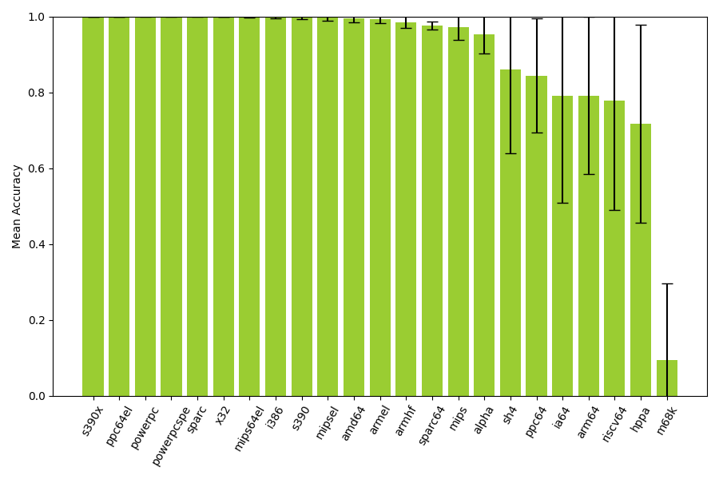

### Simple 2D CNN

TODO

Table: Classifying endianness with Simple2dCNN \label{table:logo-endianness-simple2d-results}

| Architecture | Mean Accuracy | Standard Deviation |
| ------------ | ------------: | -----------------: |
| armel        |         1.000 |              0.000 |
| alpha        |         1.000 |              0.000 |
| mips64el     |         1.000 |              0.000 |
| ppc64el      |         1.000 |              0.000 |
| powerpc      |         0.998 |              0.002 |
| powerpcspe   |         0.982 |              0.013 |
| x32          |         0.981 |              0.010 |
| armhf        |         0.981 |              0.013 |
| i386         |         0.978 |              0.023 |
| amd64        |         0.944 |              0.015 |
| ppc64        |         0.905 |              0.129 |
| mipsel       |         0.766 |              0.073 |
| sparc64      |         0.723 |              0.098 |
| sparc        |         0.460 |              0.308 |
| arm64        |         0.365 |              0.134 |
| mips         |         0.352 |              0.143 |
| riscv64      |         0.246 |              0.182 |
| sh4          |         0.199 |              0.221 |
| s390x        |         0.133 |              0.240 |
| hppa         |         0.121 |              0.042 |
| ia64         |         0.060 |              0.070 |
| s390         |         0.004 |              0.001 |
| m68k         |         0.000 |              0.000 |
| **Overall**  |     **0.589** |          **0.024** |

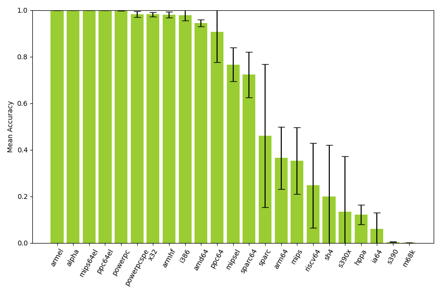

### Simple 2D CNN with embedding layer

TODO

Table: Classifying endianness with Simple2dEmbedding \label{table:logo-endianness-simple2dembedding-results}

| Architecture | Mean Accuracy | Standard Deviation |
| ------------ | ------------: | -----------------: |
| powerpc      |         1.000 |              0.000 |
| ppc64el      |         1.000 |              0.000 |
| powerpcspe   |         1.000 |              0.000 |
| x32          |         1.000 |              0.000 |
| mipsel       |         0.999 |              0.002 |
| sparc        |         0.999 |              0.001 |
| mips64el     |         0.999 |              0.001 |
| amd64        |         0.998 |              0.004 |
| i386         |         0.997 |              0.005 |
| s390         |         0.995 |              0.008 |
| armel        |         0.985 |              0.019 |
| armhf        |         0.978 |              0.020 |
| alpha        |         0.949 |              0.056 |
| mips         |         0.946 |              0.071 |
| sparc64      |         0.945 |              0.016 |
| s390x        |         0.909 |              0.233 |
| sh4          |         0.729 |              0.357 |
| hppa         |         0.729 |              0.146 |
| ppc64        |         0.682 |              0.294 |
| ia64         |         0.662 |              0.423 |
| riscv64      |         0.585 |              0.346 |
| arm64        |         0.581 |              0.287 |
| m68k         |         0.014 |              0.038 |
| **Overall**  |     **0.851** |          **0.036** |

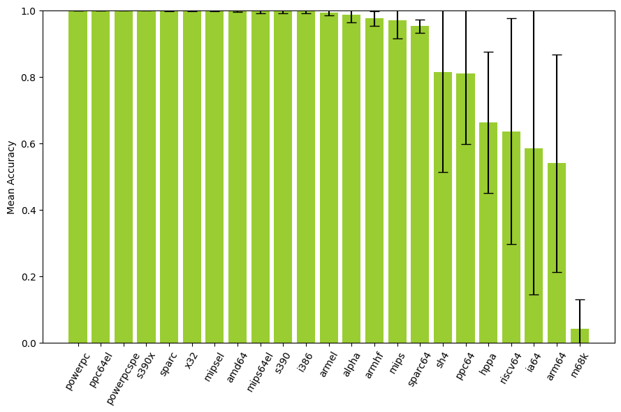

### ResNet50

TODO

Table: Classifying endianness with ResNet50 \label{table:logo-endianness-resnet50-results}

| Architecture | Mean Accuracy | Standard Deviation |
| ------------ | ------------: | -----------------: |
| armel        |         1.000 |              0.000 |
| powerpc      |         0.997 |              0.001 |
| alpha        |         0.987 |              0.008 |
| powerpcspe   |         0.982 |              0.007 |
| x32          |         0.978 |              0.003 |
| armhf        |         0.972 |              0.007 |
| i386         |         0.964 |              0.016 |
| amd64        |         0.950 |              0.005 |
| mips64el     |         0.929 |              0.078 |
| ppc64el      |         0.919 |              0.141 |
| sparc        |         0.764 |              0.124 |
| ia64         |         0.715 |              0.259 |
| ppc64        |         0.655 |              0.167 |
| riscv64      |         0.508 |              0.076 |
| hppa         |         0.441 |              0.129 |
| s390x        |         0.355 |              0.384 |
| sparc64      |         0.330 |              0.189 |
| mipsel       |         0.264 |              0.089 |
| mips         |         0.226 |              0.121 |
| arm64        |         0.200 |              0.098 |
| s390         |         0.188 |              0.400 |
| sh4          |         0.124 |              0.077 |
| m68k         |         0.024 |              0.017 |
| **Overall**  |     **0.622** |          **0.019** |

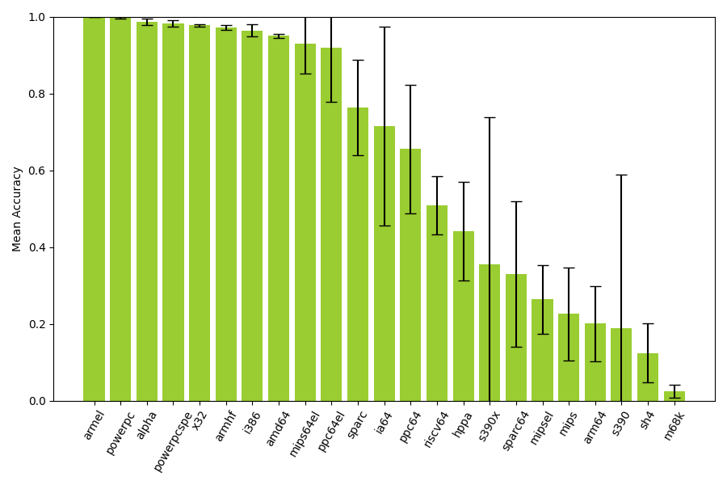

### ResNet50 with embedding layer

TODO

Table: Classifying endianness with ResNet50Embedding \label{table:logo-endianness-resnet50embedding-results}

| Architecture | Mean Accuracy | Standard Deviation |
| ------------ | ------------: | -----------------: |
| powerpc      |         1.000 |              0.001 |
| x32          |         0.999 |              0.001 |
| powerpcspe   |         0.999 |              0.002 |
| ppc64el      |         0.998 |              0.004 |
| amd64        |         0.995 |              0.005 |
| mipsel       |         0.989 |              0.009 |
| armel        |         0.985 |              0.017 |
| i386         |         0.977 |              0.016 |
| armhf        |         0.976 |              0.018 |
| alpha        |         0.974 |              0.046 |
| mips64el     |         0.963 |              0.055 |
| s390         |         0.951 |              0.032 |
| sparc        |         0.912 |              0.117 |
| sparc64      |         0.837 |              0.185 |
| s390x        |         0.751 |              0.212 |
| riscv64      |         0.730 |              0.359 |
| mips         |         0.673 |              0.180 |
| sh4          |         0.644 |              0.165 |
| hppa         |         0.591 |              0.207 |
| arm64        |         0.547 |              0.309 |
| ia64         |         0.494 |              0.327 |
| ppc64        |         0.395 |              0.315 |
| m68k         |         0.013 |              0.015 |
| **Overall**  |     **0.799** |          **0.044** |

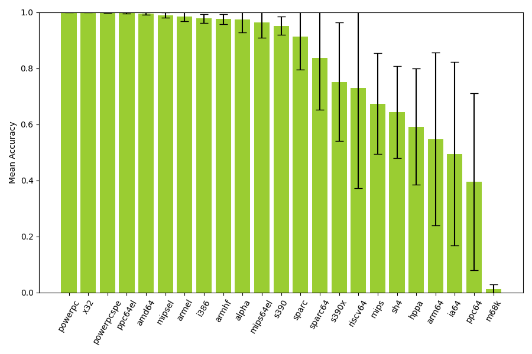

### Summary

TODO

## Instruction width type

This section evaluates and compares the performance the proposed \ac{CNN} models in accurately identifying the instruction width type of binary files.

### Simple 1D CNN

TODO

Table: Classifying instruction width type with Simple1dCNN \label{table:logo-instructionwidthtype-simple1d-results}

| Architecture | Mean Accuracy | Standard Deviation |
| ------------ | ------------: | -----------------: |
| armel        |         1.000 |              0.000 |
| powerpc      |         1.000 |              0.000 |
| powerpcspe   |         1.000 |              0.000 |
| sparc        |         0.996 |              0.005 |
| armhf        |         0.994 |              0.008 |
| m68k         |         0.993 |              0.008 |
| mips64el     |         0.987 |              0.012 |
| mips         |         0.987 |              0.009 |
| alpha        |         0.982 |              0.057 |
| x32          |         0.973 |              0.005 |
| ppc64        |         0.957 |              0.050 |
| amd64        |         0.928 |              0.023 |
| mipsel       |         0.918 |              0.048 |
| sparc64      |         0.903 |              0.095 |
| sh4          |         0.897 |              0.206 |
| i386         |         0.897 |              0.050 |
| arm64        |         0.856 |              0.141 |
| s390         |         0.427 |              0.342 |
| hppa         |         0.206 |              0.071 |
| s390x        |         0.186 |              0.265 |
| riscv64      |         0.161 |              0.125 |
| ppc64el      |         0.144 |              0.308 |
| ia64         |         0.011 |              0.003 |
| **Overall**  |     **0.747** |          **0.034** |

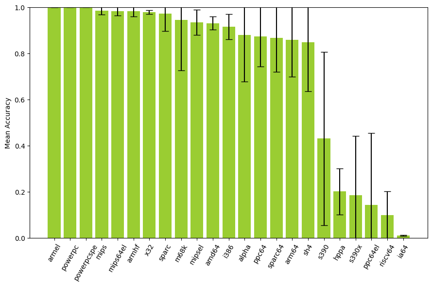

### Simple 1D CNN with embedding layer

This subsection presents the results of applying the model specified in \autoref{simple-1d-cnn-with-embedding-layer} to classifying the instruction width type of a binary file.

We run \acf{LOGO CV} on ISADetect using each \ac{ISA} as the left-out group, repeating the process 20 times with different random seeds. The per-\ac{ISA} results are aggregated across the 20 runs. The results are shown in \autoref{table:logo-instructionwidthtype-simple1dembedding-results} and \autoref{fig:logo-instructionwidthtype-simple1dembedding-results}. The bars represent the mean accuracy, and the error markers show one standard deviation above and below the mean. We observe an overall mean accuracy of 85.2% and a standard deviation of 5.8% across all \acp{ISA}.

Table: Classifying instruction width type with Simple1dEmbedding \label{table:logo-instructionwidthtype-simple1dembedding-results}

| Architecture | Mean Accuracy | Standard Deviation |
| ------------ | ------------: | -----------------: |
| powerpc      |         1.000 |              0.000 |
| riscv64      |         1.000 |              0.000 |
| sparc        |         1.000 |              0.000 |
| powerpcspe   |         1.000 |              0.000 |
| x32          |         0.999 |              0.001 |
| mips64el     |         0.997 |              0.005 |
| i386         |         0.997 |              0.004 |
| armel        |         0.996 |              0.004 |
| amd64        |         0.995 |              0.008 |
| s390x        |         0.986 |              0.027 |
| s390         |         0.983 |              0.034 |
| armhf        |         0.980 |              0.012 |
| sparc64      |         0.960 |              0.038 |
| mipsel       |         0.946 |              0.066 |
| sh4          |         0.920 |              0.165 |
| m68k         |         0.856 |              0.305 |
| mips         |         0.851 |              0.261 |
| hppa         |         0.846 |              0.249 |
| ppc64el      |         0.823 |              0.366 |
| ppc64        |         0.642 |              0.208 |
| ia64         |         0.556 |              0.398 |
| arm64        |         0.484 |              0.299 |
| alpha        |         0.248 |              0.065 |
| **Overall**  |     **0.878** |          **0.043** |

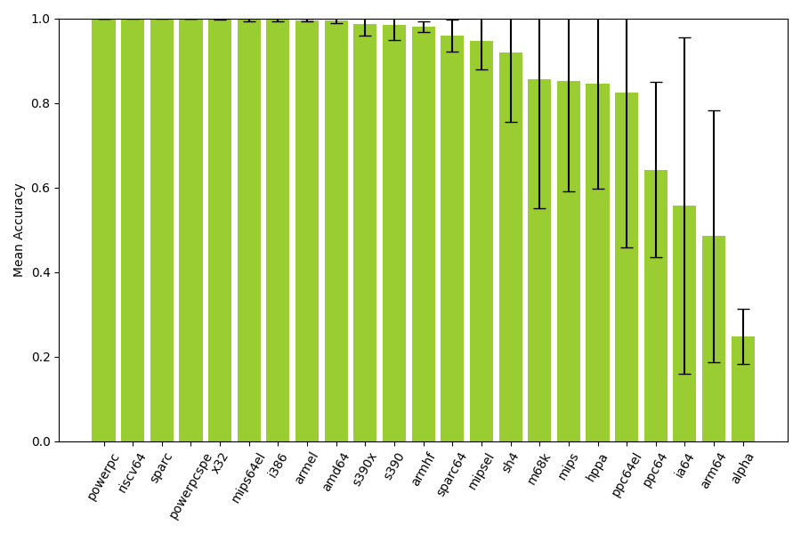

### Simple 2D CNN

TODO

Table: Classifying instruction width type with Simple2dCNN \label{table:logo-instructionwidthtype-simple2d-results}

| Architecture | Mean Accuracy | Standard Deviation |
| ------------ | ------------: | -----------------: |
| powerpc      |         1.000 |              0.000 |
| armel        |         1.000 |              0.000 |
| powerpcspe   |         0.999 |              0.001 |
| arm64        |         0.997 |              0.005 |
| mips         |         0.996 |              0.009 |
| sh4          |         0.993 |              0.020 |
| mipsel       |         0.993 |              0.006 |
| mips64el     |         0.992 |              0.009 |
| x32          |         0.986 |              0.003 |
| armhf        |         0.928 |              0.022 |
| amd64        |         0.912 |              0.036 |
| i386         |         0.896 |              0.060 |
| ppc64        |         0.839 |              0.161 |
| sparc64      |         0.782 |              0.077 |
| riscv64      |         0.774 |              0.280 |
| ppc64el      |         0.708 |              0.386 |
| ia64         |         0.603 |              0.477 |
| alpha        |         0.492 |              0.239 |
| sparc        |         0.402 |              0.185 |
| hppa         |         0.230 |              0.102 |
| s390x        |         0.161 |              0.309 |
| s390         |         0.094 |              0.135 |
| m68k         |         0.072 |              0.143 |
| **Overall**  |     **0.720** |          **0.052** |

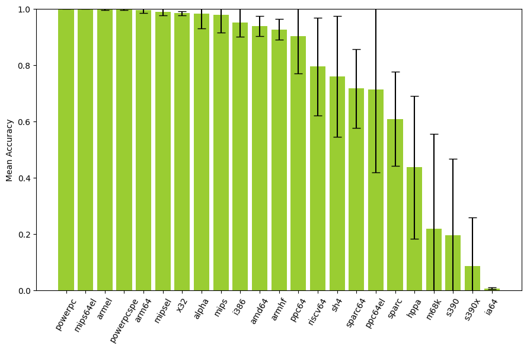

### Simple 2D CNN with embedding layer

TODO

Table: Classifying instruction width type with Simple2dEmbedding \label{table:logo-instructionwidthtype-simple2dembedding-results}

| Architecture | Mean Accuracy | Standard Deviation |
| ------------ | ------------: | -----------------: |
| powerpc      |         1.000 |              0.000 |
| powerpcspe   |         1.000 |              0.000 |
| riscv64      |         1.000 |              0.000 |
| sparc        |         1.000 |              0.000 |
| sh4          |         1.000 |              0.001 |
| x32          |         0.999 |              0.001 |
| amd64        |         0.999 |              0.001 |
| s390x        |         0.997 |              0.003 |
| armel        |         0.994 |              0.008 |
| i386         |         0.989 |              0.014 |
| armhf        |         0.981 |              0.013 |
| sparc64      |         0.965 |              0.027 |
| m68k         |         0.944 |              0.164 |
| mips64el     |         0.925 |              0.141 |
| mipsel       |         0.924 |              0.107 |
| s390         |         0.833 |              0.341 |
| mips         |         0.806 |              0.139 |
| hppa         |         0.722 |              0.334 |
| ppc64el      |         0.682 |              0.419 |
| arm64        |         0.467 |              0.327 |
| ppc64        |         0.301 |              0.206 |
| alpha        |         0.239 |              0.071 |
| ia64         |         0.164 |              0.345 |
| **Overall**  |     **0.831** |          **0.035** |

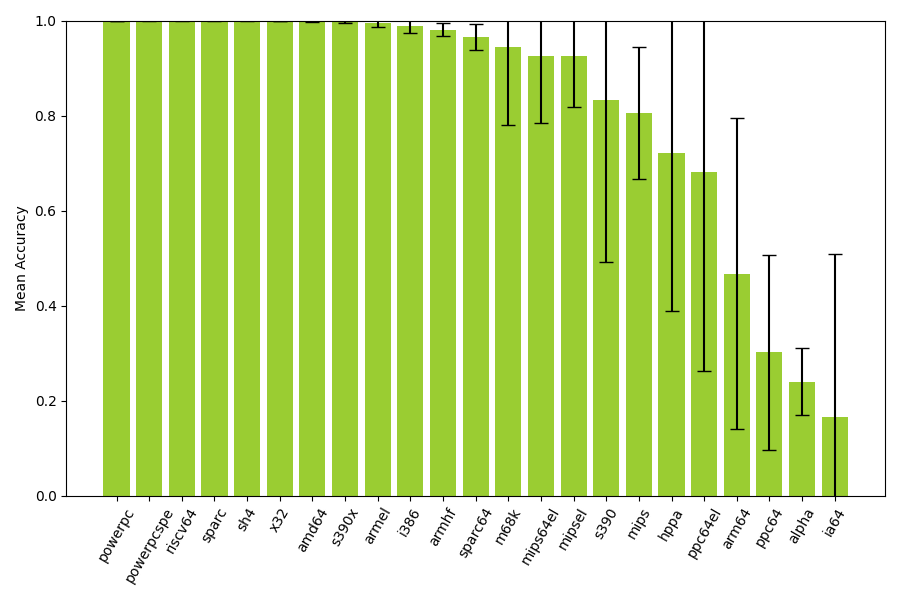

### ResNet50

TODO

Table: Classifying instruction width type with ResNet50 \label{table:logo-instructionwidthtype-resnet-results}

| Architecture | Mean Accuracy | Standard Deviation |
| ------------ | ------------: | -----------------: |
| powerpc      |         0.999 |              0.000 |
| armel        |         0.997 |              0.002 |
| powerpcspe   |         0.992 |              0.012 |
| mipsel       |         0.986 |              0.001 |
| mips         |         0.985 |              0.011 |
| arm64        |         0.984 |              0.009 |
| ppc64el      |         0.970 |              0.027 |
| x32          |         0.968 |              0.003 |
| hppa         |         0.961 |              0.046 |
| armhf        |         0.950 |              0.013 |
| sh4          |         0.938 |              0.114 |
| sparc64      |         0.893 |              0.077 |
| mips64el     |         0.871 |              0.070 |
| amd64        |         0.866 |              0.006 |
| riscv64      |         0.859 |              0.057 |
| i386         |         0.838 |              0.040 |
| m68k         |         0.812 |              0.171 |
| ppc64        |         0.776 |              0.163 |
| sparc        |         0.756 |              0.172 |
| s390x        |         0.561 |              0.370 |
| alpha        |         0.332 |              0.314 |
| s390         |         0.326 |              0.393 |
| ia64         |         0.001 |              0.001 |
| **Overall**  |     **0.798** |          **0.040** |

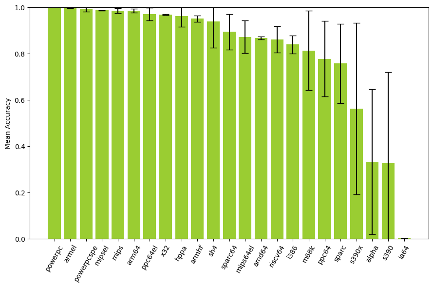

### ResNet50 with embedding layer

| Architecture | Mean Accuracy | Standard Deviation |
| ------------ | ------------: | -----------------: |
| powerpcspe   |         1.000 |              0.000 |
| powerpc      |         1.000 |              0.001 |
| ppc64el      |         0.999 |              0.001 |
| sh4          |         0.998 |              0.003 |
| riscv64      |         0.997 |              0.004 |
| sparc        |         0.997 |              0.005 |
| armel        |         0.994 |              0.005 |
| x32          |         0.993 |              0.005 |
| sparc64      |         0.993 |              0.008 |
| mipsel       |         0.992 |              0.009 |
| arm64        |         0.987 |              0.004 |
| armhf        |         0.984 |              0.012 |
| amd64        |         0.978 |              0.014 |
| mips         |         0.945 |              0.070 |
| i386         |         0.935 |              0.035 |
| mips64el     |         0.935 |              0.090 |
| ppc64        |         0.871 |              0.119 |
| hppa         |         0.754 |              0.362 |
| m68k         |         0.684 |              0.349 |
| s390x        |         0.399 |              0.433 |
| ia64         |         0.284 |              0.318 |
| alpha        |         0.247 |              0.128 |
| s390         |         0.078 |              0.118 |
| **Overall**  |     **0.818** |          **0.030** |

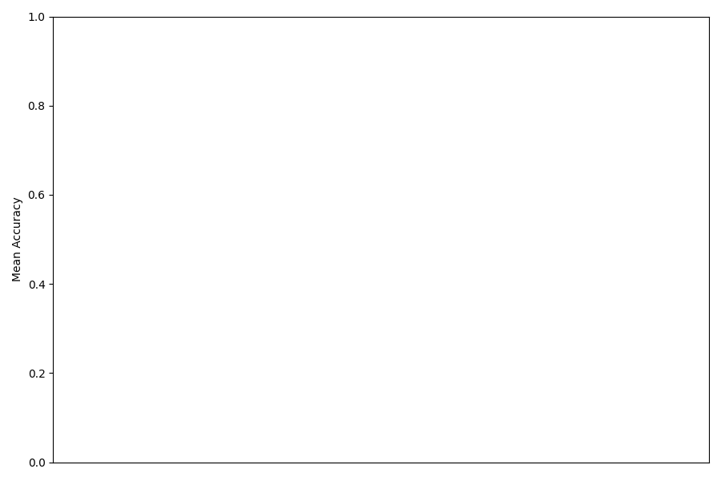

### Summary
