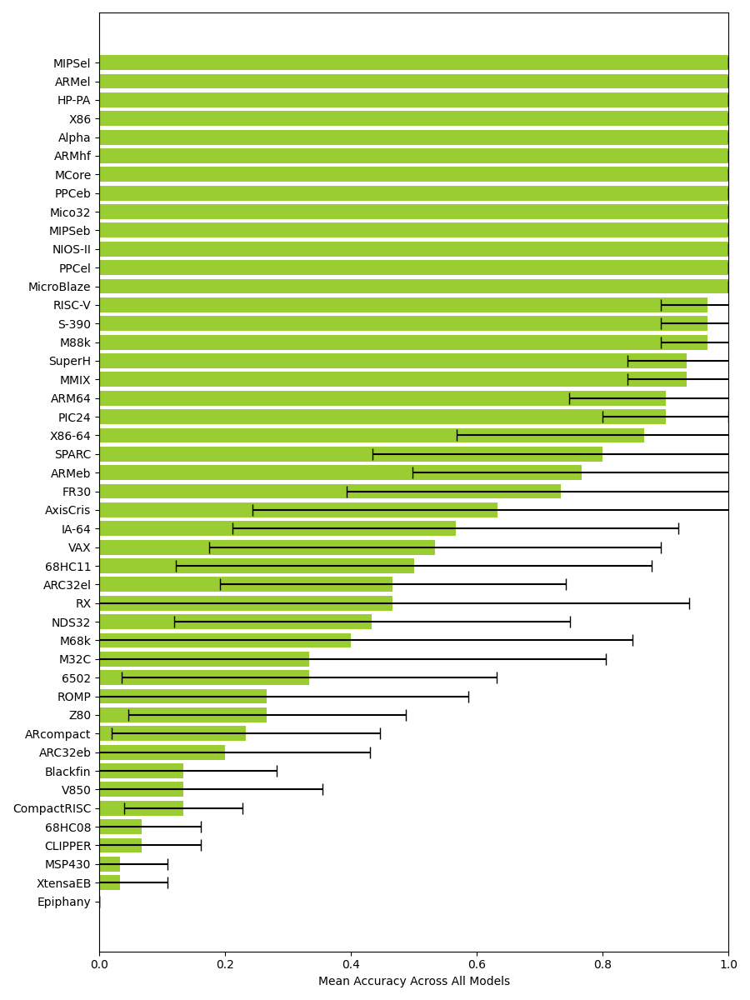

# Results

This chapter presents the results of the experiments described in \autoref{methodology}. In \autoref{endianness}, we present the results of applying our proposed model architectures to detecting endianness from a binary file. In \autoref{instruction-width-type}, we present the results of applying the same model architectures to detecting whether a binary file has fixed-length or variable-length instructions (hereby referred to as _instruction width type_).

## Endianness

This section evaluates and compares the performance of the proposed \ac{CNN} models (described in \autoref{model-architectures}) in detecting the endianness of binary files.

### Training and testing on ISADetect

\autoref{table:logo-endianness-results} shows classification performance for every model/\ac{ISA} combination.

\small

Table: Endianness classification performance when using \ac{LOGO CV} on the ISADetect dataset. \label{table:logo-endianness-results}

| ISA         |        Simple1d |      Simple1d-E |        Simple2d |      Simple2d-E |        ResNet50 |      ResNet50-E |
| ----------- | --------------: | --------------: | --------------: | --------------: | --------------: | --------------: |
| alpha       |     0.996±0.003 |     0.954±0.051 |     1.000±0.000 |     0.949±0.056 |     0.987±0.008 |     0.974±0.046 |
| amd64       |     0.979±0.016 |     0.995±0.010 |     0.944±0.015 |     0.998±0.004 |     0.950±0.005 |     0.995±0.005 |
| arm64       |     0.777±0.251 |     0.791±0.207 |     0.365±0.134 |     0.581±0.287 |     0.200±0.098 |     0.547±0.309 |
| armel       |     1.000±0.000 |     0.992±0.009 |     1.000±0.000 |     0.985±0.019 |     1.000±0.000 |     0.985±0.017 |
| armhf       |     0.946±0.023 |     0.985±0.015 |     0.981±0.013 |     0.978±0.020 |     0.972±0.007 |     0.976±0.018 |
| hppa        |     0.491±0.312 |     0.717±0.261 |     0.121±0.042 |     0.729±0.146 |     0.441±0.129 |     0.591±0.207 |
| i386        |     0.970±0.021 |     0.998±0.003 |     0.978±0.023 |     0.997±0.005 |     0.964±0.016 |     0.977±0.016 |
| ia64        |     0.604±0.488 |     0.792±0.283 |     0.060±0.070 |     0.662±0.423 |     0.715±0.259 |     0.494±0.327 |
| m68k        |     0.174±0.315 |     0.094±0.202 |     0.000±0.000 |     0.014±0.038 |     0.024±0.017 |     0.013±0.015 |
| mips        |     0.178±0.189 |     0.972±0.035 |     0.352±0.143 |     0.946±0.071 |     0.226±0.121 |     0.673±0.180 |
| mips64el    |     0.995±0.004 |     0.998±0.002 |     1.000±0.000 |     0.999±0.001 |     0.929±0.078 |     0.963±0.055 |
| mipsel      |     0.866±0.079 |     0.996±0.007 |     0.766±0.073 |     0.999±0.002 |     0.264±0.089 |     0.989±0.009 |
| powerpc     |     0.999±0.001 |     1.000±0.000 |     0.998±0.002 |     1.000±0.000 |     0.997±0.001 |     1.000±0.001 |
| powerpcspe  |     0.988±0.007 |     1.000±0.000 |     0.982±0.013 |     1.000±0.000 |     0.982±0.007 |     0.999±0.002 |
| ppc64       |     0.861±0.128 |     0.844±0.151 |     0.905±0.129 |     0.682±0.294 |     0.655±0.167 |     0.395±0.315 |
| ppc64el     |     1.000±0.000 |     1.000±0.000 |     1.000±0.000 |     1.000±0.000 |     0.919±0.141 |     0.998±0.004 |
| riscv64     |     0.426±0.165 |     0.777±0.287 |     0.246±0.182 |     0.585±0.346 |     0.508±0.076 |     0.730±0.359 |
| s390        |     0.010±0.030 |     0.997±0.005 |     0.004±0.001 |     0.995±0.008 |     0.188±0.400 |     0.951±0.032 |
| s390x       |     0.532±0.331 |     1.000±0.000 |     0.133±0.240 |     0.909±0.233 |     0.355±0.384 |     0.751±0.212 |
| sh4         |     0.243±0.281 |     0.861±0.221 |     0.199±0.221 |     0.729±0.357 |     0.124±0.077 |     0.644±0.165 |
| sparc       |     0.994±0.012 |     0.999±0.001 |     0.460±0.308 |     0.999±0.001 |     0.764±0.124 |     0.912±0.117 |
| sparc64     |     0.949±0.032 |     0.976±0.010 |     0.723±0.098 |     0.945±0.016 |     0.330±0.189 |     0.837±0.185 |
| x32         |     0.991±0.003 |     0.999±0.001 |     0.981±0.010 |     1.000±0.000 |     0.978±0.003 |     0.999±0.001 |
| **Overall** | **0.717±0.055** | **0.897±0.028** | **0.589±0.024** | **0.851±0.036** | **0.622±0.019** | **0.799±0.044** |

\normalsize

\autoref{fig:logo-endianness-by-model} aggregates the results across \acp{ISA}, allowing for comparison of the overall performance of each model. We see that the _Simple1d-E_ model performs the best, with a mean overall accuracy of 89.7% and a standard deviation of 5.5%.

\autoref{fig:logo-endianness-by-isa} aggregates results across the different models, painting a picture of which \acp{ISA} are easier to classify. We observe that some architectures provide consistent performance across the models, while others exhibit extremely high variance across the different model architectures and seeds. Lastly, the _m68k_ binaries are systematically misclassified by every model architecture.

### Training on ISADetect, testing on CpuRec

\autoref{table:cpurec-endianness-results} shows classification performance for every model/\ac{ISA} combination.

\small

Table: Endianness classification performance when training on the ISADetect dataset and testing on the CpuRec dataset. \label{table:cpurec-endianness-results}

| Architecture |        Simple1d |      Simple1d-E |        Simple2d |      Simple2d-E |        ResNet50 |      ResNet50-E |
| ------------ | --------------: | --------------: | --------------: | --------------: | --------------: | --------------: |
| 68HC08       |             0/5 |             1/5 |             0/5 |             1/5 |             2/5 |             1/5 |
| 68HC11       |             0/5 |             2/5 |             2/5 |             1/5 |             1/5 |             0/5 |
| XtensaEB     |             0/5 |             1/5 |             0/5 |             1/5 |             2/5 |             2/5 |
| FR30         |             0/5 |             1/5 |             4/5 |             1/5 |             3/5 |             1/5 |
| Epiphany     |             4/5 |             0/5 |             5/5 |             0/5 |             2/5 |             1/5 |
| CLIPPER      |             2/5 |             4/5 |             0/5 |             2/5 |             2/5 |             4/5 |
| NIOS-II      |             4/5 |             1/5 |             5/5 |             1/5 |             0/5 |             3/5 |
| MCore        |             1/5 |             4/5 |             3/5 |             0/5 |             4/5 |             2/5 |
| RISC-V       |             0/5 |             5/5 |             0/5 |             5/5 |             2/5 |             4/5 |
| S-390        |             0/5 |             5/5 |             0/5 |             5/5 |             1/5 |             5/5 |
| ROMP         |             2/5 |             5/5 |             0/5 |             4/5 |             3/5 |             2/5 |
| IQ2000       |             3/5 |             5/5 |             0/5 |             5/5 |             1/5 |             2/5 |
| M68k         |             0/5 |             5/5 |             1/5 |             5/5 |             1/5 |             4/5 |
| NDS32        |             5/5 |             0/5 |             4/5 |             2/5 |             4/5 |             4/5 |
| ARC32el      |             5/5 |             0/5 |             5/5 |             2/5 |             5/5 |             3/5 |
| M32C         |             5/5 |             3/5 |             5/5 |             3/5 |             4/5 |             2/5 |
| VAX          |             0/5 |             3/5 |             5/5 |             4/5 |             5/5 |             5/5 |
| PIC24        |             5/5 |             5/5 |             3/5 |             5/5 |             0/5 |             5/5 |
| ARMeb        |             5/5 |             5/5 |             5/5 |             5/5 |             3/5 |             0/5 |
| SPARC        |             1/5 |             5/5 |             5/5 |             5/5 |             2/5 |             5/5 |
| CompactRISC  |             5/5 |             4/5 |             3/5 |             5/5 |             2/5 |             5/5 |
| HP-PA        |             3/5 |             5/5 |             1/5 |             5/5 |             5/5 |             5/5 |
| MSP430       |             5/5 |             5/5 |             5/5 |             5/5 |             0/5 |             5/5 |
| IA-64        |             5/5 |             2/5 |             5/5 |             5/5 |             5/5 |             4/5 |
| ARcompact    |             5/5 |             4/5 |             4/5 |             4/5 |             4/5 |             5/5 |
| SuperH       |             5/5 |             5/5 |             2/5 |             5/5 |             4/5 |             5/5 |
| 6502         |             5/5 |             4/5 |             5/5 |             5/5 |             4/5 |             4/5 |
| MN10300      |             5/5 |             3/5 |             5/5 |             4/5 |             5/5 |             5/5 |
| MicroBlaze   |             5/5 |             5/5 |             5/5 |             5/5 |             2/5 |             5/5 |
| ARC32eb      |             5/5 |             4/5 |             5/5 |             3/5 |             5/5 |             5/5 |
| Mico32       |             5/5 |             5/5 |             5/5 |             5/5 |             4/5 |             4/5 |
| Blackfin     |             5/5 |             4/5 |             5/5 |             5/5 |             5/5 |             5/5 |
| MIPSeb       |             5/5 |             5/5 |             5/5 |             5/5 |             4/5 |             5/5 |
| Z80          |             5/5 |             5/5 |             5/5 |             4/5 |             5/5 |             5/5 |
| RL78         |             5/5 |             5/5 |             5/5 |             5/5 |             5/5 |             4/5 |
| RX           |             5/5 |             4/5 |             5/5 |             5/5 |             5/5 |             5/5 |
| X86          |             5/5 |             5/5 |             5/5 |             5/5 |             5/5 |             5/5 |
| ARMel        |             5/5 |             5/5 |             5/5 |             5/5 |             5/5 |             5/5 |
| ARM64        |             5/5 |             5/5 |             5/5 |             5/5 |             5/5 |             5/5 |
| PPCeb        |             5/5 |             5/5 |             5/5 |             5/5 |             5/5 |             5/5 |
| M88k         |             5/5 |             5/5 |             5/5 |             5/5 |             5/5 |             5/5 |
| X86-64       |             5/5 |             5/5 |             5/5 |             5/5 |             5/5 |             5/5 |
| Alpha        |             5/5 |             5/5 |             5/5 |             5/5 |             5/5 |             5/5 |
| AxisCris     |             5/5 |             5/5 |             5/5 |             5/5 |             5/5 |             5/5 |
| PPCel        |             5/5 |             5/5 |             5/5 |             5/5 |             5/5 |             5/5 |
| V850         |             5/5 |             5/5 |             5/5 |             5/5 |             5/5 |             5/5 |
| MMIX         |             5/5 |             5/5 |             5/5 |             5/5 |             5/5 |             5/5 |
| MIPSel       |             5/5 |             5/5 |             5/5 |             5/5 |             5/5 |             5/5 |
| ARMhf        |             5/5 |             5/5 |             5/5 |             5/5 |             5/5 |             5/5 |
| **Overall**  | **0.755±0.014** | **0.792±0.080** | **0.763±0.023** | **0.804±0.045** | **0.718±0.030** | **0.800±0.037** |

\normalsize

\autoref{fig:cpurec-endianness-by-model} aggregates the results across \acp{ISA}.

\autoref{fig:cpurec-endianness-by-isa} aggregates results across the different models.

### Training on ISADetect, testing on BuildCross

\autoref{table:buildcross-endianness-results} shows classification performance for every model/\ac{ISA} combination.

\small

Table: Endianness classification performance when training on the ISADetect dataset and testing on the BuildCross dataset. \label{table:buildcross-endianness-results}

| Architecture |        Simple1d |      Simple1d-E |        Simple2d |      Simple2d-E |        ResNet50 |      ResNet50-E |
| ------------ | --------------: | --------------: | --------------: | --------------: | --------------: | --------------: |
| rxeb         |     0.022±0.008 |     0.096±0.054 |     0.065±0.020 |     0.075±0.069 |     0.068±0.018 |     0.051±0.045 |
| arceb        |     0.033±0.017 |     0.097±0.030 |     0.064±0.010 |     0.052±0.018 |     0.248±0.019 |     0.094±0.075 |
| h8300        |     0.166±0.117 |     0.291±0.316 |     0.240±0.033 |     0.107±0.136 |     0.214±0.005 |     0.063±0.080 |
| fr30         |     0.320±0.181 |     0.090±0.155 |     0.225±0.112 |     0.016±0.016 |     0.433±0.077 |     0.143±0.278 |
| pru          |     0.020±0.007 |     0.053±0.027 |     0.038±0.010 |     0.081±0.039 |     0.923±0.034 |     0.173±0.075 |
| xtensa       |     0.059±0.007 |     0.391±0.130 |     0.175±0.036 |     0.191±0.094 |     0.583±0.053 |     0.208±0.066 |
| mcoreeb      |     0.014±0.005 |     0.478±0.289 |     0.294±0.084 |     0.441±0.348 |     0.768±0.070 |     0.367±0.294 |
| nds32be      |     0.175±0.093 |     0.395±0.083 |     0.597±0.139 |     0.235±0.053 |     0.761±0.100 |     0.295±0.101 |
| tilegxbe     |     0.033±0.022 |     0.966±0.037 |     0.030±0.011 |     0.597±0.300 |     0.503±0.160 |     0.342±0.141 |
| moxie        |     0.452±0.149 |     0.706±0.211 |     0.236±0.062 |     0.512±0.217 |     0.328±0.022 |     0.323±0.229 |
| loongarch64  |     0.256±0.097 |     0.690±0.255 |     0.081±0.055 |     0.746±0.243 |     0.096±0.070 |     0.733±0.114 |
| epiphany     |     0.550±0.111 |     0.198±0.138 |     0.585±0.093 |     0.413±0.079 |     0.449±0.037 |     0.459±0.245 |
| m68k-elf     |     0.219±0.108 |     0.854±0.043 |     0.208±0.034 |     0.679±0.137 |     0.349±0.031 |     0.475±0.147 |
| c6x          |     0.159±0.127 |     0.997±0.003 |     0.001±0.000 |     0.994±0.008 |     0.291±0.091 |     0.487±0.213 |
| csky         |     0.820±0.157 |     0.127±0.023 |     0.860±0.040 |     0.190±0.045 |     0.568±0.116 |     0.548±0.273 |
| visium       |     0.444±0.203 |     0.524±0.359 |     0.870±0.061 |     0.493±0.327 |     0.559±0.136 |     0.270±0.203 |
| tilegx       |     0.967±0.022 |     0.033±0.037 |     0.970±0.011 |     0.402±0.299 |     0.497±0.159 |     0.654±0.139 |
| nds32        |     0.783±0.112 |     0.518±0.152 |     0.458±0.160 |     0.659±0.083 |     0.389±0.093 |     0.736±0.117 |
| nios2        |     0.895±0.051 |     0.154±0.089 |     0.972±0.004 |     0.123±0.098 |     0.916±0.012 |     0.515±0.255 |
| cr16         |     0.936±0.041 |     0.342±0.097 |     0.828±0.074 |     0.404±0.148 |     0.408±0.067 |     0.682±0.201 |
| ft32         |     0.973±0.024 |     0.115±0.117 |     0.998±0.002 |     0.173±0.139 |     0.571±0.108 |     0.816±0.158 |
| mcore        |     0.970±0.010 |     0.525±0.289 |     0.869±0.022 |     0.589±0.324 |     0.192±0.076 |     0.685±0.303 |
| arc          |     0.914±0.020 |     0.270±0.204 |     0.879±0.025 |     0.411±0.173 |     0.745±0.041 |     0.632±0.182 |
| xstormy16    |     0.872±0.057 |     0.679±0.283 |     0.600±0.171 |     0.602±0.399 |     0.262±0.103 |     0.978±0.026 |
| kvx          |     0.831±0.058 |     0.390±0.187 |     0.845±0.068 |     0.604±0.172 |     0.606±0.072 |     0.719±0.165 |
| or1k         |     0.965±0.017 |     0.772±0.189 |     0.716±0.074 |     0.712±0.260 |     0.498±0.107 |     0.590±0.212 |
| v850         |     0.763±0.080 |     0.897±0.108 |     0.569±0.131 |     0.955±0.034 |     0.430±0.084 |     0.972±0.025 |
| bfin         |     0.934±0.028 |     0.570±0.270 |     0.912±0.015 |     0.587±0.227 |     0.808±0.035 |     0.780±0.183 |
| moxieel      |     0.509±0.156 |     0.878±0.062 |     0.669±0.088 |     0.939±0.038 |     0.728±0.057 |     0.923±0.096 |
| mmix         |     0.922±0.062 |     0.788±0.198 |     0.922±0.060 |     0.646±0.276 |     0.841±0.130 |     0.528±0.288 |
| m32r         |     0.896±0.028 |     0.796±0.081 |     0.945±0.011 |     0.834±0.069 |     0.559±0.044 |     0.623±0.301 |
| frv          |     0.918±0.017 |     0.873±0.218 |     0.964±0.009 |     0.781±0.333 |     0.801±0.066 |     0.527±0.279 |
| msp430       |     0.676±0.105 |     0.912±0.060 |     0.864±0.097 |     0.962±0.016 |     0.536±0.121 |     0.977±0.007 |
| lm32         |     0.975±0.013 |     0.882±0.122 |     0.727±0.029 |     0.941±0.043 |     0.589±0.031 |     0.903±0.079 |
| iq2000       |     0.933±0.033 |     0.984±0.019 |     0.626±0.247 |     0.917±0.102 |     0.764±0.072 |     0.830±0.127 |
| microblazeel |     0.935±0.061 |     0.647±0.137 |     1.000±0.000 |     0.774±0.047 |     0.942±0.035 |     0.898±0.089 |
| mn10300      |     0.950±0.016 |     0.614±0.232 |     0.983±0.008 |     0.842±0.117 |     0.990±0.007 |     0.884±0.038 |
| rx           |     0.966±0.010 |     0.891±0.068 |     0.918±0.023 |     0.916±0.072 |     0.925±0.020 |     0.944±0.044 |
| cris         |     0.996±0.002 |     0.838±0.199 |     0.997±0.001 |     0.892±0.072 |     0.966±0.008 |     0.938±0.059 |
| rl78         |     0.972±0.012 |     0.872±0.091 |     0.992±0.003 |     0.943±0.021 |     0.995±0.004 |     0.958±0.046 |
| microblaze   |     0.993±0.002 |     0.953±0.032 |     0.998±0.001 |     0.966±0.022 |     0.904±0.044 |     0.944±0.071 |
| tricore      |     0.923±0.028 |     0.961±0.032 |     0.974±0.003 |     0.984±0.007 |     0.969±0.004 |     0.985±0.013 |
| **Overall**  | **0.653±0.005** | **0.593±0.033** | **0.634±0.007** | **0.598±0.026** | **0.601±0.008** | **0.599±0.025** |

\normalsize

\autoref{fig:buildcross-endianness-by-model} aggregates the results across \acp{ISA}.

\autoref{fig:buildcross-endianness-by-isa} aggregates results across the different models.

### Training on ISADetect and BuildCross, testing on CpuRec

\autoref{table:combined-endianness-results} shows classification performance for every model/\ac{ISA} combination.

\small

Table: Endianness classification performance when training on the ISADetect and BuildCross datasets, and testing on the CpuRec dataset. \label{table:combined-endianness-results}

| Architecture |        Simple1d |      Simple1d-E |        Simple2d |      Simple2d-E |        ResNet50 |      ResNet50-E |
| ------------ | --------------: | --------------: | --------------: | --------------: | --------------: | --------------: |
| 68HC08       |             0/5 |             0/5 |             0/5 |             1/5 |             0/5 |             0/5 |
| NDS32        |             3/5 |             0/5 |             1/5 |             0/5 |             2/5 |             0/5 |
| 68HC11       |             2/5 |             1/5 |             4/5 |             0/5 |             0/5 |             1/5 |
| MCore        |             2/5 |             1/5 |             0/5 |             1/5 |             4/5 |             2/5 |
| RISC-V       |             0/5 |             5/5 |             0/5 |             3/5 |             2/5 |             1/5 |
| VAX          |             1/5 |             1/5 |             1/5 |             2/5 |             5/5 |             2/5 |
| ROMP         |             3/5 |             1/5 |             5/5 |             0/5 |             5/5 |             0/5 |
| ARMhf        |             1/5 |             3/5 |             0/5 |             4/5 |             3/5 |             5/5 |
| M68k         |             1/5 |             5/5 |             0/5 |             5/5 |             0/5 |             5/5 |
| XtensaEB     |             4/5 |             1/5 |             4/5 |             1/5 |             2/5 |             5/5 |
| RL78         |             4/5 |             1/5 |             5/5 |             1/5 |             5/5 |             1/5 |
| M32C         |             3/5 |             2/5 |             5/5 |             2/5 |             5/5 |             1/5 |
| PIC24        |             4/5 |             2/5 |             5/5 |             1/5 |             5/5 |             2/5 |
| Epiphany     |             1/5 |             5/5 |             1/5 |             5/5 |             3/5 |             5/5 |
| ARC32el      |             5/5 |             2/5 |             5/5 |             2/5 |             5/5 |             1/5 |
| FR30         |             1/5 |             5/5 |             2/5 |             5/5 |             2/5 |             5/5 |
| CLIPPER      |             1/5 |             4/5 |             4/5 |             4/5 |             4/5 |             3/5 |
| ARcompact    |             1/5 |             5/5 |             2/5 |             5/5 |             2/5 |             5/5 |
| 6502         |             5/5 |             4/5 |             5/5 |             2/5 |             2/5 |             2/5 |
| HP-PA        |             0/5 |             5/5 |             2/5 |             5/5 |             3/5 |             5/5 |
| IA-64        |             3/5 |             3/5 |             5/5 |             1/5 |             5/5 |             3/5 |
| NIOS-II      |             0/5 |             5/5 |             5/5 |             5/5 |             2/5 |             4/5 |
| X86-64       |             1/5 |             5/5 |             1/5 |             5/5 |             4/5 |             5/5 |
| CompactRISC  |             4/5 |             5/5 |             1/5 |             5/5 |             1/5 |             5/5 |
| S-390        |             1/5 |             5/5 |             5/5 |             5/5 |             1/5 |             5/5 |
| SuperH       |             3/5 |             5/5 |             2/5 |             5/5 |             2/5 |             5/5 |
| IQ2000       |             5/5 |             5/5 |             2/5 |             5/5 |             2/5 |             4/5 |
| RX           |             2/5 |             4/5 |             5/5 |             3/5 |             5/5 |             4/5 |
| MSP430       |             5/5 |             5/5 |             2/5 |             5/5 |             2/5 |             5/5 |
| ARC32eb      |             5/5 |             3/5 |             5/5 |             4/5 |             5/5 |             2/5 |
| MN10300      |             3/5 |             5/5 |             5/5 |             5/5 |             5/5 |             3/5 |
| Blackfin     |             1/5 |             5/5 |             5/5 |             5/5 |             5/5 |             5/5 |
| SPARC        |             2/5 |             5/5 |             4/5 |             5/5 |             5/5 |             5/5 |
| ARM64        |             5/5 |             5/5 |             5/5 |             5/5 |             2/5 |             5/5 |
| Alpha        |             5/5 |             5/5 |             5/5 |             4/5 |             4/5 |             5/5 |
| Z80          |             5/5 |             4/5 |             5/5 |             5/5 |             5/5 |             5/5 |
| AxisCris     |             5/5 |             4/5 |             5/5 |             5/5 |             5/5 |             5/5 |
| X86          |             5/5 |             5/5 |             4/5 |             5/5 |             5/5 |             5/5 |
| ARMel        |             5/5 |             5/5 |             5/5 |             5/5 |             5/5 |             5/5 |
| PPCeb        |             5/5 |             5/5 |             5/5 |             5/5 |             5/5 |             5/5 |
| MMIX         |             5/5 |             5/5 |             5/5 |             5/5 |             5/5 |             5/5 |
| PPCel        |             5/5 |             5/5 |             5/5 |             5/5 |             5/5 |             5/5 |
| MicroBlaze   |             5/5 |             5/5 |             5/5 |             5/5 |             5/5 |             5/5 |
| MIPSel       |             5/5 |             5/5 |             5/5 |             5/5 |             5/5 |             5/5 |
| MIPSeb       |             5/5 |             5/5 |             5/5 |             5/5 |             5/5 |             5/5 |
| ARMeb        |             5/5 |             5/5 |             5/5 |             5/5 |             5/5 |             5/5 |
| Mico32       |             5/5 |             5/5 |             5/5 |             5/5 |             5/5 |             5/5 |
| V850         |             5/5 |             5/5 |             5/5 |             5/5 |             5/5 |             5/5 |
| M88k         |             5/5 |             5/5 |             5/5 |             5/5 |             5/5 |             5/5 |
| **Overall**  | **0.641±0.055** | **0.780±0.062** | **0.722±0.023** | **0.759±0.089** | **0.731±0.030** | **0.759±0.053** |

\normalsize

\autoref{fig:logo-endianness-by-model} aggregates the results across \acp{ISA}.

\autoref{fig:logo-endianness-by-isa} aggregates results across the different models.

## Instruction width type

This section evaluates and compares the performance of the proposed \ac{CNN} models (described in \autoref{model-architectures}) in detecting the instruction width type of binary files.

### Training and testing on ISADetect

\autoref{table:logo-instructionwidthtype-results} shows classification performance for every model/\ac{ISA} combination.

\small

Table: Instruction width type classification performance when using \ac{LOGO CV} on the ISADetect dataset. \label{table:logo-instructionwidthtype-results}

| ISA         |        Simple1d |      Simple1d-E |        Simple2d |      Simple2d-E |        ResNet50 |      ResNet50-E |
| ----------- | --------------: | --------------: | --------------: | --------------: | --------------: | --------------: |
| alpha       |     0.982±0.057 |     0.248±0.065 |     0.492±0.239 |     0.239±0.071 |     0.332±0.314 |     0.247±0.128 |
| amd64       |     0.928±0.023 |     0.995±0.008 |     0.912±0.036 |     0.999±0.001 |     0.866±0.006 |     0.978±0.014 |
| arm64       |     0.856±0.141 |     0.484±0.299 |     0.997±0.005 |     0.467±0.327 |     0.984±0.009 |     0.987±0.004 |
| armel       |     1.000±0.000 |     0.996±0.004 |     1.000±0.000 |     0.994±0.008 |     0.997±0.002 |     0.994±0.005 |
| armhf       |     0.994±0.008 |     0.980±0.012 |     0.928±0.022 |     0.981±0.013 |     0.950±0.013 |     0.984±0.012 |
| hppa        |     0.206±0.071 |     0.846±0.249 |     0.230±0.102 |     0.722±0.334 |     0.961±0.046 |     0.754±0.362 |
| i386        |     0.897±0.050 |     0.997±0.004 |     0.896±0.060 |     0.989±0.014 |     0.838±0.040 |     0.935±0.035 |
| ia64        |     0.011±0.003 |     0.556±0.398 |     0.603±0.477 |     0.164±0.345 |     0.001±0.001 |     0.284±0.318 |
| m68k        |     0.993±0.008 |     0.856±0.305 |     0.072±0.143 |     0.944±0.164 |     0.812±0.171 |     0.684±0.349 |
| mips        |     0.987±0.009 |     0.851±0.261 |     0.996±0.009 |     0.806±0.139 |     0.985±0.011 |     0.945±0.070 |
| mips64el    |     0.987±0.012 |     0.997±0.005 |     0.992±0.009 |     0.925±0.141 |     0.871±0.070 |     0.935±0.090 |
| mipsel      |     0.918±0.048 |     0.946±0.066 |     0.993±0.006 |     0.924±0.107 |     0.986±0.001 |     0.992±0.009 |
| powerpc     |     1.000±0.000 |     1.000±0.000 |     1.000±0.000 |     1.000±0.000 |     0.999±0.000 |     1.000±0.001 |
| powerpcspe  |     1.000±0.000 |     1.000±0.000 |     0.999±0.001 |     1.000±0.000 |     0.992±0.012 |     1.000±0.000 |
| ppc64       |     0.957±0.050 |     0.642±0.208 |     0.839±0.161 |     0.301±0.206 |     0.776±0.163 |     0.871±0.119 |
| ppc64el     |     0.144±0.308 |     0.823±0.366 |     0.708±0.386 |     0.682±0.419 |     0.970±0.027 |     0.999±0.001 |
| riscv64     |     0.161±0.125 |     1.000±0.000 |     0.774±0.280 |     1.000±0.000 |     0.859±0.057 |     0.997±0.004 |
| s390        |     0.427±0.342 |     0.983±0.034 |     0.094±0.135 |     0.833±0.341 |     0.326±0.393 |     0.078±0.118 |
| s390x       |     0.186±0.265 |     0.986±0.027 |     0.161±0.309 |     0.997±0.003 |     0.561±0.370 |     0.399±0.433 |
| sh4         |     0.897±0.206 |     0.920±0.165 |     0.993±0.020 |     1.000±0.001 |     0.938±0.114 |     0.998±0.003 |
| sparc       |     0.996±0.005 |     1.000±0.000 |     0.402±0.185 |     1.000±0.000 |     0.756±0.172 |     0.997±0.005 |
| sparc64     |     0.903±0.095 |     0.960±0.038 |     0.782±0.077 |     0.965±0.027 |     0.893±0.077 |     0.993±0.008 |
| x32         |     0.973±0.005 |     0.999±0.001 |     0.986±0.003 |     0.999±0.001 |     0.968±0.003 |     0.993±0.005 |
| **Overall** | **0.747±0.034** | **0.878±0.043** | **0.720±0.052** | **0.831±0.035** | **0.798±0.040** | **0.818±0.030** |

\normalsize

\autoref{fig:logo-instructionwidthtype-by-model} aggregates the results across \acp{ISA}.

\autoref{fig:logo-instructionwidthtype-by-isa} aggregates results across the different models.

### Training on ISADetect, testing on CpuRec

\autoref{table:cpurec-instructionwidthtype-results} shows classification performance for every model/\ac{ISA} combination.

\small

Table: Instruction width type classification performance when training on the ISADetect dataset and testing on the CpuRec dataset. \label{table:cpurec-instructionwidthtype-results}

| Architecture |        Simple1d |      Simple1d-E |        Simple2d |      Simple2d-E |        ResNet50 |      ResNet50-E |
| ------------ | --------------: | --------------: | --------------: | --------------: | --------------: | --------------: |
| Epiphany     |             0/5 |             0/5 |             0/5 |             0/5 |             0/5 |             0/5 |
| MSP430       |             0/5 |             0/5 |             0/5 |             0/5 |             0/5 |             1/5 |
| XtensaEB     |             0/5 |             1/5 |             0/5 |             0/5 |             0/5 |             0/5 |
| 68HC08       |             1/5 |             0/5 |             1/5 |             0/5 |             0/5 |             0/5 |
| CLIPPER      |             1/5 |             0/5 |             1/5 |             0/5 |             0/5 |             0/5 |
| Blackfin     |             0/5 |             1/5 |             0/5 |             2/5 |             1/5 |             0/5 |
| CompactRISC  |             1/5 |             0/5 |             1/5 |             1/5 |             1/5 |             0/5 |
| V850         |             0/5 |             3/5 |             0/5 |             1/5 |             0/5 |             0/5 |
| ARC32eb      |             0/5 |             2/5 |             3/5 |             1/5 |             0/5 |             0/5 |
| ARcompact    |             0/5 |             1/5 |             2/5 |             3/5 |             1/5 |             0/5 |
| ROMP         |             0/5 |             4/5 |             0/5 |             3/5 |             0/5 |             1/5 |
| Z80          |             1/5 |             2/5 |             0/5 |             2/5 |             3/5 |             0/5 |
| M32C         |             0/5 |             0/5 |             5/5 |             0/5 |             5/5 |             0/5 |
| 6502         |             3/5 |             1/5 |             4/5 |             0/5 |             2/5 |             0/5 |
| M68k         |             0/5 |             5/5 |             0/5 |             5/5 |             0/5 |             2/5 |
| NDS32        |             0/5 |             4/5 |             3/5 |             4/5 |             1/5 |             1/5 |
| RX           |             4/5 |             0/5 |             5/5 |             0/5 |             5/5 |             0/5 |
| ARC32el      |             2/5 |             1/5 |             5/5 |             2/5 |             1/5 |             3/5 |
| 68HC11       |             5/5 |             0/5 |             1/5 |             2/5 |             5/5 |             2/5 |
| VAX          |             0/5 |             5/5 |             1/5 |             4/5 |             2/5 |             4/5 |
| IA-64        |             1/5 |             4/5 |             5/5 |             4/5 |             0/5 |             3/5 |
| AxisCris     |             2/5 |             5/5 |             0/5 |             5/5 |             2/5 |             5/5 |
| FR30         |             5/5 |             4/5 |             0/5 |             4/5 |             4/5 |             5/5 |
| ARMeb        |             5/5 |             4/5 |             5/5 |             4/5 |             1/5 |             4/5 |
| SPARC        |             5/5 |             5/5 |             0/5 |             5/5 |             4/5 |             5/5 |
| X86-64       |             5/5 |             5/5 |             5/5 |             5/5 |             1/5 |             5/5 |
| PIC24        |             4/5 |             5/5 |             4/5 |             5/5 |             5/5 |             4/5 |
| ARM64        |             3/5 |             5/5 |             5/5 |             5/5 |             4/5 |             5/5 |
| RISC-V       |             5/5 |             5/5 |             5/5 |             5/5 |             4/5 |             5/5 |
| S-390        |             5/5 |             5/5 |             5/5 |             5/5 |             4/5 |             5/5 |
| X86          |             5/5 |             5/5 |             5/5 |             5/5 |             5/5 |             5/5 |
| SuperH       |             5/5 |             5/5 |             4/5 |             5/5 |             4/5 |             5/5 |
| MMIX         |             5/5 |             4/5 |             5/5 |             4/5 |             5/5 |             5/5 |
| M88k         |             5/5 |             4/5 |             5/5 |             5/5 |             5/5 |             5/5 |
| MIPSeb       |             5/5 |             5/5 |             5/5 |             5/5 |             5/5 |             5/5 |
| ARMel        |             5/5 |             5/5 |             5/5 |             5/5 |             5/5 |             5/5 |
| NIOS-II      |             5/5 |             5/5 |             5/5 |             5/5 |             5/5 |             5/5 |
| PPCeb        |             5/5 |             5/5 |             5/5 |             5/5 |             5/5 |             5/5 |
| MCore        |             5/5 |             5/5 |             5/5 |             5/5 |             5/5 |             5/5 |
| Mico32       |             5/5 |             5/5 |             5/5 |             5/5 |             5/5 |             5/5 |
| MicroBlaze   |             5/5 |             5/5 |             5/5 |             5/5 |             5/5 |             5/5 |
| Alpha        |             5/5 |             5/5 |             5/5 |             5/5 |             5/5 |             5/5 |
| HP-PA        |             5/5 |             5/5 |             5/5 |             5/5 |             5/5 |             5/5 |
| PPCel        |             5/5 |             5/5 |             5/5 |             5/5 |             5/5 |             5/5 |
| MIPSel       |             5/5 |             5/5 |             5/5 |             5/5 |             5/5 |             5/5 |
| ARMhf        |             5/5 |             5/5 |             5/5 |             5/5 |             5/5 |             5/5 |
| **Overall**  | **0.512±0.032** | **0.562±0.039** | **0.524±0.027** | **0.562±0.058** | **0.526±0.067** | **0.529±0.029** |

\autoref{fig:cpurec-instructionwidthtype-by-model} aggregates the results across \acp{ISA}.

\autoref{fig:cpurec-instructionwidthtype-by-isa} aggregates results across the different models.

### Training on ISADetect, testing on BuildCross

\autoref{table:buildcross-instructionwidthtype-results} shows classification performance for every model/\ac{ISA} combination.

\small

Table: Instruction width type classification performance when training on the ISADetect dataset and testing on the BuildCross dataset. \label{table:buildcross-instructionwidthtype-results}

| Architecture |        Simple1d |      Simple1d-E |        Simple2d |      Simple2d-E |        ResNet50 |      ResNet50-E |
| ------------ | --------------: | --------------: | --------------: | --------------: | --------------: | --------------: |
| msp430       |     0.046±0.025 |     0.023±0.026 |     0.022±0.025 |     0.018±0.010 |     0.005±0.005 |     0.020±0.020 |
| cr16         |     0.115±0.093 |     0.007±0.002 |     0.069±0.024 |     0.031±0.036 |     0.044±0.037 |     0.138±0.212 |
| v850         |     0.028±0.012 |     0.144±0.193 |     0.064±0.036 |     0.131±0.173 |     0.011±0.010 |     0.025±0.025 |
| epiphany     |     0.067±0.040 |     0.012±0.010 |     0.197±0.074 |     0.043±0.058 |     0.107±0.071 |     0.014±0.016 |
| kvx          |     0.087±0.038 |     0.139±0.113 |     0.094±0.062 |     0.235±0.184 |     0.116±0.060 |     0.147±0.171 |
| moxieel      |     0.052±0.027 |     0.162±0.117 |     0.169±0.083 |     0.334±0.148 |     0.107±0.079 |     0.162±0.208 |
| csky         |     0.009±0.004 |     0.402±0.292 |     0.030±0.008 |     0.492±0.209 |     0.028±0.019 |     0.084±0.106 |
| moxie        |     0.018±0.016 |     0.292±0.272 |     0.120±0.074 |     0.373±0.105 |     0.105±0.088 |     0.349±0.092 |
| xtensa       |     0.551±0.110 |     0.089±0.053 |     0.507±0.150 |     0.096±0.055 |     0.169±0.103 |     0.105±0.091 |
| bfin         |     0.285±0.102 |     0.085±0.076 |     0.617±0.049 |     0.089±0.086 |     0.389±0.118 |     0.066±0.085 |
| arceb        |     0.505±0.103 |     0.068±0.065 |     0.388±0.108 |     0.100±0.103 |     0.413±0.118 |     0.060±0.103 |
| arc          |     0.774±0.077 |     0.030±0.026 |     0.682±0.111 |     0.034±0.021 |     0.582±0.101 |     0.017±0.017 |
| fr30         |     0.214±0.114 |     0.330±0.384 |     0.910±0.072 |     0.219±0.324 |     0.495±0.174 |     0.054±0.075 |
| tricore      |     0.330±0.141 |     0.108±0.097 |     0.585±0.117 |     0.313±0.209 |     0.784±0.113 |     0.191±0.202 |
| cris         |     0.684±0.145 |     0.080±0.113 |     0.715±0.126 |     0.084±0.085 |     0.753±0.088 |     0.046±0.054 |
| rx           |     0.414±0.124 |     0.170±0.219 |     0.738±0.136 |     0.234±0.306 |     0.734±0.104 |     0.156±0.199 |
| rxeb         |     0.422±0.122 |     0.171±0.246 |     0.730±0.141 |     0.226±0.321 |     0.745±0.109 |     0.159±0.206 |
| m68k-elf     |     0.025±0.013 |     0.634±0.026 |     0.376±0.085 |     0.703±0.101 |     0.241±0.104 |     0.516±0.106 |
| nds32        |     0.246±0.184 |     0.431±0.248 |     0.725±0.091 |     0.619±0.333 |     0.522±0.089 |     0.170±0.143 |
| nds32be      |     0.549±0.190 |     0.408±0.151 |     0.726±0.068 |     0.482±0.238 |     0.359±0.091 |     0.201±0.177 |
| h8300        |     0.392±0.228 |     0.785±0.163 |     0.507±0.073 |     0.627±0.403 |     0.292±0.197 |     0.159±0.139 |
| mn10300      |     0.807±0.089 |     0.053±0.040 |     0.841±0.103 |     0.059±0.046 |     0.984±0.011 |     0.036±0.033 |
| xstormy16    |     0.545±0.196 |     0.582±0.436 |     0.926±0.031 |     0.630±0.327 |     0.465±0.100 |     0.122±0.122 |
| rl78         |     0.677±0.079 |     0.286±0.212 |     0.941±0.053 |     0.197±0.180 |     0.985±0.012 |     0.333±0.351 |
| loongarch64  |     0.847±0.128 |     0.410±0.253 |     0.521±0.121 |     0.485±0.184 |     0.734±0.105 |     0.817±0.197 |
| tilegx       |     0.635±0.266 |     0.311±0.379 |     0.973±0.014 |     0.732±0.366 |     0.979±0.017 |     0.583±0.463 |
| or1k         |     0.917±0.027 |     0.587±0.296 |     0.401±0.063 |     0.958±0.039 |     0.491±0.109 |     0.858±0.123 |
| tilegxbe     |     0.634±0.266 |     0.311±0.379 |     0.973±0.014 |     0.732±0.367 |     0.979±0.018 |     0.585±0.461 |
| mcoreeb      |     0.287±0.161 |     0.792±0.312 |     0.525±0.207 |     0.809±0.235 |     0.950±0.040 |     0.976±0.027 |
| mcore        |     0.426±0.128 |     0.798±0.207 |     0.707±0.101 |     0.639±0.299 |     0.966±0.025 |     0.941±0.078 |
| frv          |     0.958±0.024 |     0.706±0.166 |     0.964±0.015 |     0.632±0.258 |     0.945±0.049 |     0.833±0.342 |
| pru          |     0.980±0.018 |     0.939±0.076 |     0.987±0.006 |     0.934±0.086 |     0.334±0.213 |     0.988±0.010 |
| m32r         |     0.966±0.016 |     0.726±0.303 |     0.963±0.016 |     0.942±0.056 |     0.831±0.103 |     0.870±0.124 |
| nios2        |     0.913±0.048 |     0.983±0.018 |     0.937±0.063 |     0.933±0.139 |     0.733±0.161 |     0.978±0.043 |
| visium       |     0.994±0.005 |     0.843±0.079 |     0.995±0.008 |     0.862±0.192 |     0.975±0.019 |     0.858±0.103 |
| iq2000       |     0.985±0.017 |     0.954±0.039 |     0.993±0.008 |     0.968±0.014 |     0.979±0.023 |     0.677±0.212 |
| lm32         |     0.999±0.001 |     0.938±0.076 |     0.834±0.069 |     0.991±0.017 |     0.908±0.080 |     0.983±0.029 |
| microblazeel |     0.999±0.000 |     0.830±0.113 |     1.000±0.000 |     0.921±0.072 |     0.996±0.003 |     0.984±0.031 |
| mmix         |     0.952±0.063 |     0.970±0.007 |     0.962±0.017 |     0.946±0.069 |     0.961±0.011 |     0.964±0.062 |
| microblaze   |     0.999±0.000 |     0.881±0.150 |     0.998±0.001 |     0.989±0.014 |     0.983±0.018 |     0.988±0.012 |
| ft32         |     0.998±0.003 |     0.989±0.010 |     0.997±0.005 |     0.960±0.066 |     0.999±0.001 |     0.918±0.126 |
| c6x          |     0.996±0.005 |     0.997±0.001 |     1.000±0.001 |     0.967±0.072 |     0.994±0.007 |     0.970±0.035 |
| **Overall**  | **0.639±0.048** | **0.499±0.075** | **0.720±0.010** | **0.616±0.087** | **0.685±0.006** | **0.555±0.074** |

\autoref{fig:buildcross-instructionwidthtype-by-model} aggregates the results across \acp{ISA}.

\autoref{fig:buildcross-instructionwidthtype-by-isa} aggregates results across the different models.

### Training on ISADetect and BuildCross, testing on CpuRec

\autoref{table:combined-instructionwidthtype-results} shows classification performance for every model/\ac{ISA} combination.

\autoref{fig:combined-instructionwidthtype-by-model} aggregates the results across \acp{ISA}.

\autoref{fig:combined-instructionwidthtype-by-isa} aggregates results across the different models.
