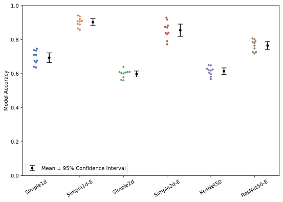
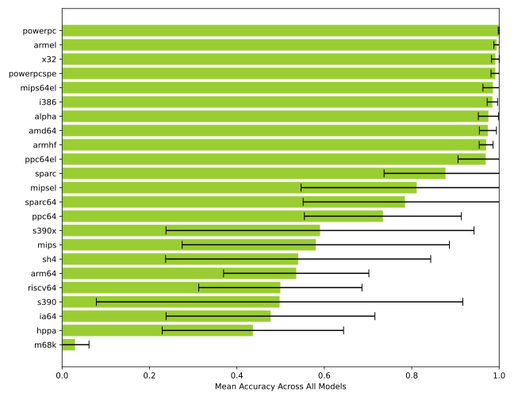
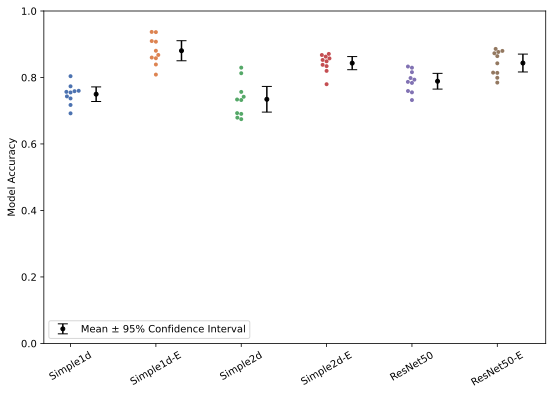
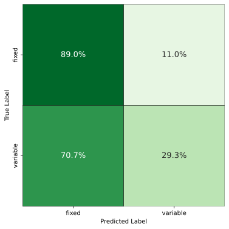

\acresetall

# Results

This chapter presents the results of the experiments described in \autoref{methodology}. In \autoref{endianness}, we present the results of applying our proposed model architectures for detecting endianness from a binary file. In \autoref{instruction-width-type}, we present the results of applying the same model architectures for detecting whether a binary file has fixed-length or variable-length instructions (hereby referred to as _instruction width type_).

## Endianness

This section evaluates and compares the performance of the proposed \ac{CNN} models (described in \autoref{model-architectures}) in detecting the endianness of binary files.

### K-fold cross-validation on ISAdetect

In this experiment, we train and evaluate our models using 5-fold cross-validation as detailed in \autoref{k-fold-cross-validation-on-isadetect-dataset}. \autoref{fig:kfold-endianness-by-model} shows the classification performance for every model. We see that all models achieve an average accuracy of above 99%.

\FloatBarrier

### Leave-one-group-out cross-validation on ISAdetect

In this experiment, we train and evaluate our models using \ac{LOGO CV} as detailed in \autoref{leave-one-group-out-cross-validation-on-isadetect-dataset}. \autoref{table:logo-endianness-results} shows classification performance for every model/\acs{ISA} combination.

\small

Table: Endianness classification performance when using \ac{LOGO CV} on the ISAdetect dataset, across 10 runs. The reported performance numbers for each architecture are mean accuracy ± standard deviation. Overall mean accuracy and standard deviation across all runs are reported in bold at the bottom, along with a 95% confidence interval range around the mean. \label{table:logo-endianness-results}

| Architecture |         Simple1d |       Simple1d-E |         Simple2d |       Simple2d-E |         ResNet50 |       ResNet50-E |
| ------------ | ---------------: | ---------------: | ---------------: | ---------------: | ---------------: | ---------------: |
| alpha        |      0.997±0.004 |      0.953±0.043 |      1.000±0.000 |      0.938±0.073 |      0.973±0.029 |      0.990±0.011 |
| amd64        |      0.981±0.011 |      0.987±0.020 |      0.943±0.016 |      0.991±0.022 |      0.952±0.014 |      0.993±0.013 |
| arm64        |      0.713±0.291 |      0.730±0.259 |      0.413±0.098 |      0.545±0.297 |      0.251±0.096 |      0.562±0.316 |
| armel        |      1.000±0.000 |      0.987±0.022 |      1.000±0.000 |      0.984±0.031 |      1.000±0.000 |      0.994±0.004 |
| armhf        |      0.939±0.038 |      0.985±0.011 |      0.982±0.008 |      0.980±0.018 |      0.972±0.004 |      0.963±0.016 |
| hppa         |      0.305±0.243 |      0.697±0.309 |      0.125±0.038 |      0.666±0.279 |      0.521±0.195 |      0.306±0.213 |
| i386         |      0.969±0.028 |      0.998±0.003 |      0.980±0.014 |      0.997±0.005 |      0.970±0.013 |      0.992±0.005 |
| ia64         |      0.414±0.428 |      0.884±0.058 |      0.098±0.236 |      0.611±0.414 |      0.482±0.308 |      0.372±0.369 |
| m68k         |      0.008±0.015 |      0.096±0.200 |      0.000±0.000 |      0.008±0.020 |      0.028±0.050 |      0.036±0.076 |
| mips         |      0.263±0.254 |      0.959±0.041 |      0.398±0.140 |      0.913±0.140 |      0.201±0.078 |      0.749±0.140 |
| mips64el     |      0.994±0.005 |      0.998±0.002 |      1.000±0.000 |      0.996±0.009 |      0.935±0.056 |      0.991±0.017 |
| mipsel       |      0.913±0.012 |      0.999±0.001 |      0.731±0.096 |      0.999±0.002 |      0.257±0.064 |      0.969±0.066 |
| powerpc      |      0.999±0.002 |      1.000±0.000 |      0.999±0.001 |      1.000±0.000 |      0.997±0.002 |      1.000±0.000 |
| powerpcspe   |      0.993±0.004 |      1.000±0.000 |      0.981±0.022 |      1.000±0.000 |      0.975±0.010 |      1.000±0.000 |
| ppc64        |      0.869±0.202 |      0.816±0.196 |      0.931±0.109 |      0.769±0.200 |      0.627±0.220 |      0.392±0.277 |
| ppc64el      |      1.000±0.000 |      1.000±0.000 |      1.000±0.001 |      1.000±0.000 |      0.828±0.158 |      0.988±0.017 |
| riscv64      |      0.436±0.139 |      0.821±0.209 |      0.225±0.157 |      0.616±0.358 |      0.387±0.108 |      0.510±0.291 |
| s390         |      0.070±0.210 |      0.999±0.002 |      0.005±0.004 |      0.992±0.015 |      0.205±0.354 |      0.716±0.360 |
| s390x        |      0.389±0.294 |      1.000±0.000 |      0.064±0.095 |      0.995±0.014 |      0.332±0.312 |      0.762±0.229 |
| sh4          |      0.273±0.233 |      0.928±0.144 |      0.138±0.202 |      0.832±0.259 |      0.331±0.242 |      0.740±0.259 |
| sparc        |      0.994±0.009 |      0.999±0.001 |      0.665±0.253 |      0.998±0.002 |      0.706±0.118 |      0.900±0.095 |
| sparc64      |      0.962±0.020 |      0.976±0.011 |      0.732±0.058 |      0.946±0.024 |      0.306±0.086 |      0.785±0.135 |
| x32          |      0.990±0.006 |      0.999±0.002 |      0.983±0.006 |      0.999±0.001 |      0.977±0.005 |      1.000±0.000 |
| **Overall**  |  **0.694±0.038** |  **0.903±0.026** |  **0.598±0.023** |  **0.855±0.048** |  **0.614±0.025** |  **0.765±0.031** |
| **95% CI**   | **0.665--0.723** | **0.883--0.923** | **0.581--0.615** | **0.819--0.891** | **0.595--0.634** | **0.741--0.789** |

\normalsize

{ width=300px }

\autoref{fig:logo-endianness-by-model} aggregates the results across \acp{ISA}, allowing for comparison of the overall performance of each model. We see that the _Simple1d-E_ model performs the best, with a mean overall accuracy of 90.3%.

\autoref{fig:logo-endianness-by-isa} aggregates results across the different models, painting a picture of which \acp{ISA} are easier to classify. We observe that some architectures provide consistent performance across the models, while others exhibit extremely high variance across the different model architectures and seeds. Lastly, the `m68k` binaries are systematically misclassified by every model architecture.

\autoref{fig:cm-logo-endianness} aggregates the results across \acp{ISA} and models, and shows the confusion matrix. We see that the models are slightly biased towards predicting big-endian.

\FloatBarrier

### Training on ISAdetect, testing on CpuRec

For this experiment, each model is trained on the ISAdetect dataset and then performance-tested using the CpuRec dataset. \autoref{table:cpurec-endianness-results} shows classification performance for every model/\ac{ISA} combination. For each \ac{ISA} and model combination, we report the number of correct classifications (out of 20 runs) for the single file present in the dataset.

\small

Table: Endianness classification performance when training on the ISAdetect dataset and testing on the CpuRec dataset, across 20 runs for each model. Each row shows the number of correctly classified files over the total number of classification attempts. Overall mean accuracy and standard deviation across all runs are reported in bold at the bottom, along with a 95% confidence interval range around the mean. \label{table:cpurec-endianness-results}

| Architecture |         Simple1d |       Simple1d-E |         Simple2d |       Simple2d-E |         ResNet50 |       ResNet50-E |
| ------------ | ---------------: | ---------------: | ---------------: | ---------------: | ---------------: | ---------------: |
| 6502         |            20/20 |            18/20 |            20/20 |            20/20 |            14/20 |            15/20 |
| 68HC08       |             0/20 |             1/20 |             0/20 |             2/20 |             2/20 |             0/20 |
| 68HC11       |             0/20 |             6/20 |             1/20 |             5/20 |             0/20 |             3/20 |
| Alpha        |            20/20 |            20/20 |            20/20 |            20/20 |            18/20 |            20/20 |
| ARC32eb      |             0/20 |             2/20 |             0/20 |             1/20 |             0/20 |             0/20 |
| ARC32el      |            20/20 |             0/20 |            20/20 |             3/20 |            16/20 |            12/20 |
| ARcompact    |            16/20 |            12/20 |            13/20 |            12/20 |            17/20 |            17/20 |
| ARM64        |            20/20 |            20/20 |            20/20 |            20/20 |            20/20 |            20/20 |
| ARMeb        |            20/20 |            19/20 |            20/20 |            20/20 |            13/20 |             9/20 |
| ARMel        |            20/20 |            18/20 |            20/20 |            20/20 |            20/20 |            20/20 |
| ARMhf        |            18/20 |            20/20 |            19/20 |            19/20 |            17/20 |            18/20 |
| AxisCris     |            20/20 |            18/20 |            20/20 |            17/20 |            18/20 |            15/20 |
| Blackfin     |            20/20 |            16/20 |            20/20 |            18/20 |            20/20 |            19/20 |
| CLIPPER      |             8/20 |            16/20 |             2/20 |            14/20 |             4/20 |            20/20 |
| CompactRISC  |            20/20 |            18/20 |            14/20 |            20/20 |            15/20 |            15/20 |
| Epiphany     |            15/20 |             0/20 |            18/20 |             0/20 |             8/20 |             5/20 |
| FR-V         |            20/20 |            15/20 |            20/20 |            19/20 |            11/20 |            17/20 |
| FR30         |             1/20 |             4/20 |            18/20 |             2/20 |            11/20 |             3/20 |
| FT32         |            20/20 |            20/20 |             5/20 |            20/20 |             7/20 |            20/20 |
| H8-300       |             0/20 |             5/20 |             1/20 |             7/20 |             5/20 |             4/20 |
| HP-PA        |            11/20 |            20/20 |             2/20 |            20/20 |            19/20 |            20/20 |
| IA-64        |            20/20 |            14/20 |            20/20 |            19/20 |            17/20 |            18/20 |
| IQ2000       |             4/20 |            20/20 |             2/20 |            20/20 |             6/20 |            15/20 |
| M32C         |            15/20 |            14/20 |            20/20 |            14/20 |            20/20 |            17/20 |
| M32R         |             3/20 |             9/20 |             7/20 |            12/20 |             2/20 |             4/20 |
| M68k         |             0/20 |            20/20 |             2/20 |            20/20 |            12/20 |            16/20 |
| M88k         |            20/20 |            20/20 |            20/20 |            20/20 |            19/20 |            19/20 |
| MCore        |            15/20 |             5/20 |            17/20 |            11/20 |             4/20 |            16/20 |
| Mico32       |            20/20 |            20/20 |            20/20 |            20/20 |            17/20 |            18/20 |
| MicroBlaze   |            20/20 |            18/20 |            20/20 |            20/20 |            13/20 |            20/20 |
| MIPSeb       |            20/20 |            20/20 |            20/20 |            20/20 |            14/20 |            20/20 |
| MIPSel       |            20/20 |            20/20 |            20/20 |            20/20 |            18/20 |            20/20 |
| MMIX         |            20/20 |            19/20 |            20/20 |            20/20 |            19/20 |            15/20 |
| MN10300      |            20/20 |            17/20 |            20/20 |            18/20 |            20/20 |            19/20 |
| Moxie        |             3/20 |            17/20 |            12/20 |            15/20 |             5/20 |             4/20 |
| MSP430       |            19/20 |            15/20 |            20/20 |            11/20 |             8/20 |            16/20 |
| NDS32        |            20/20 |             8/20 |            16/20 |             7/20 |            19/20 |            20/20 |
| NIOS-II      |            19/20 |             7/20 |            20/20 |             4/20 |            12/20 |            14/20 |
| PIC24        |            20/20 |            20/20 |             9/20 |            20/20 |             8/20 |            19/20 |
| PPCeb        |            20/20 |            20/20 |            20/20 |            20/20 |            20/20 |            20/20 |
| PPCel        |            20/20 |            20/20 |            20/20 |            20/20 |            20/20 |            20/20 |
| RISC-V       |             4/20 |            20/20 |             0/20 |            20/20 |             2/20 |            16/20 |
| RL78         |            20/20 |            20/20 |            20/20 |            19/20 |            20/20 |            18/20 |
| ROMP         |             7/20 |            12/20 |             0/20 |            11/20 |             5/20 |            10/20 |
| RX           |            20/20 |            19/20 |            18/20 |            17/20 |            20/20 |            19/20 |
| S-390        |             0/20 |            20/20 |             0/20 |            20/20 |             8/20 |            19/20 |
| SPARC        |             3/20 |            20/20 |            16/20 |            20/20 |            10/20 |            20/20 |
| Stormy16     |            20/20 |            18/20 |            20/20 |            20/20 |            10/20 |            19/20 |
| SuperH       |            20/20 |            20/20 |            11/20 |            20/20 |            11/20 |            20/20 |
| V850         |            20/20 |            20/20 |            19/20 |            20/20 |            19/20 |            20/20 |
| VAX          |             2/20 |            19/20 |            19/20 |            17/20 |            20/20 |            20/20 |
| Visium       |            20/20 |             7/20 |             8/20 |             6/20 |             8/20 |             7/20 |
| X86          |            20/20 |            20/20 |            19/20 |            19/20 |            19/20 |            20/20 |
| X86-64       |            20/20 |            20/20 |            12/20 |            20/20 |            18/20 |            20/20 |
| XtensaEB     |             0/20 |             1/20 |             3/20 |             1/20 |             6/20 |             6/20 |
| Z80          |            20/20 |            18/20 |            20/20 |            15/20 |            20/20 |            20/20 |
| **Overall**  |  **0.717±0.024** |  **0.754±0.039** |  **0.699±0.028** |  **0.763±0.048** |  **0.646±0.045** |  **0.764±0.040** |
| **95% CI**   | **0.687--0.747** | **0.722--0.787** | **0.668--0.731** | **0.729--0.798** | **0.610--0.683** | **0.732--0.797** |

\normalsize

{ width=300px }

\autoref{fig:cpurec-endianness-by-model} aggregates the results across \acp{ISA}. We observe that the three embedding models perform the best, and the performance differences between the three embedding models are down to the margin of error.

\autoref{fig:cpurec-endianness-by-isa} aggregates results across the different models. Again, we observe that some architectures provide consistent performance across the models, while others exhibit extremely high variance across the different model architectures and seeds. The mean accuracy ranges from close to 0% for `ARC32eb` to 100% for `ARM64`, `PPCel`, and `PPCeb`.

\autoref{fig:cm-isadetect-cpurec-endianness} aggregates the results across \acp{ISA} and models, and shows the confusion matrix. We see that the models are significantly biased towards predicting big-endian.

\FloatBarrier

### Training on ISAdetect, testing on BuildCross

For this experiment, each model is trained on the ISAdetect dataset and then performance-tested using the BuildCross dataset. \autoref{table:buildcross-endianness-results} shows classification performance for every model/\ac{ISA} combination.

\small

Table: Endianness classification performance when training on the ISAdetect dataset and testing on the BuildCross dataset, across 20 runs. The reported performance numbers for each architecture are mean accuracy ± standard deviation. Overall mean accuracy and standard deviation across all runs are reported in bold at the bottom, along with a 95% confidence interval range around the mean. \label{table:buildcross-endianness-results}

| Architecture |         Simple1d |       Simple1d-E |         Simple2d |       Simple2d-E |         ResNet50 |       ResNet50-E |
| ------------ | ---------------: | ---------------: | ---------------: | ---------------: | ---------------: | ---------------: |
| arc          |      0.910±0.048 |      0.358±0.272 |      0.873±0.067 |      0.379±0.256 |      0.764±0.078 |      0.688±0.221 |
| arceb        |      0.032±0.027 |      0.065±0.046 |      0.067±0.036 |      0.056±0.043 |      0.238±0.044 |      0.133±0.130 |
| bfin         |      0.940±0.046 |      0.742±0.148 |      0.918±0.044 |      0.720±0.165 |      0.811±0.038 |      0.813±0.132 |
| bpf          |      0.005±0.014 |      0.825±0.276 |      0.180±0.124 |      0.812±0.305 |      0.576±0.146 |      0.713±0.292 |
| c6x          |      0.114±0.129 |      0.949±0.135 |      0.002±0.003 |      0.991±0.014 |      0.185±0.111 |      0.517±0.285 |
| cr16         |      0.935±0.044 |      0.379±0.137 |      0.839±0.071 |      0.424±0.173 |      0.470±0.078 |      0.679±0.149 |
| cris         |      0.992±0.008 |      0.857±0.131 |      0.997±0.003 |      0.838±0.119 |      0.967±0.011 |      0.897±0.080 |
| csky         |      0.817±0.105 |      0.168±0.121 |      0.890±0.057 |      0.208±0.217 |      0.576±0.115 |      0.368±0.191 |
| epiphany     |      0.595±0.179 |      0.303±0.161 |      0.584±0.115 |      0.366±0.185 |      0.520±0.085 |      0.525±0.169 |
| fr30         |      0.288±0.134 |      0.108±0.217 |      0.222±0.138 |      0.078±0.175 |      0.384±0.085 |      0.093±0.187 |
| frv          |      0.897±0.069 |      0.862±0.183 |      0.951±0.020 |      0.841±0.192 |      0.780±0.076 |      0.608±0.243 |
| ft32         |      0.985±0.029 |      0.150±0.220 |      0.997±0.005 |      0.097±0.116 |      0.648±0.118 |      0.569±0.281 |
| h8300        |      0.165±0.128 |      0.171±0.249 |      0.236±0.096 |      0.213±0.279 |      0.167±0.050 |      0.027±0.042 |
| iq2000       |      0.843±0.147 |      0.925±0.122 |      0.599±0.163 |      0.943±0.053 |      0.722±0.159 |      0.755±0.188 |
| kvx          |      0.812±0.109 |      0.438±0.191 |      0.824±0.095 |      0.571±0.183 |      0.667±0.095 |      0.655±0.178 |
| lm32         |      0.950±0.047 |      0.803±0.166 |      0.709±0.042 |      0.896±0.088 |      0.581±0.057 |      0.818±0.179 |
| loongarch64  |      0.319±0.173 |      0.719±0.212 |      0.075±0.053 |      0.661±0.205 |      0.123±0.075 |      0.749±0.201 |
| m32r         |      0.854±0.099 |      0.709±0.187 |      0.921±0.032 |      0.850±0.156 |      0.529±0.094 |      0.668±0.224 |
| m68k-elf     |      0.205±0.122 |      0.727±0.134 |      0.199±0.080 |      0.665±0.140 |      0.329±0.055 |      0.471±0.141 |
| mcore        |      0.959±0.031 |      0.649±0.287 |      0.874±0.086 |      0.617±0.318 |      0.222±0.084 |      0.773±0.217 |
| mcoreeb      |      0.022±0.018 |      0.491±0.272 |      0.291±0.138 |      0.543±0.260 |      0.707±0.115 |      0.329±0.241 |
| microblaze   |      0.974±0.045 |      0.861±0.140 |      0.997±0.002 |      0.935±0.065 |      0.897±0.049 |      0.931±0.062 |
| microblazeel |      0.973±0.030 |      0.719±0.160 |      0.999±0.001 |      0.754±0.058 |      0.951±0.040 |      0.901±0.053 |
| mmix         |      0.839±0.146 |      0.668±0.260 |      0.914±0.081 |      0.719±0.181 |      0.757±0.121 |      0.528±0.228 |
| mn10300      |      0.940±0.034 |      0.736±0.275 |      0.983±0.018 |      0.792±0.221 |      0.970±0.075 |      0.882±0.134 |
| moxie        |      0.366±0.214 |      0.694±0.170 |      0.254±0.089 |      0.675±0.196 |      0.319±0.074 |      0.393±0.184 |
| moxieel      |      0.623±0.203 |      0.864±0.154 |      0.645±0.115 |      0.919±0.073 |      0.718±0.077 |      0.943±0.050 |
| msp430       |      0.688±0.153 |      0.852±0.187 |      0.865±0.087 |      0.878±0.099 |      0.549±0.194 |      0.946±0.053 |
| nds32        |      0.791±0.123 |      0.506±0.226 |      0.431±0.168 |      0.528±0.188 |      0.439±0.120 |      0.668±0.151 |
| nios2        |      0.897±0.105 |      0.191±0.147 |      0.971±0.017 |      0.189±0.180 |      0.916±0.023 |      0.530±0.302 |
| or1k         |      0.954±0.036 |      0.519±0.272 |      0.718±0.090 |      0.675±0.283 |      0.461±0.118 |      0.411±0.229 |
| pru          |      0.029±0.022 |      0.101±0.051 |      0.053±0.022 |      0.094±0.050 |      0.887±0.082 |      0.174±0.117 |
| rl78         |      0.972±0.022 |      0.877±0.140 |      0.991±0.008 |      0.847±0.151 |      0.993±0.007 |      0.932±0.080 |
| rx           |      0.966±0.018 |      0.857±0.152 |      0.923±0.047 |      0.837±0.149 |      0.929±0.027 |      0.885±0.125 |
| tilegx       |      0.971±0.017 |      0.082±0.216 |      0.964±0.027 |      0.100±0.183 |      0.595±0.151 |      0.309±0.307 |
| tricore      |      0.929±0.047 |      0.974±0.017 |      0.976±0.010 |      0.981±0.008 |      0.968±0.012 |      0.981±0.015 |
| v850         |      0.778±0.107 |      0.902±0.105 |      0.540±0.137 |      0.860±0.162 |      0.475±0.137 |      0.958±0.051 |
| visium       |      0.401±0.132 |      0.370±0.274 |      0.862±0.048 |      0.418±0.256 |      0.582±0.148 |      0.174±0.152 |
| xstormy16    |      0.884±0.063 |      0.605±0.338 |      0.590±0.189 |      0.600±0.347 |      0.332±0.141 |      0.942±0.091 |
| xtensa       |      0.067±0.042 |      0.270±0.183 |      0.160±0.094 |      0.256±0.129 |      0.556±0.089 |      0.179±0.127 |
| **Overall**  |  **0.713±0.010** |  **0.542±0.049** |  **0.689±0.006** |  **0.571±0.038** |  **0.610±0.018** |  **0.571±0.040** |
| **95% CI**   | **0.708--0.717** | **0.520--0.565** | **0.687--0.692** | **0.553--0.589** | **0.602--0.619** | **0.552--0.589** |

\normalsize

{ width=300px }

\autoref{fig:buildcross-endianness-by-model} aggregates the results across \acp{ISA}. Here, contrary to the other testing setups, we observe that the embedding models are performing worse than their non-embedding counterparts.

\autoref{fig:buildcross-endianness-by-isa} aggregates results across the different models. We see that the average classification performance varies substantially across the different \acp{ISA}, from 10% for the `arceb` architecture to 96% for the `tricore` architecture.

\autoref{fig:cm-isadetect-buildcross-endianness} aggregates the results across \acp{ISA} and models, and shows the confusion matrix. We see that even though overall classification performance is low, the models appear balanced and do not show any clear bias towards a specific class.

\FloatBarrier

### Training on ISAdetect and BuildCross, testing on CpuRec

\autoref{table:combined-endianness-results} shows classification performance for every model/\ac{ISA} combination.

\small

Table: Endianness classification performance when training on the ISAdetect and BuildCross datasets, and testing on the CpuRec dataset, across 20 runs for each model. Each row shows the number of correctly classified files over the total number of classification attempts. Overall mean accuracy and standard deviation across all runs are reported in bold at the bottom, along with a 95% confidence interval range around the mean. \label{table:combined-endianness-results}

| Architecture |         Simple1d |       Simple1d-E |         Simple2d |       Simple2d-E |         ResNet50 |       ResNet50-E |
| ------------ | ---------------: | ---------------: | ---------------: | ---------------: | ---------------: | ---------------: |
| 6502         |            20/20 |             7/20 |            19/20 |             1/20 |             5/20 |             6/20 |
| 68HC08       |             0/20 |             7/20 |             0/20 |             6/20 |             0/20 |             5/20 |
| 68HC11       |             2/20 |             0/20 |             8/20 |             0/20 |             0/20 |             1/20 |
| Alpha        |            20/20 |            20/20 |            20/20 |            20/20 |            19/20 |            20/20 |
| ARC32eb      |             6/20 |             4/20 |             0/20 |             0/20 |             1/20 |             3/20 |
| ARC32el      |            20/20 |             7/20 |            20/20 |             7/20 |            20/20 |            14/20 |
| ARcompact    |             6/20 |            20/20 |            12/20 |            20/20 |            18/20 |            20/20 |
| ARM64        |            20/20 |            19/20 |            20/20 |            19/20 |            14/20 |            20/20 |
| ARMeb        |            18/20 |            20/20 |            16/20 |            20/20 |            20/20 |            17/20 |
| ARMel        |            20/20 |            20/20 |            20/20 |            20/20 |            20/20 |            20/20 |
| ARMhf        |             8/20 |            10/20 |             2/20 |            12/20 |            12/20 |            16/20 |
| AxisCris     |            20/20 |            19/20 |            20/20 |            20/20 |            20/20 |            20/20 |
| Blackfin     |             9/20 |            20/20 |            20/20 |            20/20 |            19/20 |            20/20 |
| CLIPPER      |            17/20 |            18/20 |            20/20 |            20/20 |            19/20 |            19/20 |
| CompactRISC  |            13/20 |            20/20 |             3/20 |            20/20 |            14/20 |            20/20 |
| Epiphany     |            16/20 |            20/20 |            13/20 |            20/20 |            14/20 |            20/20 |
| FR-V         |            20/20 |            20/20 |            20/20 |            20/20 |            20/20 |            20/20 |
| FR30         |             0/20 |            20/20 |             7/20 |            20/20 |            12/20 |            20/20 |
| FT32         |             2/20 |            12/20 |            15/20 |            20/20 |            16/20 |            19/20 |
| H8-300       |             8/20 |            13/20 |            20/20 |             6/20 |             5/20 |             5/20 |
| HP-PA        |             1/20 |            20/20 |             7/20 |            20/20 |            19/20 |            20/20 |
| IA-64        |            18/20 |            17/20 |            20/20 |            16/20 |            15/20 |            19/20 |
| IQ2000       |            19/20 |            19/20 |             1/20 |            14/20 |            13/20 |            17/20 |
| M32C         |            17/20 |            20/20 |            20/20 |            16/20 |            17/20 |            17/20 |
| M32R         |            19/20 |            20/20 |             4/20 |            19/20 |             6/20 |            16/20 |
| M68k         |             1/20 |            20/20 |             6/20 |            20/20 |             0/20 |            20/20 |
| M88k         |            20/20 |            20/20 |            20/20 |            20/20 |            20/20 |            20/20 |
| MCore        |            17/20 |            19/20 |            19/20 |            18/20 |             8/20 |            15/20 |
| Mico32       |            20/20 |            20/20 |            20/20 |            20/20 |            20/20 |            20/20 |
| MicroBlaze   |            20/20 |            20/20 |            20/20 |            20/20 |            20/20 |            20/20 |
| MIPSeb       |            20/20 |            20/20 |            18/20 |            20/20 |            20/20 |            20/20 |
| MIPSel       |            20/20 |            20/20 |            20/20 |            20/20 |            20/20 |            20/20 |
| MMIX         |            20/20 |            20/20 |            20/20 |            20/20 |            20/20 |            20/20 |
| MN10300      |            20/20 |            18/20 |            20/20 |            20/20 |            19/20 |            20/20 |
| Moxie        |             1/20 |            20/20 |            20/20 |            20/20 |            18/20 |            20/20 |
| MSP430       |            20/20 |            20/20 |            17/20 |            20/20 |            14/20 |            20/20 |
| NDS32        |            18/20 |            17/20 |             7/20 |            19/20 |            16/20 |            19/20 |
| NIOS-II      |             3/20 |            20/20 |            20/20 |            20/20 |            13/20 |            20/20 |
| PIC24        |            20/20 |             6/20 |            20/20 |            11/20 |            20/20 |            16/20 |
| PPCeb        |            20/20 |            20/20 |            20/20 |            20/20 |            20/20 |            20/20 |
| PPCel        |            20/20 |            20/20 |            20/20 |            20/20 |            20/20 |            20/20 |
| RISC-V       |             0/20 |            18/20 |             1/20 |            16/20 |             5/20 |             7/20 |
| RL78         |            20/20 |            16/20 |            19/20 |            18/20 |            18/20 |            12/20 |
| ROMP         |             6/20 |             5/20 |            13/20 |             0/20 |            13/20 |             0/20 |
| RX           |            12/20 |            20/20 |            19/20 |            20/20 |            19/20 |            20/20 |
| S-390        |             0/20 |            20/20 |             8/20 |            20/20 |            10/20 |            18/20 |
| SPARC        |             1/20 |            20/20 |            14/20 |            20/20 |            17/20 |            20/20 |
| Stormy16     |            20/20 |            20/20 |            20/20 |            20/20 |            19/20 |            20/20 |
| SuperH       |            19/20 |            20/20 |             4/20 |            20/20 |             9/20 |            20/20 |
| V850         |            20/20 |            20/20 |            20/20 |            20/20 |            20/20 |            20/20 |
| VAX          |             1/20 |             3/20 |            16/20 |             4/20 |            16/20 |            11/20 |
| Visium       |            20/20 |            20/20 |            16/20 |            19/20 |            20/20 |            19/20 |
| X86          |            20/20 |            20/20 |            17/20 |            20/20 |            20/20 |            20/20 |
| X86-64       |            11/20 |            20/20 |             3/20 |            20/20 |            18/20 |            18/20 |
| XtensaEB     |             7/20 |             2/20 |             7/20 |             2/20 |             2/20 |            18/20 |
| Z80          |            20/20 |            20/20 |            20/20 |            20/20 |            20/20 |            20/20 |
| **Overall**  |  **0.675±0.033** |  **0.836±0.035** |  **0.724±0.028** |  **0.824±0.034** |  **0.743±0.047** |  **0.846±0.019** |
| **95% CI**   | **0.642--0.708** | **0.807--0.864** | **0.693--0.755** | **0.796--0.853** | **0.708--0.778** | **0.821--0.870** |

\normalsize

{ width=300px }

\autoref{fig:combined-endianness-by-model} aggregates the results across \acp{ISA}. Notably, introducing the BuildCross dataset as additional training data improves classification performance for most models.

\autoref{fig:combined-endianness-by-isa} aggregates results across the different models.

\autoref{fig:cm-combined-cpurec-endianness} aggregates the results across \acp{ISA} and models, and shows the confusion matrix. We see that the models are slightly biased towards predicting big-endian.

\FloatBarrier

## Instruction width type

This section evaluates and compares the performance of the proposed \ac{CNN} models (described in \autoref{model-architectures}) in detecting the instruction width type of binary files.

### K-fold cross-validation on ISAdetect

In this experiment, we train and evaluate our models using 5-fold cross-validation as detailed in \autoref{k-fold-cross-validation-on-isadetect-dataset}. \autoref{fig:kfold-instructionwidthtype-by-model} shows the classification performance for every model. We see that all models achieve an average accuracy of above 99%.

\FloatBarrier

### Training and testing on ISAdetect

In this experiment, we train and evaluate our models using \ac{LOGO CV} as detailed in \autoref{leave-one-group-out-cross-validation-on-isadetect-dataset}. \autoref{table:logo-instructionwidthtype-results} shows classification performance for every model/\ac{ISA} combination.

\small

Table: Instruction width type classification performance when using \ac{LOGO CV} on the ISAdetect dataset, across 10 runs. The reported performance numbers for each architecture are mean accuracy ± standard deviation. Overall mean accuracy and standard deviation across all runs are reported in bold at the bottom, along with a 95% confidence interval range around the mean. \label{table:logo-instructionwidthtype-results}

| Architecture |         Simple1d |       Simple1d-E |         Simple2d |       Simple2d-E |         ResNet50 |       ResNet50-E |
| ------------ | ---------------: | ---------------: | ---------------: | ---------------: | ---------------: | ---------------: |
| alpha        |      0.917±0.179 |      0.229±0.082 |      0.761±0.311 |      0.242±0.069 |      0.159±0.074 |      0.256±0.134 |
| amd64        |      0.926±0.032 |      0.996±0.008 |      0.916±0.017 |      0.993±0.008 |      0.870±0.015 |      0.985±0.008 |
| arm64        |      0.911±0.075 |      0.520±0.314 |      0.996±0.005 |      0.494±0.364 |      0.977±0.012 |      0.957±0.056 |
| armel        |      1.000±0.000 |      0.994±0.004 |      1.000±0.000 |      0.995±0.004 |      0.996±0.003 |      0.986±0.011 |
| armhf        |      0.997±0.004 |      0.981±0.012 |      0.938±0.005 |      0.981±0.008 |      0.953±0.013 |      0.974±0.013 |
| hppa         |      0.299±0.168 |      0.778±0.268 |      0.236±0.084 |      0.762±0.289 |      0.944±0.082 |      0.869±0.207 |
| i386         |      0.892±0.075 |      0.997±0.003 |      0.881±0.096 |      0.997±0.002 |      0.820±0.026 |      0.929±0.032 |
| ia64         |      0.010±0.002 |      0.698±0.371 |      0.588±0.419 |      0.088±0.274 |      0.004±0.007 |      0.225±0.301 |
| m68k         |      0.984±0.033 |      0.839±0.331 |      0.261±0.399 |      0.928±0.217 |      0.571±0.417 |      0.905±0.172 |
| mips         |      0.990±0.014 |      0.861±0.242 |      0.997±0.003 |      0.836±0.189 |      0.994±0.007 |      0.946±0.062 |
| mips64el     |      0.990±0.008 |      0.980±0.056 |      0.997±0.003 |      0.921±0.137 |      0.873±0.084 |      0.970±0.047 |
| mipsel       |      0.928±0.052 |      0.924±0.117 |      0.993±0.009 |      0.952±0.062 |      0.987±0.009 |      0.995±0.006 |
| powerpc      |      1.000±0.000 |      1.000±0.000 |      1.000±0.000 |      1.000±0.000 |      0.999±0.001 |      1.000±0.000 |
| powerpcspe   |      0.999±0.002 |      1.000±0.000 |      1.000±0.000 |      1.000±0.000 |      0.995±0.006 |      1.000±0.000 |
| ppc64        |      0.946±0.058 |      0.626±0.270 |      0.795±0.139 |      0.336±0.177 |      0.891±0.063 |      0.704±0.178 |
| ppc64el      |      0.219±0.319 |      0.849±0.330 |      0.787±0.391 |      0.735±0.318 |      0.978±0.019 |      0.998±0.002 |
| riscv64      |      0.117±0.059 |      0.994±0.020 |      0.810±0.226 |      1.000±0.001 |      0.889±0.094 |      0.996±0.007 |
| s390         |      0.580±0.202 |      0.993±0.009 |      0.048±0.021 |      0.979±0.034 |      0.205±0.289 |      0.344±0.398 |
| s390x        |      0.074±0.100 |      0.986±0.028 |      0.068±0.167 |      0.996±0.004 |      0.603±0.321 |      0.490±0.372 |
| sh4          |      0.846±0.229 |      0.895±0.204 |      0.965±0.106 |      0.999±0.001 |      0.982±0.029 |      0.999±0.001 |
| sparc        |      0.980±0.044 |      1.000±0.000 |      0.384±0.049 |      1.000±0.000 |      0.882±0.101 |      0.999±0.001 |
| sparc64      |      0.861±0.166 |      0.969±0.020 |      0.804±0.102 |      0.984±0.013 |      0.918±0.075 |      0.983±0.029 |
| x32          |      0.977±0.008 |      0.999±0.002 |      0.984±0.006 |      0.998±0.002 |      0.968±0.005 |      0.995±0.003 |
| **Overall**  |  **0.750±0.029** |  **0.880±0.040** |  **0.734±0.051** |  **0.843±0.026** |  **0.789±0.031** |  **0.843±0.036** |
| **95% CI**   | **0.728--0.772** | **0.850--0.911** | **0.696--0.773** | **0.823--0.863** | **0.765--0.812** | **0.817--0.870** |

\normalsize

{ width=300px }

\autoref{fig:logo-instructionwidthtype-by-model} aggregates the results across \acp{ISA}. Similar to the performance seen with endianness classification, the embedding models perform better than the non-embedding counterparts, with the _Simple1d-E_ model performing the best with a mean accuracy of 88.0%.

\autoref{fig:logo-instructionwidthtype-by-isa} aggregates results across the different models. Many \acp{ISA} are correctly classified with accuracy well above 90%, while others perform poorly and show large performance variations across runs.

\autoref{fig:cm-logo-instructionwidthtype} aggregates the results across \acp{ISA} and models, and shows the confusion matrix. We see that the models are slightly biased towards predicting fixed instruction width.

\FloatBarrier

### Training on ISAdetect, testing on CpuRec

\autoref{table:cpurec-instructionwidthtype-results} shows classification performance for every model/\ac{ISA} combination.

\small

Table: Instruction width type classification performance when training on the ISAdetect dataset and testing on the CpuRec dataset, across 20 runs for each model. Each row shows the number of correctly classified files over the total number of classification attempts. Overall mean accuracy and standard deviation across all runs are reported in bold at the bottom, along with a 95% confidence interval range around the mean. \label{table:cpurec-instructionwidthtype-results}

| Architecture |         Simple1d |       Simple1d-E |         Simple2d |       Simple2d-E |         ResNet50 |       ResNet50-E |
| ------------ | ---------------: | ---------------: | ---------------: | ---------------: | ---------------: | ---------------: |
| 6502         |             3/20 |             0/20 |            17/20 |             1/20 |             5/20 |             0/20 |
| 68HC08       |             4/20 |             3/20 |             8/20 |             7/20 |             5/20 |             1/20 |
| 68HC11       |            20/20 |             1/20 |             7/20 |             3/20 |            16/20 |             6/20 |
| 8051         |             4/20 |             0/20 |            20/20 |             0/20 |            16/20 |             1/20 |
| Alpha        |            20/20 |            20/20 |            20/20 |            20/20 |            20/20 |            20/20 |
| ARC32eb      |             0/20 |             6/20 |            12/20 |             4/20 |             2/20 |             2/20 |
| ARC32el      |             8/20 |            11/20 |            20/20 |             7/20 |             5/20 |            13/20 |
| ARcompact    |             4/20 |             2/20 |             5/20 |            11/20 |             1/20 |             2/20 |
| ARM64        |            11/20 |            20/20 |            20/20 |            20/20 |            17/20 |            20/20 |
| ARMeb        |            20/20 |            16/20 |            20/20 |            15/20 |             9/20 |            17/20 |
| ARMel        |            20/20 |            20/20 |            20/20 |            20/20 |            20/20 |            20/20 |
| ARMhf        |            20/20 |            20/20 |            19/20 |            20/20 |            20/20 |            20/20 |
| AVR          |             4/20 |             1/20 |             0/20 |             1/20 |             5/20 |             1/20 |
| AxisCris     |            13/20 |             1/20 |            18/20 |             2/20 |            11/20 |             0/20 |
| Blackfin     |             6/20 |             1/20 |             0/20 |             3/20 |             2/20 |             1/20 |
| CLIPPER      |             5/20 |             1/20 |             1/20 |             1/20 |             0/20 |             4/20 |
| CompactRISC  |             3/20 |             2/20 |             5/20 |             3/20 |             3/20 |             1/20 |
| Cray         |             0/20 |             4/20 |             0/20 |             8/20 |             0/20 |             2/20 |
| Epiphany     |             0/20 |             0/20 |             0/20 |             0/20 |             0/20 |             0/20 |
| FR-V         |            20/20 |            19/20 |            20/20 |            20/20 |            20/20 |            20/20 |
| FR30         |            20/20 |            19/20 |             5/20 |            19/20 |            16/20 |            18/20 |
| FT32         |            15/20 |            11/20 |            20/20 |            15/20 |            20/20 |            18/20 |
| H8-300       |            11/20 |             4/20 |            19/20 |             7/20 |             4/20 |             1/20 |
| H8S          |             0/20 |             0/20 |            11/20 |             0/20 |             2/20 |             0/20 |
| HP-Focus     |             0/20 |             8/20 |             2/20 |             5/20 |             4/20 |            10/20 |
| HP-PA        |            20/20 |            20/20 |            20/20 |            20/20 |            20/20 |            20/20 |
| i860         |             5/20 |             7/20 |            11/20 |             3/20 |            14/20 |            11/20 |
| IA-64        |             5/20 |            12/20 |            18/20 |            15/20 |             2/20 |             8/20 |
| IQ2000       |            20/20 |            20/20 |            18/20 |            20/20 |            20/20 |            20/20 |
| M32C         |             0/20 |             1/20 |            20/20 |             3/20 |            14/20 |             1/20 |
| M32R         |            17/20 |            17/20 |            17/20 |            18/20 |             2/20 |            20/20 |
| M68k         |             0/20 |            20/20 |             0/20 |            19/20 |             1/20 |            12/20 |
| M88k         |            20/20 |            17/20 |            20/20 |            20/20 |            20/20 |            18/20 |
| MCore        |            19/20 |            20/20 |            20/20 |            20/20 |            20/20 |            19/20 |
| Mico32       |            20/20 |            20/20 |            20/20 |            20/20 |            20/20 |            20/20 |
| MicroBlaze   |            20/20 |            20/20 |            20/20 |            20/20 |            19/20 |            20/20 |
| MIPS16       |            19/20 |            17/20 |            10/20 |            11/20 |            19/20 |            18/20 |
| MIPSeb       |            20/20 |            20/20 |            20/20 |            20/20 |            20/20 |            20/20 |
| MIPSel       |            20/20 |            20/20 |            20/20 |            20/20 |            20/20 |            20/20 |
| MMIX         |            20/20 |            12/20 |            20/20 |            17/20 |            20/20 |            19/20 |
| MN10300      |            11/20 |             5/20 |            20/20 |             5/20 |            20/20 |             9/20 |
| Moxie        |             0/20 |             5/20 |             6/20 |             5/20 |             1/20 |             5/20 |
| MSP430       |             0/20 |             2/20 |             0/20 |             3/20 |             0/20 |             0/20 |
| NDS32        |             4/20 |            12/20 |             9/20 |            18/20 |             5/20 |             0/20 |
| NIOS-II      |            20/20 |            20/20 |            20/20 |            19/20 |            20/20 |            19/20 |
| PDP-11       |             3/20 |             2/20 |             3/20 |             1/20 |             2/20 |             0/20 |
| PIC10        |            11/20 |            12/20 |             5/20 |            15/20 |            20/20 |            20/20 |
| PIC16        |            12/20 |            19/20 |            12/20 |            18/20 |            20/20 |            19/20 |
| PIC18        |            18/20 |            14/20 |             0/20 |            13/20 |             0/20 |            17/20 |
| PIC24        |            17/20 |            20/20 |            17/20 |            20/20 |            20/20 |            19/20 |
| PPCeb        |            20/20 |            20/20 |            20/20 |            20/20 |            20/20 |            20/20 |
| PPCel        |            20/20 |            20/20 |            20/20 |            20/20 |            20/20 |            20/20 |
| RISC-V       |            20/20 |            20/20 |            20/20 |            20/20 |            18/20 |            20/20 |
| RL78         |            14/20 |             1/20 |            20/20 |             3/20 |            17/20 |             3/20 |
| ROMP         |             1/20 |             5/20 |             4/20 |            12/20 |             0/20 |             0/20 |
| RX           |            13/20 |             0/20 |            20/20 |             1/20 |            19/20 |             1/20 |
| S-390        |            16/20 |            20/20 |            20/20 |            20/20 |            20/20 |            19/20 |
| SPARC        |            20/20 |            20/20 |             1/20 |            20/20 |            11/20 |            20/20 |
| STM8         |             0/20 |             0/20 |             0/20 |             0/20 |             0/20 |             0/20 |
| Stormy16     |             2/20 |             1/20 |             0/20 |             1/20 |             0/20 |             2/20 |
| SuperH       |            20/20 |            20/20 |            17/20 |            20/20 |            20/20 |            20/20 |
| TILEPro      |             0/20 |             0/20 |            15/20 |             0/20 |             6/20 |             3/20 |
| TLCS-90      |             1/20 |             0/20 |             1/20 |             1/20 |            16/20 |             3/20 |
| TMS320C2x    |             2/20 |             9/20 |             2/20 |             9/20 |             0/20 |             5/20 |
| TMS320C6x    |            20/20 |            20/20 |            20/20 |            19/20 |            20/20 |            18/20 |
| V850         |             0/20 |             5/20 |             0/20 |             2/20 |             1/20 |             0/20 |
| VAX          |             0/20 |            18/20 |             0/20 |            20/20 |             7/20 |             9/20 |
| Visium       |            20/20 |             5/20 |            20/20 |             4/20 |            20/20 |            14/20 |
| X86          |            20/20 |            20/20 |            20/20 |            20/20 |            20/20 |            20/20 |
| X86-64       |            16/20 |            20/20 |            19/20 |            20/20 |             9/20 |            20/20 |
| Xtensa       |             0/20 |             5/20 |             0/20 |             5/20 |             0/20 |             4/20 |
| XtensaEB     |             0/20 |             0/20 |             0/20 |             2/20 |             0/20 |             0/20 |
| Z80          |             6/20 |             3/20 |             4/20 |             4/20 |            20/20 |             2/20 |
| **Overall**  |  **0.536±0.064** |  **0.532±0.037** |  **0.601±0.037** |  **0.560±0.039** |  **0.566±0.040** |  **0.531±0.033** |
| **95% CI**   | **0.496--0.577** | **0.499--0.564** | **0.569--0.633** | **0.527--0.593** | **0.533--0.599** | **0.499--0.562** |

\normalsize

{ width=300px }

\autoref{fig:cpurec-instructionwidthtype-by-model} aggregates the results across \acp{ISA}. None of the models perform any better than a baseline model with random output for this target feature.

\autoref{fig:cpurec-instructionwidthtype-by-isa} aggregates results across the different models. While some architectures are mostly classified correctly, overall accuracy is low and very sensitive to random initialization.

\autoref{fig:cm-isadetect-cpurec-instructionwidthtype} aggregates the results across \acp{ISA} and models, and shows the confusion matrix. We see that the models are severely biased towards predicting fixed instruction width, to the point where true variable instruction width binaries are misclassified over 70.7% of the time.

\FloatBarrier

### Training on ISAdetect, testing on BuildCross

For this experiment, each model is trained on the ISAdetect dataset and then performance-tested using the BuildCross dataset. \autoref{table:buildcross-instructionwidthtype-results} shows classification performance for every model/\ac{ISA} combination.

\small

Table: Instruction width type classification performance when training on the ISAdetect dataset and testing on the BuildCross dataset, across 20 runs. The reported performance numbers for each architecture are mean accuracy ± standard deviation. Overall mean accuracy and standard deviation across all runs are reported in bold at the bottom, along with a 95% confidence interval range around the mean. \label{table:buildcross-instructionwidthtype-results}

| Architecture |         Simple1d |       Simple1d-E |         Simple2d |       Simple2d-E |         ResNet50 |       ResNet50-E |
| ------------ | ---------------: | ---------------: | ---------------: | ---------------: | ---------------: | ---------------: |
| arc          |      0.525±0.243 |      0.027±0.018 |      0.645±0.191 |      0.047±0.047 |      0.502±0.098 |      0.031±0.053 |
| arceb        |      0.347±0.217 |      0.101±0.142 |      0.436±0.181 |      0.245±0.223 |      0.339±0.089 |      0.035±0.033 |
| bfin         |      0.348±0.175 |      0.122±0.115 |      0.657±0.145 |      0.139±0.132 |      0.363±0.057 |      0.083±0.057 |
| bpf          |      1.000±0.000 |      0.782±0.251 |      0.926±0.092 |      0.713±0.256 |      0.682±0.222 |      0.521±0.321 |
| c6x          |      0.991±0.012 |      0.999±0.002 |      0.999±0.001 |      0.995±0.019 |      0.997±0.002 |      0.898±0.165 |
| cr16         |      0.159±0.134 |      0.037±0.071 |      0.091±0.066 |      0.068±0.105 |      0.017±0.009 |      0.126±0.187 |
| cris         |      0.596±0.228 |      0.322±0.313 |      0.779±0.175 |      0.382±0.296 |      0.762±0.081 |      0.095±0.098 |
| csky         |      0.007±0.008 |      0.227±0.216 |      0.051±0.035 |      0.437±0.277 |      0.018±0.008 |      0.074±0.101 |
| epiphany     |      0.080±0.074 |      0.011±0.017 |      0.180±0.107 |      0.024±0.022 |      0.065±0.028 |      0.010±0.014 |
| fr30         |      0.209±0.171 |      0.273±0.353 |      0.866±0.107 |      0.245±0.325 |      0.474±0.124 |      0.076±0.116 |
| frv          |      0.951±0.039 |      0.867±0.179 |      0.968±0.014 |      0.814±0.195 |      0.941±0.040 |      0.930±0.100 |
| ft32         |      0.993±0.011 |      0.944±0.130 |      0.997±0.004 |      0.967±0.044 |      0.999±0.002 |      0.938±0.107 |
| h8300        |      0.532±0.240 |      0.820±0.237 |      0.533±0.148 |      0.821±0.250 |      0.297±0.124 |      0.445±0.330 |
| iq2000       |      0.958±0.059 |      0.966±0.049 |      0.993±0.009 |      0.947±0.037 |      0.988±0.015 |      0.773±0.270 |
| kvx          |      0.187±0.126 |      0.352±0.263 |      0.098±0.067 |      0.372±0.162 |      0.104±0.031 |      0.105±0.136 |
| lm32         |      0.999±0.001 |      0.896±0.145 |      0.869±0.076 |      0.973±0.043 |      0.929±0.042 |      0.946±0.078 |
| loongarch64  |      0.909±0.090 |      0.704±0.232 |      0.553±0.114 |      0.733±0.212 |      0.743±0.129 |      0.902±0.116 |
| m32r         |      0.962±0.024 |      0.768±0.251 |      0.963±0.017 |      0.937±0.057 |      0.826±0.077 |      0.879±0.152 |
| m68k-elf     |      0.037±0.037 |      0.604±0.146 |      0.383±0.137 |      0.702±0.111 |      0.210±0.042 |      0.464±0.185 |
| mcore        |      0.491±0.220 |      0.628±0.310 |      0.709±0.179 |      0.536±0.286 |      0.985±0.012 |      0.878±0.217 |
| mcoreeb      |      0.398±0.215 |      0.821±0.213 |      0.605±0.221 |      0.807±0.212 |      0.978±0.019 |      0.878±0.182 |
| microblaze   |      0.999±0.000 |      0.918±0.155 |      0.999±0.001 |      0.981±0.050 |      0.979±0.016 |      0.962±0.096 |
| microblazeel |      0.999±0.001 |      0.882±0.098 |      0.999±0.001 |      0.951±0.046 |      0.996±0.003 |      0.981±0.026 |
| mmix         |      0.929±0.117 |      0.877±0.213 |      0.964±0.039 |      0.931±0.079 |      0.947±0.030 |      0.967±0.056 |
| mn10300      |      0.720±0.190 |      0.037±0.036 |      0.842±0.121 |      0.053±0.034 |      0.979±0.037 |      0.038±0.050 |
| moxie        |      0.048±0.048 |      0.388±0.203 |      0.116±0.108 |      0.444±0.163 |      0.075±0.050 |      0.364±0.212 |
| moxieel      |      0.048±0.038 |      0.210±0.174 |      0.149±0.116 |      0.360±0.217 |      0.085±0.049 |      0.175±0.131 |
| msp430       |      0.042±0.043 |      0.011±0.016 |      0.026±0.034 |      0.071±0.139 |      0.002±0.003 |      0.038±0.066 |
| nds32        |      0.181±0.113 |      0.271±0.155 |      0.619±0.111 |      0.494±0.171 |      0.431±0.093 |      0.096±0.076 |
| nios2        |      0.858±0.108 |      0.958±0.065 |      0.920±0.061 |      0.950±0.085 |      0.712±0.102 |      0.979±0.046 |
| or1k         |      0.927±0.062 |      0.628±0.315 |      0.438±0.106 |      0.839±0.159 |      0.459±0.086 |      0.775±0.192 |
| pru          |      0.973±0.024 |      0.945±0.053 |      0.985±0.008 |      0.872±0.248 |      0.277±0.143 |      0.978±0.062 |
| rl78         |      0.605±0.215 |      0.189±0.202 |      0.938±0.057 |      0.190±0.244 |      0.981±0.015 |      0.163±0.179 |
| rx           |      0.362±0.216 |      0.158±0.188 |      0.732±0.164 |      0.200±0.164 |      0.717±0.077 |      0.086±0.152 |
| tilegx       |      0.645±0.226 |      0.601±0.389 |      0.969±0.025 |      0.769±0.338 |      0.990±0.005 |      0.665±0.332 |
| tricore      |      0.433±0.226 |      0.154±0.233 |      0.701±0.191 |      0.315±0.264 |      0.813±0.106 |      0.284±0.254 |
| v850         |      0.022±0.018 |      0.187±0.269 |      0.055±0.045 |      0.140±0.184 |      0.003±0.002 |      0.036±0.056 |
| visium       |      0.973±0.031 |      0.762±0.173 |      0.995±0.006 |      0.765±0.221 |      0.987±0.007 |      0.804±0.181 |
| xstormy16    |      0.466±0.202 |      0.622±0.302 |      0.851±0.064 |      0.614±0.274 |      0.384±0.099 |      0.193±0.180 |
| xtensa       |      0.451±0.234 |      0.107±0.124 |      0.467±0.199 |      0.153±0.105 |      0.105±0.042 |      0.130±0.117 |
| **Overall**  |  **0.634±0.032** |  **0.585±0.054** |  **0.696±0.025** |  **0.648±0.058** |  **0.640±0.011** |  **0.567±0.048** |
| **95% CI**   | **0.619--0.650** | **0.560--0.611** | **0.685--0.708** | **0.621--0.675** | **0.635--0.646** | **0.545--0.590** |

\normalsize

{ width=300px }

\autoref{fig:buildcross-instructionwidthtype-by-model} aggregates the results across \acp{ISA}. With instruction width type as the target feature, it is even more prominent that the embedding models do not perform well when evaluating on the BuildCross dataset. The best-performing model is the _Simple2d_ model, with a mean accuracy of 69.6%.

\autoref{fig:buildcross-instructionwidthtype-by-isa} aggregates results across the different models. Once again, certain \acp{ISA} are consistently performing well, while others are systematically misclassified.

\autoref{fig:cm-isadetect-buildcross-instructionwidthtype} aggregates the results across \acp{ISA} and models, and shows the confusion matrix. We see that the models are severely biased towards predicting fixed instruction width, to the point where true variable instruction width binaries are misclassified 68.7% of the time.

\FloatBarrier

### Training on ISAdetect and BuildCross, testing on CpuRec

\autoref{table:combined-instructionwidthtype-results} shows classification performance for every model/\ac{ISA} combination.

\small

Table: Instruction width type classification performance when training on the ISAdetect and BuildCross datasets, and testing on the CpuRec dataset, across 20 runs for each model. Each row shows the number of correctly classified files over the total number of classification attempts. Overall mean accuracy and standard deviation across all runs are reported in bold at the bottom, along with a 95% confidence interval range around the mean. \label{table:combined-instructionwidthtype-results}

| Architecture |         Simple1d |       Simple1d-E |         Simple2d |       Simple2d-E |         ResNet50 |       ResNet50-E |
| ------------ | ---------------: | ---------------: | ---------------: | ---------------: | ---------------: | ---------------: |
| 6502         |            20/20 |             3/20 |            19/20 |             8/20 |            20/20 |            15/20 |
| 68HC08       |            20/20 |            18/20 |            18/20 |            20/20 |            20/20 |            19/20 |
| 68HC11       |            20/20 |            20/20 |            19/20 |            20/20 |            20/20 |            17/20 |
| 8051         |            20/20 |            20/20 |            19/20 |            20/20 |            20/20 |            20/20 |
| Alpha        |            20/20 |            20/20 |            20/20 |            20/20 |            19/20 |            20/20 |
| ARC32eb      |             1/20 |            19/20 |             0/20 |            20/20 |             0/20 |            14/20 |
| ARC32el      |             7/20 |            18/20 |             0/20 |            20/20 |             3/20 |            16/20 |
| ARcompact    |             6/20 |            20/20 |            19/20 |            20/20 |            14/20 |            20/20 |
| ARM64        |             0/20 |            20/20 |             2/20 |            20/20 |             5/20 |            20/20 |
| ARMeb        |            20/20 |            20/20 |            20/20 |            20/20 |            20/20 |            14/20 |
| ARMel        |            20/20 |            20/20 |            20/20 |            18/20 |            20/20 |            19/20 |
| ARMhf        |            19/20 |            20/20 |            19/20 |            16/20 |             7/20 |            16/20 |
| AVR          |            15/20 |            10/20 |             6/20 |             9/20 |            18/20 |            16/20 |
| AxisCris     |            20/20 |            19/20 |            19/20 |            20/20 |            20/20 |            19/20 |
| Blackfin     |            20/20 |            19/20 |            19/20 |            20/20 |            20/20 |            18/20 |
| CLIPPER      |             5/20 |            12/20 |             2/20 |            19/20 |            14/20 |            19/20 |
| CompactRISC  |            20/20 |            20/20 |            19/20 |            20/20 |            18/20 |            19/20 |
| Cray         |            20/20 |            13/20 |            19/20 |            19/20 |            19/20 |            17/20 |
| Epiphany     |             1/20 |            18/20 |            10/20 |            20/20 |            12/20 |            20/20 |
| FR-V         |            20/20 |            20/20 |            20/20 |            20/20 |            20/20 |            20/20 |
| FR30         |             7/20 |             1/20 |             3/20 |             0/20 |             7/20 |             0/20 |
| FT32         |            17/20 |            13/20 |            18/20 |            15/20 |            18/20 |            16/20 |
| H8-300       |            20/20 |            20/20 |            19/20 |            20/20 |            18/20 |            20/20 |
| H8S          |            20/20 |            17/20 |            18/20 |            19/20 |            16/20 |            19/20 |
| HP-Focus     |            18/20 |             7/20 |            18/20 |            13/20 |             4/20 |             3/20 |
| HP-PA        |            13/20 |            20/20 |            20/20 |            20/20 |            17/20 |            20/20 |
| i860         |             0/20 |             4/20 |             1/20 |             2/20 |             4/20 |            10/20 |
| IA-64        |            19/20 |            18/20 |            19/20 |            19/20 |            20/20 |            16/20 |
| IQ2000       |            18/20 |            20/20 |            18/20 |            20/20 |            12/20 |            19/20 |
| M32C         |            20/20 |            13/20 |            19/20 |            20/20 |            20/20 |            20/20 |
| M32R         |            15/20 |            20/20 |            10/20 |            17/20 |             8/20 |            10/20 |
| M68k         |            20/20 |            20/20 |            19/20 |            20/20 |            19/20 |            20/20 |
| M88k         |            20/20 |            20/20 |            20/20 |            20/20 |            20/20 |            20/20 |
| MCore        |            12/20 |            17/20 |             4/20 |            18/20 |            16/20 |            17/20 |
| Mico32       |            20/20 |            16/20 |            20/20 |            20/20 |            20/20 |            17/20 |
| MicroBlaze   |            20/20 |            20/20 |            20/20 |            20/20 |            20/20 |            20/20 |
| MIPS16       |             0/20 |             1/20 |             1/20 |             0/20 |             4/20 |             0/20 |
| MIPSeb       |            20/20 |            20/20 |            20/20 |            20/20 |            20/20 |            20/20 |
| MIPSel       |            17/20 |            20/20 |            20/20 |            20/20 |            20/20 |            20/20 |
| MMIX         |            20/20 |            20/20 |            20/20 |            20/20 |            20/20 |            20/20 |
| MN10300      |            20/20 |            20/20 |            18/20 |            20/20 |            20/20 |            20/20 |
| Moxie        |            20/20 |            20/20 |            19/20 |            20/20 |            20/20 |            20/20 |
| MSP430       |            20/20 |            20/20 |            19/20 |            20/20 |            20/20 |            20/20 |
| NDS32        |            20/20 |            20/20 |            19/20 |            20/20 |            15/20 |            20/20 |
| NIOS-II      |            20/20 |            20/20 |             1/20 |            20/20 |            11/20 |            20/20 |
| PDP-11       |            20/20 |            19/20 |            17/20 |            20/20 |             9/20 |            17/20 |
| PIC10        |             0/20 |             2/20 |             2/20 |             0/20 |             1/20 |             0/20 |
| PIC16        |             7/20 |             9/20 |             4/20 |             1/20 |             2/20 |             4/20 |
| PIC18        |             0/20 |             1/20 |             1/20 |             0/20 |             0/20 |             0/20 |
| PIC24        |             6/20 |            19/20 |            20/20 |            13/20 |            19/20 |            10/20 |
| PPCeb        |            20/20 |            20/20 |            20/20 |            20/20 |            20/20 |            20/20 |
| PPCel        |            20/20 |            20/20 |            20/20 |            20/20 |            20/20 |            20/20 |
| RISC-V       |            20/20 |            18/20 |            20/20 |            20/20 |            20/20 |            20/20 |
| RL78         |            20/20 |            20/20 |            19/20 |            20/20 |            20/20 |            20/20 |
| ROMP         |            20/20 |             6/20 |            19/20 |            20/20 |            19/20 |            19/20 |
| RX           |            20/20 |            20/20 |            19/20 |            20/20 |            20/20 |            20/20 |
| S-390        |            20/20 |            19/20 |             9/20 |            20/20 |            10/20 |            20/20 |
| SPARC        |            17/20 |            20/20 |            11/20 |            20/20 |            16/20 |            20/20 |
| STM8         |             2/20 |             9/20 |             1/20 |             9/20 |             3/20 |            11/20 |
| Stormy16     |            10/20 |            10/20 |            16/20 |            19/20 |             9/20 |            17/20 |
| SuperH       |            10/20 |            19/20 |            13/20 |            19/20 |             5/20 |            11/20 |
| TILEPro      |             5/20 |            10/20 |            18/20 |            18/20 |            19/20 |            15/20 |
| TLCS-90      |            20/20 |            20/20 |            19/20 |            20/20 |            20/20 |            20/20 |
| TMS320C2x    |            20/20 |            20/20 |            18/20 |            20/20 |            10/20 |            19/20 |
| TMS320C6x    |            20/20 |             8/20 |            20/20 |             0/20 |            20/20 |             6/20 |
| V850         |            20/20 |            14/20 |            19/20 |            20/20 |            20/20 |            18/20 |
| VAX          |             0/20 |             1/20 |             1/20 |             0/20 |             6/20 |             6/20 |
| Visium       |            20/20 |            20/20 |            19/20 |            20/20 |            20/20 |            20/20 |
| X86          |            20/20 |            20/20 |            19/20 |            20/20 |            20/20 |            20/20 |
| X86-64       |            18/20 |            20/20 |            19/20 |            20/20 |            17/20 |            20/20 |
| Xtensa       |             0/20 |             0/20 |             0/20 |             0/20 |             0/20 |             0/20 |
| XtensaEB     |             0/20 |            20/20 |            15/20 |            20/20 |             7/20 |            20/20 |
| Z80          |            20/20 |            20/20 |            19/20 |            20/20 |            20/20 |            19/20 |
| **Overall**  |  **0.743±0.026** |  **0.795±0.031** |  **0.732±0.071** |  **0.829±0.017** |  **0.733±0.038** |  **0.806±0.033** |
| **95% CI**   | **0.716--0.770** | **0.768--0.821** | **0.691--0.773** | **0.807--0.852** | **0.703--0.763** | **0.780--0.833** |

\normalsize

{ width=300px }

\autoref{fig:combined-instructionwidthtype-by-model} aggregates the results across \acp{ISA}, and \autoref{fig:combined-instructionwidthtype-by-isa} aggregates results across the different models. For this target feature, we also see a significant performance improvement when adding the BuildCross dataset as additional training data. The _Simple2d-E_ model performs the best, with a mean accuracy of 82.9%.

\autoref{fig:cm-combined-cpurec-instructionwidthtype} aggregates the results across \acp{ISA} and models, and shows the confusion matrix. Notably, adding the BuildCross dataset as additional training data seems to solve the bias issues observed in \autoref{fig:cm-isadetect-cpurec-instructionwidthtype}, and the models are now reasonably balanced in their predictions.

\FloatBarrier
