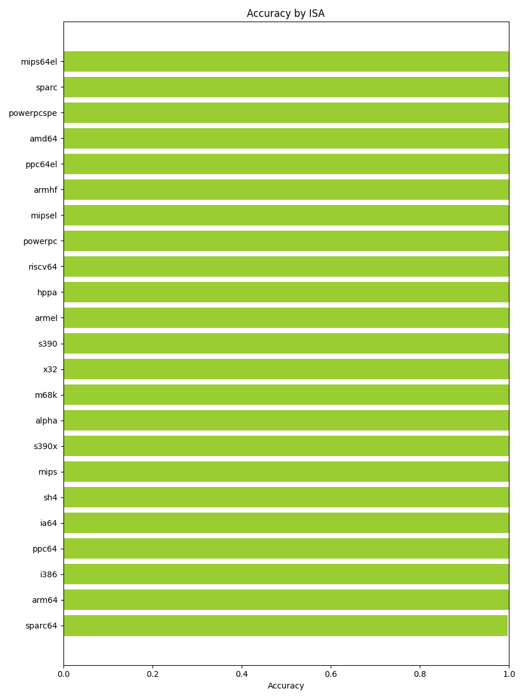
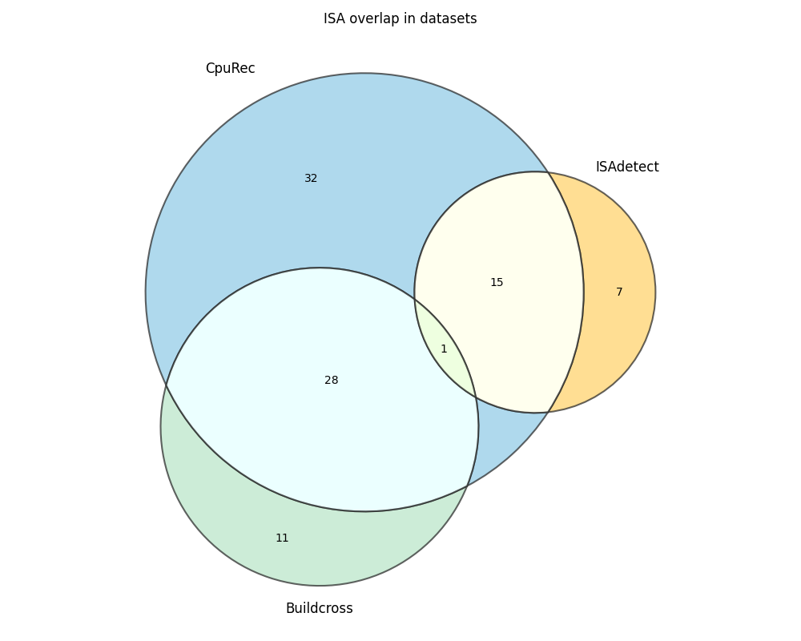
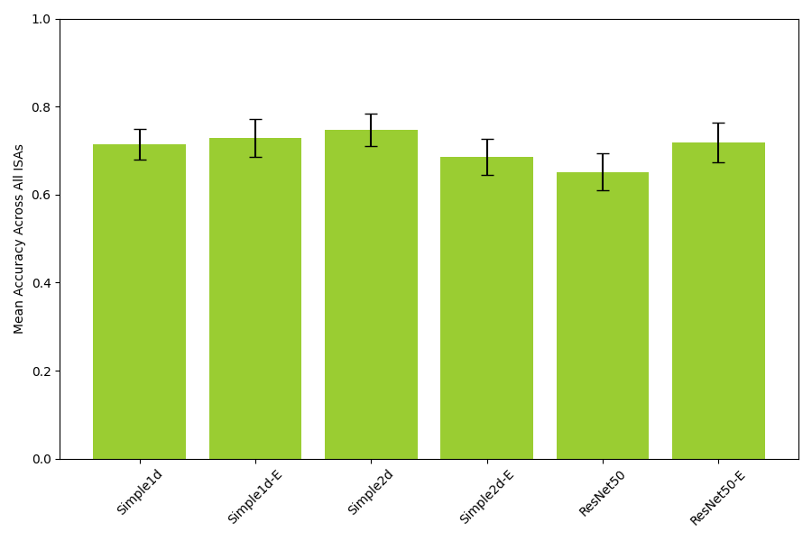
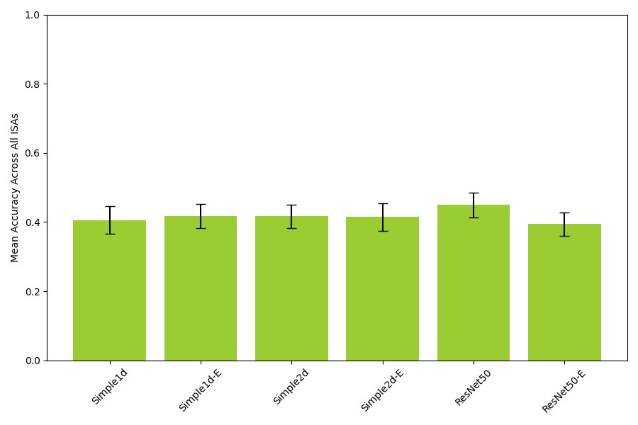

# Discussion

## Overview of key findings

<!--
(Stian)
- Superior performance of Simple1d-E
- Bar chart with performance on each ISA
- Statistical significance
-->

### Endianness

<!--
ISAdetect logocv: embedding higher performance across the board
- added complexity of resnet does not improve results
- 1D vs 2D, similar performance, but 1d marginally better.
- Simple 1d & 2d embedding models able to diff between ISAs with same instruction set but different endianness

CPURec: embedding higher performance across the board, but less that ISAdetect logocv
- 1D vs 2D, similar performance, but 2d marginally better.
- Seen archs perform well, with 100% accuracy, but is able to decte archs like blackfin rl78 rx etc very well.
- More correctly guesses than wrong

buildcross: very similar across all models, but 1d no embedding is best
- worse overall performance than cpu rec and isadetect

isadetect & buildcross on cpu rec:
- surprisingly does not improve performance
- 1d embedding is best
- embedding best

Key take aways:
- 1d better at endianness, allthough marginally. Depends on suite, but never performs much worse.
- Embedding seems best for endianness, and performs better on 3/4 cases. Huge diff on LOGO cv isadetect. The roles are reversed when testing on BuildCross though.
- The larger complexity of resnet does not improve results, and usually performs worse.
- Although results seem promesing on LOGO cv for isadetect, the performance on cpu rec and buildcross is not as good.
- Buildcross has no overlap with isadetect, except m68k, and is not as good as cpu rec.
 -->

Out of all the models on the different test suites, Simple1d-E performed the best overall. While Simple2d-E does marginally beat out Simple1d-E on isadetect-cpurec in \autoref{table:cpurec-endianness-results} and isadetect-buildcross in \autoref{table:buildcross-endianness-results}of 1.2 \ac{p.p.} and 0.5 \ac{p.p.} respectively, we deem these small differences inside the margin of error. However, the relatively larger performance wins on LOGO-CV ISAdetect in \autoref{table:logo-endianness-results} of 4.6 \ac{p.p.} is evidence that Simple1d-E would perform best in real world scenarios.

The largest overall performance differences in our experiments is seen when comparing embedding and non-embedding versions of our models. On the endianness experiments, embedding models perform better in 3/4 cases, with the exception of ISAdetect-Buildcross where Simple1d.

### Instruction width

## Model architecture performance analysis

<!--
(Mikkel)
- Why embeddings work so well
- Why larger models do not perform better
- 1D vs 2D
  - 2D better at instruction width? Why?
- Variability ("flakyness") in model performance
-->

### Impact of embedding layers

In most of our experiments, we see that the model architectures that employ an embedding layer as the first layer of the model perform significantly better than their non-embedding counterparts. This is a key finding, and aligns with our hypothesis that embedding techniques may improve performance for \ac{CNN} models due to the categorical nature of binary code.

Consider this simple instruction for the Intel 8080 instruction set:

```assembly
ADI 25;
```

It uses the `ADI` opcode, which indicates an addition with an immediate value. It sums the content of the accumulator register and the immediate value, and saves the result to the accumulator register. We can examine what this looks like when assembled to a 16-bit binary instruction:

$$
\underbrace{1100\ 0110}_{Opcode} \ \ \underbrace{0001\ 1001}_{Immediate\ value}
$$

The first byte contains the operation code. While operation codes are represented as numbers in the executable code, there is no semantic meaning to this number. It is actually a discrete, categorical piece of data that have no semantic relationship to bytes of close values such as $1100\ 0101$ and $1100\ 0111$.

Intuitively, an operation that is semantically similar to `ADI` (Add Immediate) is `SUI` (Sub Immediate). It performs the same operation, but subtracts the immediate value from the accumulator instead of adding it. The opcode for `SUI` is $1101\ 0110$. Converting this to base 10, the numbers used to represent the `ADI` and `SUI` instructions are 198 and 214. These values themselves do not properly represent the close semantic relationship between the operations.

However, introducing an embedding layer in the model makes it capable of identifying and learning semantic relationships such as this by converting each byte value into a continuous vector. Bytes with close semantic relationships would be represented as similar vectors. While this is a very simple example, converting categorical data into semantic-capturing vectors is a powerful technique that often results in superior performance when training and testing deep learning models on categorical input.

### Model complexity

A clear trend in our results is that the large ResNet models do not perform better than the smaller and simpler \ac{CNN} architectures, and in many cases they actually perform worse than the smaller models. A possible explanation for this is that the ResNet models' high representational power might overfit on the training data. This typically happens when the size or diversity of the training data is limited.

While we consider our data quantity to be sufficient, there are reasons to believe that the diversity of the data is not high enough to avoid overfitting when training larger models. This claim is also supported by the fact that every model we trained converged rather quickly, almost always after just one or two epochs. The limited representational power of the smaller models may actually be beneficial in our case, since they are forced to learn simpler and more obvious patterns instead of picking up on what might effectively be random noise in the training data.

TODO: bar chart showing the parameter count of each model

### CNN dimensionality

While most applications of \acp{CNN}, such as image analysis, use two-dimensional convolution layers, we also included one-dimensional models in our experiments. Prior to running our experiments, we hypothesized that two-dimensional \acp{CNN} might perform better than the one-dimensional ones due to the repeating patterns of fixed-width instruction sets. We also chose the 32x16 dimensions for the same reason, considering that many \acp{ISA} use 32-bit wide instructions.

Our results indicate that for detecting endianness, the two-dimensional models generally do not show an advantage over the one-dimensional counterparts. It is likely that the models do not rely on repeating patterns for detecting endianness, since endianness fundamentally operates on an individual byte organization level.

For detecting instruction width type, the two-dimensional models do perform as well or better than the one-dimensional models for experiments that use CpuRec or BuildCross as the test set. However, for \ac{LOGO CV} on ISADetect, the one-dimensional models still perform slightly better.

The relationship between model dimensionality and performance appears to be influenced by both the specific architectural feature being detected and the diversity of the training/testing datasets. This indicates that optimal \ac{CNN} dimensionality for binary code analysis may be feature-dependent, rather than universally favoring a particular approach.

### Variance in model performance

When training a deep learning model, several components use pseudo-randomness:

- **Weight initialization:** The trainable model parameters are initialized with random values before training starts. This is usually preferred over starting with all parameters set to zero.
- **Mini-batch sampling:** For each training iteration, a random subset of the training data is used to compute the next weight update.
- **Dropout:** A random set of neurons in each layer is set to zero during training.

To control and reproduce these pseudo-random elements, one can specify a seed. Setting a seed guarantees that the pseudo-random behavior can be reproduced. When training our models, we train and test it multiple times using different seeds. This allows us to compare the accuracy between different random initializations.

Generally, we observe a very high variance between different runs due to differences in randomness. This indicates that the training process of the model is unstable, where the performance on an unseen test set varies greatly even if the training loss quickly converges to zero. For instance, the best-performing model for endianness detection (_Simple1d-E_), when evaluating with \ac{LOGO CV} on ISADetect, shows a standard deviation of up to 28 percentage points for certain \acp{ISA} when comparing the accuracy across different random seeds (see \autoref{table:logo-endianness-results}). This happens even though we take precautions such as using low learning rates and regularizing the models with dropout.

This is common behavior when the size of the training dataset is limited. While we consider our training dataset to be large and comprehensive, the model variability strengthens our suspicion that the dataset is too homogeneous for training deep neural networks in an optimal way. Another factor that might cause these results is outliers in the data. Random initialization might make models more or less sensitive to outliers in the training data.

## Model generalizability

<!--
- LOGO already tests this
  - Show comparison to regular leave-one-out cross validation to prove that it overfits if not using LOGO CV
- Why does this not convert well to CpuRec and BuildCross?
  - Models might be memorizing specific ISA characteristics rather than learning generalizable features
  - Limited sample size
  - Greater diversity of architectures
    - Struggles with 8-bit?
  - Statistical significance
- Does training on BuildCross improve performance?
- Visualize some grayscale images
- Learning rate converges fast relative to the amount of data we have, suggest that it is fitting to something
-->

A key objective of our models is to be able to generalize to \acp{ISA} that were not seen during training. This section analyzes the generalizability of our models and how our experiments support this objective.

### Leave-one-group-out cross validation

We use \ac{LOGO CV} as our cross validation method for the ISAdetect dataset. In contrast to standard K-fold cross validation, \ac{LOGO CV} tests how the model performs on a previously unseen group. This is a more realistic scenario for testing generalizability, since it simulates the real-world scenario where a model is deployed to a new \ac{ISA} that was not seen during training.

To showcase the effectiveness of \ac{LOGO CV}, we compare the accuracy of our models when evaluated on \ac{LOGO CV} to the accuracy when evaluated with a standard train/test split using 80% of the data for training and 20% for testing. The results of the latter approach on the best-performing _Simple1d_ model is shown in \autoref{fig:isadetect-traintest-accuracy-by-isa}. We observe extreme performance, achieving an average accuracy of 99.99%. In contrast, the same setup using \ac{LOGO CV} gave an accuracy of 89.7%, as observed in \autoref{training-and-testing-on-isadetect}. It is clear that evaluating on the same \acp{ISA} as the ones present in the training data results in performance that is artificially high when the overall objective is to evaluate generalizability to unseen \acp{ISA}.

TODO: Change this image, it is wrong



### Testing on other datasets

For evaluating the generalizability beyond the 23 \acp{ISA} present in the ISAdetect dataset, we use the CpuRec dataset as well as BuildCross, the custom dataset we developed for this thesis. These datasets provide a more diverse set of \acp{ISA} than the ISAdetect dataset. In particular, CpuRec contains binaries from 76 different \acp{ISA}, while BuildCross contains binaries from 40 different \acp{ISA}.

#### CpuRec

We observe that models trained on ISAdetect do not generalize well to the CpuRec dataset. While certain models appears to perform well, it is important to note that there is an overlap between the \acp{ISA} present in the ISAdetect and CpuRec datasets. \autoref{fig:dataset-isa-overlap} illustrates this. Out of the 76 \acp{ISA} present in CpuRec, 15 of them are also present in ISAdetect.



This overlap of \acp{ISA} between the datasets is a limitation of our experiments, as it may lead to models memorizing specific \acp{ISA} characteristics rather than learning generalizable features. However, we can mitigate this by excluding the \acp{ISA} present in ISAdetect from the CpuRec dataset, and observe the performance using only the non-overlapping \acp{ISA}. Endianness classification performance after excluding the \acp{ISA} present in ISAdetect from the test set is shown in \autoref{fig:cpurec-endianness-by-model-exclude-overlap}. We observe that the model with the highest accuracy is now Simple2d, achieving an accuracy of 74.7%, down from Simple1d-E's 81.0% when evaluated on the entire CpuRec dataset. For instruction width type classification, the effect of removing overlapping \acp{ISA} is even more pronounced. \autoref{fig:cpurec-instructionwidthtype-by-model-exclude-overlap} shows the instruction width classification performance after excluding the \acp{ISA} present in ISAdetect from the test set. Here, the best-performing model only achieves an accuracy of 44.9%, which is worse than what a dummy model that always predicts the most common class would achieve.





#### BuildCross

TODO

## Augmenting training data with BuildCross

TODO

## Comparision with prior literature

<!--
(Stian)
- Compare to Andreassen
- Critique of Andreassen
  - Doesn’t exclude previously seen architectures when testing on CPURec
  - Lacking a lot of labels and mislabeling certain things
  -->

## Dataset quality assessment

<!--
5.5.1 ISADetect Dataset

Strengths and limitations
Representation of mainstream vs. exotic architectures
Similar architectures impact logocv and balance? (ref powerpc vs powerpcspe, armel armhf)

5.5.2 CPURec Dataset

Single binary per ISA limitation
Misclassification issues
Statistical reliability concerns

5.5.3 BuildCross Dataset

Library code rather than executables, impact on results
Which libraries and why, (maybe this should be in methododology?)
Limited to ELF-supported architectures
Dependency on external toolchain (mikpe's GitHub)
Quantity and quality of gathered data
improves instruction width but not endianness. why?
-->

## UN sustainability goals

<!--
- Smaller models use less power which is good
- https://www.ntnu.no/excited/b%C3%A6rekraft-i-it-utdanning
-->

## Limitations

<!--
- Only two target features
- Black-box models – hard to interpret why it doesn't generalize that well
- Training on more than just code sections?
- File splitting implications
-->
