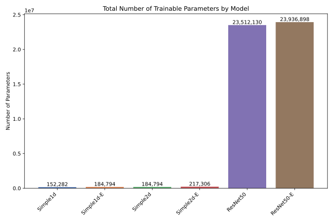
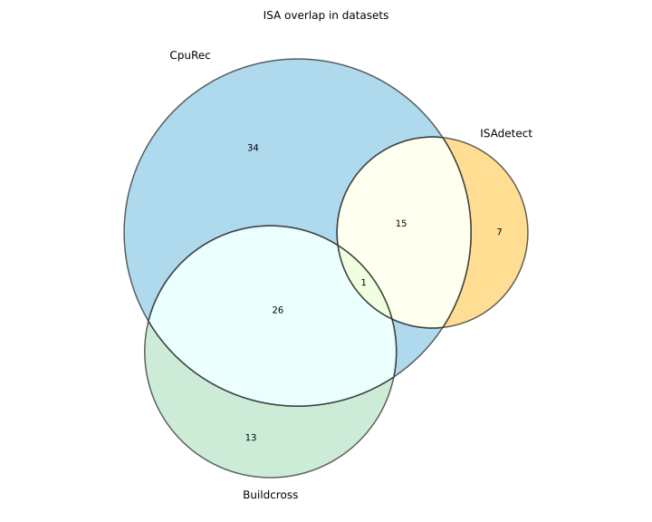
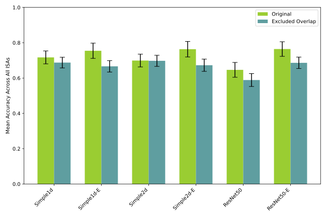
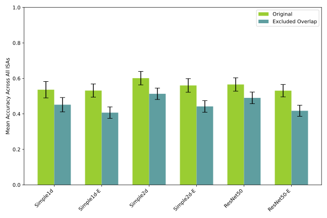
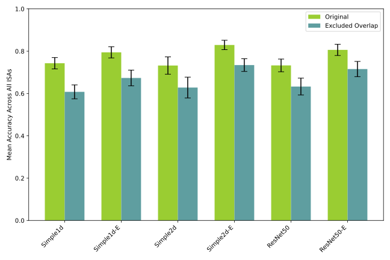

\acresetall

# Discussion

<!-- TODO: mention RQs more often -->

This chapter discusses and interprets our results and findings from \autoref{results}. \autoref{overview-of-key-findings} begins by summarizing the main discoveries and their implications. \autoref{model-architecture-performance-analysis} then examines the performance characteristics of the different model architectures, focusing on aspects such as the impact of embedding layers, model complexity, \acs{CNN} dimensionality, and observed performance variance. Then, \autoref{model-generalizability} assesses the ability of our models to generalize to unseen \acsp{ISA}. A comparative analysis with prior research is presented in \autoref{comparison-with-prior-literature-andreassen-and-morrison}. Following this, \autoref{dataset-quality-assessment} critically evaluates the datasets employed, discussing their respective strengths and limitations. We also explore the broader sustainability implications in \autoref{sustainability-implications-and-ethical-considerations}, and conclude by acknowledging the limitations of our work in \autoref{limitations}.

## Overview of key findings

In this section, we will briefly go over the main findings of our experiments. We will also highlight the potential implications of these findings related to our research questions by indicating further points of discussion for later sections in this chapter.

### K-fold cross-validation and chosen evaluation strategies

In the initial K-fold cross-validation experiments on ISAdetect, we observed that all models performed similarly well, with near 100% classification accuracy on both endianness and instruction width type, as seen in \autoref{fig:kfold-endianness-by-model} and \autoref{fig:kfold-instructionwidthtype-by-model} respectively. This result was also achieved with very little variance between runs, and points to the fact that already seen architectures across the training and test set let the models excel at fitting to endianness and instruction width. The extreme accuracy supports our suspicion that the models can quickly fit to architectural features that are not inherently tied to endianness and instruction width. We believe we were correct in our assessment that this needed to be investigated further, and that \ac{LOGO CV} as well as testing on different datasets is the best way to evaluate the general ability of \acp{CNN} in detecting \ac{ISA} features.

With \ac{LOGO CV} and the evaluation strategies using multiple datasets, we see more varied and interesting results compared to K-fold. In terms of raw classification performance, individual model performance varies quite a lot depending on the datasets used. With \ac{LOGO CV} with ISAdetect, we achieve mean accuracies of **90.3%** for endianness detection (see \autoref{table:logo-endianness-results}), and **88.0%** for instruction width type detection (see \autoref{table:logo-instructionwidthtype-results}). Both of these scores were achieved with the Simple1d-E model. The performance on the other datasets is not quite as convincing. On the evaluation setups testing on CpuRec, we see higher variability between runs with lower accuracies, and lower overall accuracy on the BuildCross tests.

### Endianness detection

For endianness detection, we see clear performance differences between embedding and non-embedding models. The embedding models perform better in three out of the four evaluation strategies, with a clear gap in performance under \ac{LOGO CV} on ISAdetect. The only exception is ISAdetect-BuildCross, where the non-embedding versions of both the Simple1d and the Simple2d model beat out their embedding counterparts, with significantly lower variance in the accuracies as well (see \autoref{table:buildcross-endianness-results}). Still, the large performance difference under \ac{LOGO CV} on ISAdetect (see \autoref{table:logo-endianness-results}), and the gap in accuracy in the ISAdetect-CpuRec (see \autoref{table:cpurec-endianness-results}) and Combined-CpuRec experiments (see \autoref{table:combined-endianness-results}), indicate that the embedding models are better suited for endianness detection. This is backed by the paired t-test results in \autoref{fig:paired-t-test-logo-endianness}, \autoref{fig:paired-t-test-isadetect-cpurec-endianness}, and \autoref{fig:paired-t-test-combined-cpurec-endianness}, wherein these three evaluations, none of the non-embedding models outperform any of the embedding models with a p-value of less than 0.05.

### Instruction width type detection {#overview-instruction-width-type}

For instruction width type detection, it is less clear which model variations perform the best, especially compared to endianness detection. In the ISAdetect-CpuRec evaluation, the performance is poor, as seen in \autoref{table:cpurec-instructionwidthtype-results}. The average accuracy measure ranges from **53.2%** to **60.1%** – results that are no better than always predicting the majority class. Just like with endianness detection, the two best-performing evaluations are \ac{LOGO CV} on ISAdetect and Combined-CpuRec. We also observe that non-embedding models are seemingly better in the two worst-performing tests, ISAdetect-CpuRec and ISAdetect-BuildCross, as shown by the comparisons in \autoref{fig:paired-t-test-isadetect-cpurec-instructionwidthtype} and \autoref{fig:paired-t-test-isadetect-buildcross-instructionwidthtype}. Based on \ac{LOGO CV} on ISAdetect and the Combined-CpuRec evaluation, we initially concluded that embedding models perform better overall, although with smaller performance differences across the top-performing models, making the advantage less pronounced than for endianness detection.

However, we notice an interesting trend: the confusion matrices for the models only training on ISAdetect show that variable width architectures are often misclassified as fixed width architectures, while the opposite is not true. In the ISAdetect-CpuRec confusion matrix in \autoref{fig:cm-isadetect-cpurec-instructionwidthtype}, we see that **70.7%** of variable width architectures are classified as fixed, a significant error across all models. We see a similar pattern with ISAdetect-BuildCross, shown in \autoref{fig:cm-isadetect-buildcross-instructionwidthtype}. This suggests that instruction width type classification models trained on only ISAdetect do not transfer well to other unseen architectures.

### Impact of BuildCross dataset

We believe that the addition of the BuildCross dataset has had a positive impact on the overall quality and robustness of our testing methodology, as shown in the results from both ISAdetect-BuildCross and Combined-CpuRec experiments. Our ISAdetect-BuildCross performance shows comparable results to ISAdetect-CpuRec on instruction width detection, validating our efforts in creating a dataset with more unconventional and diverse architectures. However, an interesting anomaly appears with endianness detection, where the non-embedding models outperform their embedding counterparts with remarkably low variance, seen in \autoref{fig:buildcross-endianness-by-model}. This unexpected pattern contrasts the other experimental suites. There is some indication of similar behavior, although less pronounced, in the instruction width detection experiments with the same setup.

While testing on the BuildCross dataset showed some interesting patterns, the most significant impact in terms of overall accuracy appeared when combining ISAdetect and BuildCross for training the models. The addition of BuildCross significantly improved performance on the CpuRec evaluation, particularly for instruction width type detection. In this case, accuracy jumped from **50--60%** to above **80%** for the top performing models, comparing \autoref{table:cpurec-instructionwidthtype-results} and \autoref{table:combined-instructionwidthtype-results}. This indicates that the addition of more diverse and unconventional architectures in the training data has a positive impact on the overall performance of our models. This is also further indicated by the improved balance of the models, as demonstrated in \autoref{fig:cm-combined-cpurec-instructionwidthtype}. We find that variable-width architectures are no longer systematically misclassified as fixed, as was the case when only training on ISAdetect.

## Model architecture performance analysis

### Impact of embedding layers

In most of our experiments, we see that the model architectures that employ an embedding layer as the first layer of the model perform significantly better than their non-embedding counterparts. This is a key finding, and aligns with our hypothesis that embedding techniques may improve performance for \ac{CNN} models due to the categorical nature of binary code.

Consider this simple instruction for the Intel 8080 instruction set:

```assembly
ADI 25;
```

It uses the `ADI` opcode, which indicates an addition with an immediate value. It sums the content of the accumulator register and the immediate value and saves the result to the accumulator register. We can examine what this looks like when assembled to a 16-bit binary instruction:

$$
\underbrace{1100\ 0110}_{Opcode} \ \ \underbrace{0001\ 1001}_{Immediate\ value}
$$

The first byte contains the operation code. While operation codes are represented as numbers in the executable code, there is no semantic meaning to these numbers. It is a discrete, categorical piece of data that has no semantic relationship to bytes of close values such as $1100\ 0101$ and $1100\ 0111$.

Intuitively, an operation that is semantically similar to `ADI` (Add Immediate) is `SUI` (Sub Immediate). It performs the same operation but subtracts the immediate value from the accumulator instead of adding it. The opcode for `SUI` is $1101\ 0110$. Converting this to base 10, the numbers used to represent the `ADI` and `SUI` instructions are 198 and 214. These values themselves do not properly represent the close semantic relationship between the operations.

However, introducing an embedding layer in the model makes it capable of identifying and learning semantic relationships such as this by converting each byte value into a continuous vector. Bytes with close semantic relationships would be represented as similar vectors. While this is a very simple example, converting categorical data into semantic-capturing vectors is a powerful technique that often results in superior performance when training and testing deep learning models on categorical input.

### Model complexity

\autoref{fig:parameter-count} shows the parameter count of each of our models. A clear trend in our results is that the larger ResNet models do not outperform the smaller and simpler \ac{CNN} architectures; in many cases, they actually perform worse. This observation holds even when considering that ResNet models were given a larger input window of 1024 bytes compared to the 512 bytes used by simpler models. A possible explanation for this is that the ResNet models' high representational power might overfit to the training data. This typically happens when the size or diversity of the training data is limited.



While we consider our data quantity to be sufficient, there are reasons to believe that the diversity of the data is not high enough to avoid overfitting when training larger models. This claim is also supported by the fact that every model we trained converged rather quickly, almost always after just one or two epochs. In fact, the limited representational power of the smaller models may be beneficial in our case, since they are forced to learn simpler and more obvious patterns instead of picking up on what might effectively be random noise in the training data.

### CNN dimensionality

While most applications of \acp{CNN}, such as image analysis, use two-dimensional convolution layers, we also included one-dimensional models in our experiments. Before running our experiments, we hypothesized that two-dimensional \acp{CNN} might perform better than the one-dimensional ones due to the repeating patterns of fixed-width instruction sets. We also chose the 32x16 input size for the same reason, considering that many \acp{ISA} use 32-bit wide instructions.

Our results indicate that for detecting endianness, the two-dimensional models generally do not show an advantage over the one-dimensional counterparts. Likely, the models do not rely on repeating patterns for detecting endianness, since endianness fundamentally operates on an individual byte organization level.

For detecting instruction width type, the two-dimensional models do perform as well or better than the one-dimensional models for experiments that use CpuRec or BuildCross as the test set. However, for \ac{LOGO CV} on ISAdetect, the one-dimensional models still perform slightly better.

The relationship between model dimensionality and performance appears to be influenced by both the specific architectural feature being detected and the diversity of the training/testing datasets. This indicates that optimal \ac{CNN} dimensionality for binary code analysis may be feature-dependent, rather than universally favoring a particular approach.

### Variance in model performance

When training a deep learning model, several components use pseudo-randomness:

- **Weight initialization:** The trainable model parameters are initialized with random values before training starts. This is usually preferred over starting with all parameters set to zero.
- **Mini-batch sampling:** For each training iteration, a random subset of the training data is used to compute the next weight update.
- **Dropout:** A random set of neurons in each layer is set to zero during training.

To control and reproduce these pseudo-random elements, one can specify a seed. Setting a seed guarantees that the pseudo-random behavior can be reproduced. When developing our models, we train and test them multiple times using different seeds. This allows us to compare the accuracy between different random initializations.

Generally, we observe a very high variance between different runs due to differences in randomness. This indicates that the training process of the model is unstable, where the performance on an unseen test set varies greatly even if the training loss quickly converges to zero. For instance, the best-performing model for endianness detection (_Simple1d-E_), when evaluating with \ac{LOGO CV} on ISAdetect, shows a standard deviation of up to 28 percentage points for certain \acp{ISA} when comparing the accuracy across different random seeds (see \autoref{table:logo-endianness-results}). This happens even though we take precautions such as using low learning rates and regularizing the models with dropout.

This is common behavior when the size of the training dataset is limited. While we consider our training dataset to be large and comprehensive, the model variability strengthens our suspicion that the dataset is too homogeneous for optimally training deep neural networks. Another factor that might cause these results is outliers in the data. Random initialization might make models more or less sensitive to outliers in the training data.

## Model generalizability

A key objective of our models is to be able to generalize to \acp{ISA} that were not seen during training. This section analyzes the generalizability of our models and how our experiments support this objective.

### Leave-one-group-out cross-validation

We use \ac{LOGO CV} as our cross-validation method for the ISAdetect dataset. In contrast to standard K-fold cross-validation, \ac{LOGO CV} tests how the model performs on a previously unseen group. This is a more realistic scenario for testing generalizability, since it simulates the real-world scenario where a model is deployed to a new \ac{ISA} that was not seen during training.

To showcase the effectiveness of \ac{LOGO CV}, we can compare the accuracy of our models when evaluated on \ac{LOGO CV} to the accuracy when evaluated with standard K-fold cross-validation. As shown in \autoref{k-fold-cross-validation-on-isadetect}, we observe extreme performance under 5-fold cross-validation, with all models achieving accuracies above **99%**. In contrast, the same setup using \ac{LOGO CV} gave an accuracy of **89.7%** for the best model, as observed in \autoref{training-and-testing-on-isadetect}. It is clear that evaluating on the same \acp{ISA} as the ones present in the training data results in performance that is artificially high when the overall objective is to evaluate generalizability to unseen \acp{ISA}.

### Testing on other datasets

For evaluating the generalizability beyond the 23 \acp{ISA} present in the ISAdetect dataset, we use the CpuRec dataset as well as BuildCross, the custom dataset we developed for this thesis. These datasets provide a more diverse set of \acp{ISA} than the ISAdetect dataset. In particular, CpuRec contains binaries from 76 different \acp{ISA}, while BuildCross contains binaries from 40 different \acp{ISA}.

#### CpuRec

We observe that models trained on ISAdetect do not generalize well to the CpuRec dataset. While certain models appear to perform well, it is important to note that there is an overlap between the \acp{ISA} present in the ISAdetect and CpuRec datasets. \autoref{fig:dataset-isa-overlap} illustrates this. Out of the 76 \acp{ISA} present in CpuRec, 16 of them are also present in ISAdetect.



This overlap of \acp{ISA} between the datasets is a limitation of our experiments, as it may lead to models memorizing specific \acp{ISA} characteristics rather than learning generalizable features. However, we can mitigate this by excluding the \acp{ISA} present in ISAdetect from the CpuRec dataset, and observe the performance using only the non-overlapping \acp{ISA}. Endianness classification performance after excluding the \acp{ISA} present in ISAdetect from the test set is shown in \autoref{fig:cpurec-endianness-by-model-exclude-overlap}. We observe that the model with the highest accuracy is now Simple2d, achieving an accuracy of 74.7%, down from Simple1d-E's 81.0% when evaluated on the entire CpuRec dataset. For instruction width type classification, the effect of removing overlapping \acp{ISA} is even more pronounced. \autoref{fig:cpurec-instructionwidthtype-by-model-exclude-overlap} shows the instruction width classification performance after excluding the \acp{ISA} present in ISAdetect from the test set. Here, the best-performing model only achieves an accuracy of 44.9%, which is worse than what a baseline model that always predicts the most common class would achieve.





We identify several potential reasons for the poor generalizability of our ISAdetect-trained models:

- The diversity of the ISAdetect dataset used for training is quite limited. CpuRec contains 76 different \acp{ISA}, while ISAdetect only contains 23. In addition, the ISAdetect dataset is more homogeneous, with all \acp{ISA} being supported compile targets for recent versions of the Debian Linux distribution. CpuRec, on the other hand, was developed by manually cross-compiling source code to a very diverse set of \acp{ISA}. By inspecting the \ac{ISA} features in the two datasets, we can for instance observe that while all \acp{ISA} in ISAdetect have 32-bit or 64-bit word sizes, CpuRec also contains several \acp{ISA} with 8-bit and 16-bit word sizes.

- The CpuRec dataset only contains a single binary file per \ac{ISA}. This is a significant limitation of the dataset that makes our results less conclusive and more sensitive to anomalies in the specific binary used for each \ac{ISA}.

- Due to the nature of deep learning, it is possible that the \ac{CNN} models are picking up on \ac{ISA}-specific patterns that are not inherently related to the endianness or instruction width. This is a common problem in deep learning and is known as overfitting to the training data. Since it is difficult to interpret the inner workings of \ac{CNN} models, we can only speculate whether this is the case. However, the high accuracies observed when running K-fold cross-validation on the ISAdetect dataset do support the claim that the models are easy to fit to full \acp{ISA} compared to fitting them to specific \ac{ISA} characteristics.

As noted in the results chapter, our findings show that augmenting the training data with BuildCross does not improve the generalizability of endianness detection. However, we do see indications that the instruction width type classification task benefits from augmenting the training data with BuildCross. To make this a fair comparison, we must note that training on BuildCross results in more \acp{ISA} overlap between the training and test datasets, as compared to training on ISAdetect only. To emphasize that the performance is truly better on unseen \acp{ISA}, we can examine the results when excluding both the \acp{ISA} present in ISAdetect and BuildCross from the test set. \autoref{fig:combined-instructionwidthtype-by-model-exclude-overlap} illustrates this. Compared to \autoref{fig:cpurec-instructionwidthtype-by-model-exclude-overlap}, we see significant performance improvements across all model architectures, indicating that the inclusion of a more diverse training dataset does improve the generalizability of instruction width type classification.



#### BuildCross

BuildCross is the dataset we developed specifically for this thesis, containing binaries from 40 different \acp{ISA}. In contrast to the other experiments, we observe that the non-embedding models perform better when evaluated on this dataset. Particularly, the best-performing model for endianness classification is Simple1d, achieving an accuracy of 71.3%. For instruction width type classification, the best-performing model is Simple2d, achieving an accuracy of 69.6%.

An advantage of the BuildCross dataset compared to the CpuRec dataset is that there is little \acp{ISA} overlap with the training dataset (ISAdetect). This reduces the risk of the performance numbers showing up as artificially high due to the models memorizing specific \acp{ISA} characteristics rather than learning generalizable features.

We note that while generalizability for the endianness classification task seems similar between the CpuRec and BuildCross datasets, the instruction width type classification task shows a clear improvement when evaluated on the BuildCross dataset.

## Comparison with prior literature: Andreassen and Morrison

In our search for related work documented in \autoref{related-work}, the thesis _Discovery of ISA features from binary programs from unknown instruction set architectures_ by Andreassen and Morrison stands out as the only other identified research that specifically addresses the problem of detecting individual \ac{ISA} features from unknown binary code [@Andreassen_Morrison_2024]. This work was supervised by Donn Morrison, who is also the supervisor of this thesis and who recommended we review this research. For brevity in the following discussion, we will refer to this paper as "Andreassen's work," acknowledging Morrison's supervisory role in that project. The thesis uses similar evaluation strategies and datasets, but with different feature extraction methods. Andreassen uses explicit feature engineering with classical machine learning classifiers for predicting the different \ac{ISA} features, as opposed to deep learning techniques that automatically extract features from the binary code. In addition to targeting endianness and instruction width type detection, he includes a third target feature of detecting the instruction width of fixed-width architectures.

The thesis uses experiments similar to ours for endianness detection, with the same datasets and evaluation strategies. We will compare the results of our models with the results of Andreassen's models where applicable. However, there are notable differences in dataset labeling and the architectures used for training and testing, which complicate a fully accurate and direct comparison. In the rest of this section, we present our interpretation of a direct performance comparison on endianness and instruction width type classification, before discussing the key differences in our approaches and addressing the issues associated with these comparisons.

### Endianness

#### Performance

There are two experimental suites targeting endianness set up in [@Andreassen_Morrison_2024] that are comparable to our results. The first suite is \ac{LOGO CV} on ISAdetect on code sections, where he achieved an accuracy of **92.0%** using a Random Forest classifier with bigram features, and **91.7%** using a Random Forest classifier with EndiannessSignature features. In comparison, we achieve an accuracy of **90.3%** using the Simple1d-E model on the same dataset. Andreassen's accuracy figures are slightly higher than ours on average, but still within the 95% confidence interval of ±2.0% for our top-performing model (see \autoref{table:logo-endianness-results}). The other comparable suite is training on ISAdetect code sections and testing on CpuRec. Andreassen achieved an accuracy of **86.3%** using a Random Forest and Logistic Regression classifier with bigram features [@Andreassen_Morrison_2024]. We were only able to achieve an accuracy of **75.4%**, **76.3%** and **76.4%** using the Simple1d-E, Simple2d-E and ResNet50-E models respectively in our testing (see \autoref{table:cpurec-endianness-results}). This is a relatively large difference in performance.

#### Complexity

Andreassen uses two different feature engineering techniques: bigrams and EndiannessSignatures. Both methods have different advantages in complexity and training data requirements compared to our \ac{CNN} approach. The bigram feature consists of counting up all combinations of two byte-pairs in each program, resulting in a histogram of $256 \cdot 256 = 65,536$ input features. The EndiannessSignature feature consists of the counts of only 4 bigrams: 0xfffe, 0xfeff, 0x0001, and 0x0100, and the idea was originally developed by Clemens (see \autoref{feature-engineering-and-feature-extraction}) [@Clemens2015; @Andreassen_Morrison_2024].

The bigram feature was limited to 150 binaries per architecture for training due to memory constraints but is still able to perform well with a much smaller training dataset than what deep learning approaches would require. The 65,536-long feature vector does result in a significant count of trainable parameters depending on the classifier, and scikit-learn's MLPClassifier with the default hidden layer size of 100, assuming that is what Andreassen used, would have 6.56 million weights [@MLPClassifierScikitLearn]. This falls in between our simple \ac{CNN} models with 150k-217k parameters and ResNet50 with ~23.5M. The EndiannessSignature feature, on the other hand, is very simple with an input feature vector of only 4 elements. It is able to achieve similar performance and often outperforms the bigram feature. Andreassen's approaches are able to achieve similar overall performance compared to ours, yet with less training data and lower complexity, especially when looking at the EndiannessSignature feature [@Andreassen_Morrison_2024].

#### Generalizability

A possible explanation for the effectiveness of Andreassen's feature extraction methods is his use of entire binary files, as the two bigram-based features can gather statistical information from the complete binary. In contrast, \ac{CNN}-based automatic feature extraction is limited to the input window size of the model, which we have set to 512 and 1024 bytes for Simple and ResNet models, respectively. While requiring more training data, the \ac{CNN} approach might have an advantage in inference scenarios when only limited portions of a binary are available. We suspect that the bigram feature, based on a memory-intensive brute force approach, would require larger amounts of input binary data to be effective. For the EndiannessSignature feature, we cannot determine how frequently these specific bigrams appear within the first kilobytes of code, making it difficult to assess its effectiveness on smaller code sections. While our \ac{CNN} approach might be better suited for smaller code samples, Andreassen's models can make accurate predictions using much simpler classification techniques [@Andreassen_Morrison_2024].

### Instruction width type

#### Performance

For instruction width type detection, there are no directly comparable evaluations between our work and Andreassen's. He uses CpuRec for training on all experimental suites, running experiments with \ac{LOGO CV} with CpuRec, testing on ISAdetectFull, and testing on ISAdetectCode. The decision not to train on ISAdetect is justified by the lack of variety in his labeling, resulting in only 2 variable width architectures: `amd64` and `i386`, both from the x86 family. His results are still impressive when training on the more limited CpuRec dataset, with the best-performing models reaching accuracies of **86.0%** with \ac{LOGO CV} on CpuRec and **92.2%** accuracy when testing on ISAdetect [@Andreassen_Morrison_2024]. While not directly comparable, our evaluation using \ac{LOGO CV} on ISAdetect performs on par in terms of accuracy on ISAdetect (**88.0%** with Simple1d-E from \autoref{table:logo-instructionwidthtype-results}). Meanwhile, our evaluation training on ISAdetect and testing on CpuRec performs significantly worse with only **60.1%** accuracy (see \autoref{table:cpurec-instructionwidthtype-results}). Only the Combined evaluation results in comparable performance (**82.9%** with Simple2d-E from \autoref{table:combined-instructionwidthtype-results}).

#### Complexity

Comparing model performance, training data, and model complexity, Andreassen presents three feature extraction methods: ByteDifferencePrimes, AutoCorrelation, and Fourier. Andreassen does not explicitly detail the feature vector lengths of his models, but reading his thesis we are able to create likely estimates. ByteDifferencePrimes keeps track of distances between identical byte values in the binary, managing the first 50 prime factors of distances for each byte value. This should result in a feature vector of $50 \cdot 256 = 12,800$ elements. The AutoCorrelation feature depends on the lag range parameter, computing autocorrelation for each value across that range. The optimal lag range depended on the classifier but varied between 32 and 1024. The Fourier feature converts the binary into a frequency spectrum, and the number of input features depends on the decided frequency range. Like with the AutoCorrelation feature, the optimal frequency range depended on the classifier but varied between 16 and 512, resulting in $2 \cdot FrequencyRange + 1$ features [@Andreassen_Morrison_2024]. Both AutoCorrelation and Fourier result in models much smaller in complexity than our \acp{CNN}, with AutoCorrelation seemingly performing on par with or better than our models. ByteDifferencePrimes is significantly more complex, and the larger classifiers are comparable to our Simple \ac{CNN} models in complexity.

#### Generalizability

Looking at Andreassen's results using AutoCorrelation and ByteDifferencePrimes, there is an apparent advantage in being able to train on the architecturally diverse CpuRec dataset. Comparing our results, we see that our models struggle when moving from ISAdetect to CpuRec, and that we required the more diverse BuildCross dataset to achieve similar performance. Andreassen's results indicate that his feature extraction methods can learn generalizable features even when trained on a smaller dataset, and that the feature engineering approach would be able to outperform our \ac{CNN} models in this case [@Andreassen_Morrison_2024].

### Differences in approach and comparison issues

While we attempt to compare our work with Andreassen's, there are some key differences in our approaches that make a direct comparison difficult. These include dataset labeling and \ac{ISA} inclusion differences, lack of documentation of model hyperparameters, and statistical evidence for comparing our approaches [@Andreassen_Morrison_2024].

#### Dataset labeling and ISA inclusion differences

The most significant difference between our and Andreassen's comparative analysis lies in the dataset labeling. ISAdetect contains mostly mainstream architectures with readily available documentation, whereas CpuRec comprises code sections from numerous rare, less documented architectures. This presents considerable challenges for accurate labeling, something that we experienced during dataset preparation documented in \autoref{methodology-datasets}. Andreassen's research relied on labeling provided by another researcher at \ac{NTNU} which lacked a lot of data for many architectures, likely because of the time-consuming process of categorizing endianness and instruction widths. We conducted our own review of each of the architecture's labeling across both ISAdetect and CpuRec datasets, which enabled us to include additional \acp{ISA} for endianness and instruction width type analysis. During this process, we also identified incorrect labels for several architectures in CpuRec, such as endianness for `MCore` and instruction width type for `AxisCris`, `CompactRISC`, `M32R`, among others. A full list of new and corrected labels can be found in \autoref{table:isadetect-labels-comparison} and \autoref{table:cpurec-labels-comparison}. Additionally, CpuRec has undergone updates since Andreassen completed his thesis, introducing architectures like `ARC32el` and `ARC32eb` that were unavailable during his research [@Andreassen_Morrison_2024]. It should be noted that we are not entirely confident in the accuracy of our labeling. We discuss this further in \autoref{dataset-quality-cpurec}. These labeling challenges combined with the differences in dataset composition limit our capacity to draw definitive conclusions comparing our findings to Andreassen's previous work.

#### Experimental setup and statistical evidence

In an attempt to compare model complexity and performance, we discovered a lack of documentation on how Andreassen's custom software implements these models, particularly regarding hyperparameter configuration. Reproducing his results fell out of the scope of this thesis, so we are not able to verify his work nor determine if reproduction is feasible. Many classifiers from the scikit-learn library that he uses have numerous configurable parameters, and while he optimized some hyperparameters on certain models using grid search, Andreassen only explicitly documents that the `random_state` parameter was set to 42 for reproducibility, `max_iter` set to 10,000 for convergence, and `n_jobs` set to -1 to enable multi-core processing. We can only assume that he used default values from scikit-learn for non-specified hyperparameters. On the evaluations where our work overlaps with his, meaningful statistical comparison is difficult since Andreassen appears to have done only one run for each model configuration. While his use of \ac{LOGO CV} provides some statistical robustness, models dependent on random initialization would benefit from multiple runs with different seeds to document performance stability. This was evident in our experiments, where we sometimes observed high variability and clear outliers in our results, like in \autoref{fig:combined-instructionwidthtype-by-model}. Attempts at reproduction of his work would require making assumptions about the unspecified hyperparameters, further complicating verification of his findings [@Andreassen_Morrison_2024].

#### Analysis of generalizability

In terms of model generalizability across unseen architectures, we find Andreassen's work lacks a more thorough discussion of this aspect. While he implements \ac{LOGO CV} on ISAdetect for endianness and \ac{LOGO CV} on CpuRec for instruction width type, which provides valuable insights into performance on exotic unseen architectures, our research demonstrates that testing across different datasets with overlapping architectures significantly impacts model performance, as discussed in \autoref{testing-on-other-datasets}. This cross-dataset testing represents an important dimension of generalizability that Andreassen does not explore to a point where we can fairly compare our approaches. However, it is still our opinion that feature engineering provides much clearer insights into what the models are fitting to, with features like EndiannessSignatures and AutoCorrelation offering more interpretability than those learned by a \ac{CNN}.

### Summary

Comparing our deep learning approach with Andreassen's feature engineering methods reveals important insights about both methodologies. Classical machine learning classifiers with engineered features for detecting endianness and instruction width type demonstrate several advantages: they appear to require less training data, offer better interpretability, and can achieve competitive or superior performance. However, differences in evaluation setups, differences in dataset labeling and architecture inclusion, and limited documentation of hyperparameters and cross-run variation make direct comparisons challenging. Our work contributes additional rigor through multiple runs and statistical analysis, while elaborating on generalizability through our methodology and newly created dataset. We have shown that the CNN approach may offer advantages compared to Andreassen's work, such as when working with limited binary sections or when expanding to \ac{ISA} features without requiring the extensive domain knowledge needed for effective feature engineering. We believe both approaches have their merits, and that future work could benefit from leveraging both the interpretability and efficiency of engineered features and the automatic feature extraction capabilities of deep learning models.

## Dataset quality assessment

### ISAdetect dataset

ISAdetect is our main dataset for training machine learning models. It contains 23 different \acp{ISA}, with each architecture containing between 2800 and 6000 binary program samples [@Kairajarvi2020; @Clemens2015] per architecture. We train our models on the code sections of these binary program samples, excluding the code sections that are smaller than 1024 bytes. Even after this exclusion we are left with **16 GB** worth of samples, considerably larger than the other two datasets of 21 MB and 120 MB in CpuRec and BuildCross, respectively. Full details of ISAdetect's data size and features used in the thesis can be found in \autoref{table:isadetect-labels-full}. We decided not to perform file splitting on the ISAdetect dataset to augment the amount of training data, as preliminary results revealed that this did not improve model performance or generalizability. Taking this into consideration, \autoref{table:isadetect-samples} shows the number of samples per \ac{ISA} in ISAdetect. This averages to 4,086 samples per \ac{ISA}.

Table: Number of samples per \ac{ISA} in ISAdetect. \label{table:isadetect-samples}

| \ac{ISA}   | No. samples |
| ---------- | ----------: |
| s390       |       5,118 |
| sparc      |       4,923 |
| armhf      |       3,674 |
| i386       |       4,484 |
| arm64      |       3,518 |
| armel      |       3,814 |
| sh4        |       5,854 |
| amd64      |       4,059 |
| riscv64    |       4,285 |
| mipsel     |       3,693 |
| s390x      |       3,511 |
| powerpc    |       3,618 |
| mips       |       3,547 |
| m68k       |       4,313 |
| ppc64el    |       3,521 |
| x32        |       4,059 |
| hppa       |       4,830 |
| powerpcspe |       3,922 |
| alpha      |       3,952 |
| sparc64    |       3,205 |
| mips64el   |       4,280 |
| ppc64      |       2,822 |
| ia64       |       4,983 |
| **Total**  |  **93,985** |

We can examine the number of samples for each class for both of our target features. \autoref{table:isadetect-endianness-samples-per-class} and \autoref{table:isadetect-instructionwidthtype-samples-per-class} show the number of samples per class for endianness and instruction width type, respectively. We can see that for both target features, there are more than 30,000 training instances per class. This should be sufficient for training even the most complex \ac{CNN} models.

Table: Number of samples per class for endianness in ISAdetect. \label{table:isadetect-endianness-samples-per-class}

| Endianness | No. samples | Percentage |
| ---------- | ----------: | ---------: |
| little     |      54,176 |     57.64% |
| big        |      39,809 |     42.36% |

Table: Number of samples per class for instruction width type in ISAdetect. \label{table:isadetect-instructionwidthtype-samples-per-class}

| Instruction width type | No. samples | Percentage |
| ---------------------- | ----------: | ---------: |
| fixed                  |      63,458 |     67.52% |
| variable               |      30,527 |     32.48% |

We also observe that there is some class imbalance in the dataset, particularly for instruction width type, where more than two-thirds of the binaries have fixed-width instructions. While this level of class imbalance is generally considered acceptable, it might cause the models to bias slightly towards the majority class [@Abdelhamid2024; @MlImbalanced2025].

While the amount of data and the class balance are sufficient for training large deep learning models, it is not particularly diverse in terms of the \acp{ISA} present in the dataset. Since all architectures are supported compile targets for recent versions of the Debian Linux distribution, these \acp{ISA} are likely built for running general-purpose operating systems rather than specialized applications such as embedded systems. There are also \ac{ISA} pairs in the dataset that are quite similar, such as `armel`/`armhf` and `powerpc`/`powerpcspe`. This might cause slightly misleading performance numbers when running \ac{LOGO CV}, as the models may overfit to the similarity between these \acp{ISA}.

On the note of similar architectures, the most pronounced problem with the ISAdetect dataset is when looking at the diversity of \acp{ISA} in the variable instruction width class. The \acp{ISA} in this class are `amd64`, `i386`, `ia64`, `m68k`, `s390`, `s390x`, and `x32`. However, several of these architectures are closely related variants rather than truly distinct instruction sets. Both `amd64` and `i386` belong to the x86 family and share the same fundamental instruction set, differing mostly in their 64-bit versus 32-bit implementations. Similarly, we discovered that the `x32` architecture is an extension of `amd64`, allowing 32-bit applications with 32-bit pointer addressing to use the more modern `x86-64` platform [@Intelx322012]. The `s390` and `s390x` architectures follow the same pattern, with `s390x` being an extension of the `s390` architecture [@IBMs390x2002]. As noted in \autoref{overview-instruction-width-type}, we noticed a pattern of variable width architectures being misclassified as fixed width in models trained on ISAdetect. We suspect this occurs because models are learning to overfit to the fixed width class due to the dataset's imbalance toward fixed width \acp{ISA} (**67.52%** of samples) and the limited true diversity within the variable width class. We suspect that rather than learning the fundamental characteristics of distinguishing variable-width from fixed-width instruction sets, models appear to be identifying superficial features common among the similar variable-width architecture families. If this is the case, then this is a significant limitation of the ISAdetect dataset for our purposes of instruction width detection, as it does not provide sufficient diversity in the variable width class to train models that can generalize well to unseen architectures.

### CpuRec dataset {#dataset-quality-cpurec}

We use the CpuRec dataset for testing the performance and evaluating the generalizability of our trained models. Contrary to ISAdetect, it contains binaries from 76 different \acp{ISA}, providing us with a significantly more diverse set of architectures for evaluating our models. A full list of \acp{ISA}, their sizes and labels can be found in \autoref{table:cpurec-labels-full}. CpuRec is quite small compared to our other two datasets, with only **20.98 MB** of data, and it contains only a single compiled binary file per \ac{ISA}. We consider this a significant limitation of this dataset. Not only does this mean that the data is too limited to be used for any training of deep learning models, there is also only one sample binary per \ac{ISA} we can use for evaluating whether the model generalizes to new \acp{ISA}. To claim stronger statistical significance of the per \ac{ISA} results, we would ideally need more than one sample for each. Still, using the ISAdetect-CpuRec and Combined-CpuRec evaluations, we were able to confirm our hypothesis that architectural diversity and the presence of rare \acp{ISA} in the training data are important factors for the generalizability of our models, justifying its inclusion as a testing dataset.

In terms of dataset balance, the CpuRec dataset maintains a relatively even distribution across both target features. \autoref{table:cpurec-endianness-samples-per-class} and \autoref{table:cpurec-instructionwidthtype-samples-per-class} present the sample counts for each class within these respective features. While endianness shows a slightly larger class imbalance, we consider this acceptable given that CpuRec serves exclusively as a testing dataset for our models. The limited number of binary files initially prompted us to explore file splitting to augment our testing data. However, our investigation revealed a critical issue with this approach. To meet binary size requirements for some of the more obscure architectures, the CpuRec developer has duplicated code sections within the binary files themselves. This duplication means that splitting these files would not generate genuinely independent samples, but instead create redundant data points containing identical code patterns. File splitting would not provide meaningful data augmentation on some of the \acp{ISA}, and we decided against implementing this strategy on all the architectures.

Table: Number of samples per class for endianness in CpuRec. \label{table:cpurec-endianness-samples-per-class}

| Endianness | No. samples | Percentage |
| ---------- | ----------- | ---------- |
| big        | 23          | 41.07%     |
| little     | 33          | 58.93%     |

Table: Number of samples per class for instruction width type in CpuRec. \label{table:cpurec-instructionwidthtype-samples-per-class}

| Instruction Width Type | No. samples | Percentage |
| ---------------------- | ----------- | ---------- |
| variable               | 41          | 56.16%     |
| fixed                  | 32          | 43.84%     |

An important limitation of the CpuRec dataset we want to highlight is its inconsistencies in labeling, data sourcing, and reproducibility. While the CpuRec repository is open source, the origin of the compiled binaries is, in our opinion, not sufficiently documented. Examining the code comments in the `cpu_rec.py` source code and the additional documentation in `cpu_rec_sstic_english.md` [@Granboulan_paper2020] reveals that the binaries came from a combination of precompiled binaries available online and the author's cross-compiler suite, but this documentation is incomplete [@Granboulan_cpu_rec_dataset2024]. Given these reproducibility challenges, we developed our own labeling process to properly categorize the endianness and instruction width of the \acp{ISA}. We began by building on previous work, specifically using the labels from Andreassen [@Andreassen_Morrison_2024], but as discussed in \autoref{dataset-labeling-and-isa-inclusion-differences}, we discovered numerous missing and incorrectly labeled \acp{ISA}. As described in \autoref{cpurec}, we expanded our approach by directly consulting architecture documentation found online, which yielded significantly more labeled architectures (see \autoref{table:cpurec-labels-comparison}). However, we acknowledge that without knowing the origins of many binaries and lacking comprehensive analysis tools, we cannot verify these labels with complete certainty. Furthermore, for architectures without standard file headers, the original author had to make educated guesses about where the code sections were located within the binary files before extracting them for inclusion in the dataset, introducing an additional layer of uncertainty about the accuracy of the extracted code segments. In addition, while we have no reason to distrust the author regarding the legitimacy of the ISA classifications, we cannot independently confirm that each binary matches its filename. We were able to validate some \ac{ISA} labels using disassemblers from the BuildCross cross-compiler suite, which did provide additional confidence in our approach. Ultimately, despite our incomplete confidence in the dataset's labeling accuracy, we believe the benefits of including this diverse architectural coverage in our work justify its use.

### BuildCross dataset

The BuildCross dataset is a custom dataset we developed for this thesis, with the ambition of creating a dataset with a more diverse set of \acp{ISA} while maintaining the quality of ISAdetect. The dataset contains code sections from compiled open-source libraries. Our main objectives when creating this dataset (which we will discuss in this section) were:

- Ensuring sufficient diversity of \acp{ISA} to supplement previous datasets
- Ensuring sufficient quantity of data
- Ensuring that the binary data is representative of production-ready binary code seen in reverse engineering scenarios

BuildCross ultimately contains object code from static libraries for **40** different \acp{ISA}. The total dataset size is **123MB**, with a per-architecture average of **3.00 MB** and a median of **2.51 MB**. The dataset sizes and file counts for each architecture are listed in \autoref{table:buildcross-labels-full}. We believe we have successfully created a dataset that offers greater diversity than ISAdetect, incorporating 39 additional \acp{ISA} not present there. The dataset is also balanced for both target features, both when looking at the number of samples per class and the number of architectures per class, shown in \autoref{table:buildcross-endianness-samples-per-class} and \autoref{table:buildcross-instructionwidthtype-samples-per-class}. However, there is some variability in the number of samples per architecture. For instance, `tilegx` has 11,986 samples, while `bpf`, `epiphany`, `ft32`, `msp430`, `rl78`, and `xstormy16` have less than 1,000. For the purpose of answering our research questions and how our \ac{CNN} models are able to generalize to unseen architectures, we have been more concerned with the volume of training data, and we are confident that the decision to keep the dataset as is has not significantly impacted results.

Table: Number of samples per class for endianness in BuildCross. \label{table:buildcross-endianness-samples-per-class}

| Endianness | No. 1024 byte samples | Percentage of samples | Architecture count | Percentage of architectures |
| ---------- | --------------------: | --------------------: | -----------------: | --------------------------: |
| big        |                54,186 |                44.22% |                 16 |                      40.00% |
| little     |                68,356 |                55.78% |                 24 |                      60.00% |

Table: Number of samples per class for instruction width type in BuildCross. \label{table:buildcross-instructionwidthtype-samples-per-class}

| Instruction Width Type | No. 1024 byte samples | Percentage of samples | Architecture count | Percentage of architectures |
| ---------------------- | --------------------: | --------------------: | -----------------: | --------------------------: |
| variable               |                52,367 |                42.73% |                 22 |                      55.00% |
| fixed                  |                70,175 |                57.27% |                 18 |                      45.00% |

Although our dataset is around six times the size of CpuRec (**20.98 MB** vs. **119.88 MB**) and contains approximately half the number of architectures (**40** compared to **76**), using individual file samples alone would be too limiting for training large deep learning models. We had to resort to file splitting to reach a level of trainable data comparable to ISAdetect, and without the ability to analyze code similarity across the splits, we cannot fully verify the quality of the resulting data. However, our focus on library code may be advantageous, as libraries inherently separate commonly used functionality into reusable functions, which we believe are likely to create representative samples of binary code. File splitting on BuildCross is a better option than on CpuRec, where some files have duplicated code sections three or four times to fill file size requirements [@Granboulan_cpu_rec_dataset2024]. Nevertheless, we recognize that samples from unique programs would likely provide more distinctive and representative training examples.

We were also concerned that the static library object code might not adequately represent features found in full binary programs. Our decision to compile static libraries instead of working programs came from two practical challenges: the difficulty of finding compiled programs for rare architectures, and the difficulty in finding source code that could be cross-compiled for our target architectures. While executable compiled programs would have been ideal to represent real-world scenarios, the availability and standalone nature of these open-source libraries made them the only feasible alternative we found for creating a dataset of sufficient size, given the scope of the project.

We investigated the potential impact of using libraries further, and came to the conclusion that object code from static libraries serves as an appropriate representation based on several key findings. The transformation from static library code to a program binary occurs exclusively during the linking stage, as illustrated in \autoref{fig:gcc-binutils-pipeline}. Static library object code essentially consists of compiled functions and subroutines, which are handled identically to object code from compiled source files in working programs. The machine code itself is identical in nature – the CPU instructions extracted from a static library and placed into the final binary are the same format as instructions from the directly compiled source files. Once linked, they are all sequences of machine instructions. While the linking stage does not affect the machine instructions themselves, the linker does resolve symbol references and memory addresses. Object code typically contains placeholders for these references, which are replaced with the actual addresses during linking. However, the inherent features of the \ac{ISA} do not change despite unresolved symbols, and the instructions themselves remain valid. While we acknowledge that the linking stage modifies the object code in ways that could potentially influence the \acp{CNN} trained on this data, we believe that it does not compromise our research objectives. If \acp{CNN} are indeed capable of detecting ISA features (a positive answer to RQ1), then the presence of unresolved symbols and placeholder addresses in library object code should not impair the models' ability to learn the architectural characteristics we aim to identify.

To validate this approach, we attempted to forcefully link the libraries to see if this yielded better results. Our tests revealed that linking all object code into a single binary across different bare metal targets consistently resulted in inflated code sections compared to the original library object code. For example, on the Epiphany architecture shown by the use of its cross-compiler toolchain below this paragraph, the .text section increased substantially in size, from 63 KB to 110 KB. This inflation likely results from the addition of C runtime initialization code (such as `crt0.c`), padding/alignment requirements, and other overhead necessary for bare metal execution. This standardized initialization code would appear nearly identical across all binaries for the same architecture, providing no meaningful differences in features for classification tasks. In fact, the inclusion of such similar boilerplate code would likely hurt classifier performance with code splitting, as the limited input window of our model would capture unique less architecture-specific code, potentially diluting the patterns we aim to detect.

```bash
# Using the epiphany apptainer container from the BuildCross crosscompiler suite
cat results/report.csv | grep -e epiphany,libzlib.a -e Architecture
> Architecture,Libraries,Text_Size
> epiphany,libzlib.a,62.9727 KB

epiphany-unknown-elf-gcc -o zlib_complete_binary \
  -Wl,--whole-archive,--unresolved-symbols=ignore-all \
  results/library_files/epiphany/libzlib.a -Wl,--no-whole-archive

epiphany-unknown-elf-readelf -S zlib_complete_binary | grep -e Name -e .text
>  [Nr] Name              Type            Addr     Off    Size   ES Flg Lk Inf Al
>  [ 2] .text             PROGBITS        80000030 008030 01ae94 00  AX  0   0 16
                                                      # 0x01ae94 ~= 110 KB
```

Despite initial concerns about dataset quality, our experiments provided validation of BuildCross's effectiveness. When incorporating BuildCross in the training dataset, we observed notable performance improvements when testing on CpuRec – an increase of **8.3 \ac{p.p.}** in average accuracy for endianness detection and a notable **26.9 \ac{p.p.}** improvement for instruction width type classification across our best-performing models. These substantial improvements, particularly in instruction width type detection, provide good evidence supporting both the code quality and accuracy of the dataset's labeling. These results suggest that the dataset successfully captures the architectural features necessary for effective classification.

## Sustainability implications and ethical considerations

While this thesis focuses on a specialized technical problem in computer science, our contributions may also have broader implications for sustainability and raise certain ethical concerns. We examine some of these implications and relate them to the \ac{SGD} [@UN2015].

Our work contributes to the field of reverse engineering. Reverse engineering is a crucial part of malware analysis and digital forensics. \ac{SGD} 16 targets peace, justice, and strong institutions. Enhanced capabilities in reverse engineering help combat cybersecurity threats, which impacts this goal in a positive way. However, reverse engineering techniques also have the potential for misuse by malicious actors. If reverse engineers with malicious intent discover vulnerabilities in the software, they may use this information to perform illegal activities. While we believe better reverse engineering tools provide a net benefit for software security and thus support \ac{SGD} 16, there are still considerations to make regarding aiding malicious actors.

Unfortunately, reverse engineering is occasionally used for misusing proprietary software. Malicious actors may steal secrets embedded in compiled code, illegally copy or clone functionality, or bypass licensing mechanisms in the software. As a consequence of this, there is a risk that our work undermines \ac{SGD} 9, which relates to resilient infrastructure and innovation.

The environmental impact of modern AI tools is commonly criticized. Deep learning models require significant amounts of energy, both during training and during inference. For instance, in 2023, the daily energy usage for inference for ChatGPT was estimated at 564 MWh [@DeVries2023]. This amount of energy could power around 20,000 households, and it is reasonable to assume that the power usage of ChatGPT has increased significantly since this estimation was made. This is a concerning trend that may undermine \ac{SGD} 12, which calls for responsible consumption and production. In our work, we use \acp{CNN}, which is a deep learning architecture with significant computational demands. By sticking to traditional machine learning algorithms and manual feature engineering, significant amounts of energy would likely be spared. However, our results also indicate that very small \ac{CNN} models perform as well or better than larger and deeper networks. Since the smaller models require far less computational power to train and use, this result will hopefully steer future research toward more energy-efficient approaches.

## Limitations

The most significant limitation of our work with regard to our research questions is that we only consider two target features: endianness and instruction width type. The rationale for this is partly time and resource constraints, but also because other \ac{ISA} features such as instruction width in bits (for fixed-width \acp{ISA}), \ac{CISC}/\ac{RISC} type, or number of registers are generally more ambiguous features, and the labeling of these features would likely not be as well-defined as the features we chose. However, we do acknowledge that this limits our ability to answer RQ1 in a complete manner.

Furthermore, RQ2 is concerned with how the model architecture impacts the results. While we experimented with small, custom \ac{CNN} architectures and large, pre-defined architectures like ResNet, we did not explore medium-sized \ac{CNN} models in the range of 1-5 million trainable parameters. Such an exploration might have revealed more insights in performance characteristics and overfitting behavior, potentially identifying model architectures better suited to the task and available data.

Our models are exclusively trained and tested on the code sections of the binary file. The rationale behind this is that the non-code sections, particularly the headers, of a binary file often reveal information about the \ac{ISA}, and we would risk that the model overfits on this. During the initial exploration phase, we did notice that training on the full binary file resulted in higher model performance across the board, supporting our hypothesis that training on full binary files leads to models learning to identify other \ac{ISA}-specific patterns in the non-code sections of the file, rather than fitting to inherent \ac{ISA} features, which is undesirable. However, since we only train on code sections, the reverse engineer would need to identify the code section of an unknown binary before using our models to detect \ac{ISA} features. This can be a difficult task for undocumented file formats and instruction sets, and might limit the practical usability of our models.

The lack of interpretability of neural networks is also a limitation of our work. This is a common issue with deep learning models in general. While other machine learning techniques such as linear regression, nearest neighbor, and decision trees are easy to inspect and interpret, neural networks operate in a way that makes the model weights hard to reason about after training. Because of this, we are not able to make strong claims about why the models predict the way they do in our performance analysis. That said, we still provide insights that we consider likely based on observed model behavior.

For the BuildCross dataset specifically, we have identified several limitations that affect our contributions. The two existing datasets (ISAdetect and CpuRec) face their own challenges related to labeling accuracy, architectural diversity, and training data volume, which we have previously discussed in \autoref{dataset-quality-assessment}. While our BuildCross dataset addresses some of these limitations, it also introduces new shortcomings. In terms of architectural diversity, we encountered several roadblocks that prevented us from reaching the same level of diversity as CpuRec within the scope of the thesis. The primary challenge was that many older architectures had incomplete GCC toolchains missing C standard library functions, making cross-compiler builds difficult. Additionally, our pipeline relied on ELF header-based tools for feature extraction and code section identification. This meant we could not support targets like `PDP-11` and `68HC08`, which use different file formats. We also discovered that cross-compilers for many supported targets required specific legacy versions of GCC. Pursuing these legacy toolchains was unfavorable from a cost-benefit point of view. Each legacy GCC version required approximately 15GB of storage space and cumbersome manual configuration with long trial-and-error cycles, yet would yield only one to three additional architectures. These older architectures often lacked support for the libraries we needed to cross-compile, creating a high risk that the setup effort would not be worth it. Ultimately, we prioritized focusing on architectures supported by the base configuration of the script that could reliably generate the training data needed for our research objectives.

Another limitation of the BuildCross cross-compiler suite is its reliance on the work of Mikael Pettersson [@Mikpe2024]. Even though his buildcross.sh script was tweaked by us to fit our needs, a lot of the trial and error work of getting different GCC, binutils, and libc versions and implementations to work together was done by him, and some architectures required specific patches that are hosted on his GitHub. This means that the BuildCross dataset is dependent on external sources, which may not be available in the future. We have made our code available on GitHub, but we cannot guarantee that the external toolchain will remain available indefinitely. This could limit the reproducibility of our results in the future and is something we regret not having the time to address.
