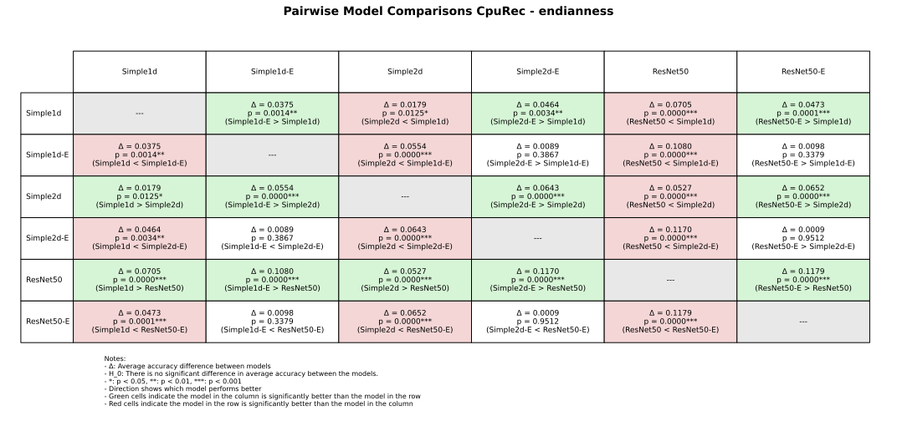

\appendix

<!-- Reference with \autoref{dataset-additional-information} -->

# Dataset additional information

This is an appendix

## Comparison with Andreassen

### ISAdetect labels comparison

Table: ISAdetect labeling differences between our research and what was presented in Andreassen's paper. Differences highlighted in bold. \label{table:isadetect-labels-comparison}

| ISA        | Our endianness | Andreassen endianness | Our instructionwidth_type | Andreassen instructionwidth_type |
| ---------- | -------------: | :-------------------- | ------------------------: | :------------------------------- |
| alpha      |         little | little                |                     fixed | fixed                            |
| amd64      |         little | little                |                  variable | variable                         |
| arm64      |         little | little                |                     fixed | fixed                            |
| armel      |         little | little                |                     fixed | fixed                            |
| armhf      |         little | little                |                     fixed | fixed                            |
| hppa       |            big | big                   |                     fixed | fixed                            |
| i386       |         little | little                |                  variable | variable                         |
| ia64       |         little | little                |              **variable** | **fixed**                        |
| m68k       |            big | big                   |              **variable** | **unk**                          |
| mips       |            big | big                   |                     fixed | fixed                            |
| mips64el   |         little | little                |                     fixed | fixed                            |
| mipsel     |         little | little                |                     fixed | fixed                            |
| powerpc    |            big | big                   |                     fixed | fixed                            |
| powerpcspe |            big | big                   |                     fixed | fixed                            |
| ppc64      |            big | big                   |                 **fixed** | **unk**                          |
| ppc64el    |         little | little                |                 **fixed** | **unk**                          |
| riscv64    |         little | little                |                     fixed | fixed                            |
| s390       |            big | big                   |              **variable** | **unk**                          |
| s390x      |            big | big                   |              **variable** | **unk**                          |
| sh4        |     **little** | **BI**                |                 **fixed** | **unk**                          |
| sparc      |            big | big                   |                     fixed | fixed                            |
| sparc64    |            big | big                   |                     fixed | fixed                            |
| x32        |         little | little                |              **variable** | **unk**                          |

### CpuRec labels comparison

Table: CpuRec labeling differences between our research and what was presented in Andreassen's paper. Differences highlighted in bold. 78k was not in the corpus at the time of us downloading the dataset. \label{table:cpurec-labels-comparison}

| ISA         | Our Endianness | Andreassen Endianness | Our instructionwidth_type | Andreassen instructionwidth_type |
| :---------- | -------------: | :-------------------- | ------------------------: | :------------------------- |
| 6502        |         little | little                |                  variable | variable                   |
| 68HC08      |            big | big                   |                  variable | variable                   |
| 68HC11      |            big | big                   |                  variable | variable                   |
| 78k         |              - | -                     |                        NA |                            |
| 8051        |         **na** | **little**            |                  variable | variable                   |
| Alpha       |         little | little                |                     fixed | fixed                      |
| ARCompact   |         little | little                |                  variable | variable                   |
| ARM64       |         little | little                |                     fixed | fixed                      |
| ARMeb       |            big | big                   |                     fixed | fixed                      |
| ARMel       |         little | little                |                     fixed | fixed                      |
| ARMhf       |         little | little                |                     fixed | fixed                      |
| AVR         |         **na** | **little**            |                  variable | variable                   |
| AxisCris    |         little | little                |              **variable** | **fixed**                  |
| Blackfin    |         little | little                |                  variable | variable                   |
| Cell-SPU    |         **bi** | **big**               |                   **unk** | **fixed**                  |
| CLIPPER     |         little | little                |                  variable | variable                   |
| CompactRISC |         little | little                |              **variable** | **fixed**                  |
| Cray        |             na | NA                    |                  variable |                            |
| Epiphany    |         little | little                |                  variable | variable                   |
| FR-V        |            big | NA                    |                     fixed |                            |
| FR30        |            big | big                   |                     fixed | fixed                      |
| FT32        |         little | NA                    |                     fixed |                            |
| H8-300      |            big | big                   |                  variable | variable                   |
| H8S         |            unk | big                   |                  variable |                            |
| HP-Focus    |             na | NA                    |                  variable |                            |
| HP-PA       |            big | big                   |                     fixed | fixed                      |
| i860        |             bi | BI                    |                     fixed |                            |
| IA-64       |         little | little                |              **variable** | **fixed**                  |
| IQ2000      |            big | big                   |                     fixed |                            |
| M32C        |         little | NA                    |                  variable |                            |
| M32R        |        **big** | **BI**                |                 **fixed** | **variable**               |
| M68k        |            big | big                   |                  variable |                            |
| M88k        |        **big** | **BI**                |                     fixed | fixed                      |
| MCore       |     **little** | **big**               |                     fixed | fixed                      |
| Mico32      |            big | big                   |                     fixed | fixed                      |
| MicroBlaze  |        **big** | **BI**                |                     fixed | fixed                      |
| MIPS16      |             bi | BI                    |                     fixed | fixed                      |
| MIPSeb      |            big | big                   |                     fixed | fixed                      |
| MIPSel      |         little | little                |                     fixed | fixed                      |
| MMIX        |            big | big                   |                     fixed | fixed                      |
| MN10300     |         little | little                |                  variable |                            |
| Moxie       |        **big** | **BI**                |                  variable | variable                   |
| MSP430      |         little | little                |                  variable |                            |
| NDS32       |     **little** | **BI**                |                  variable | variable                   |
| NIOS-II     |         little | little                |                     fixed | fixed                      |
| PDP-11      |     **middle** | **little**            |              **variable** | **fixed**                  |
| PIC10       |         **na** | **little**            |                     fixed |                            |
| PIC16       |         **na** | **little**            |                     fixed |                            |
| PIC18       |         **na** | **little**            |                     fixed |                            |
| PIC24       |         little | little                |                     fixed | fixed                      |
| PPCeb       |            big | big                   |                     fixed |                            |
| PPCel       |         little | little                |                     fixed |                            |
| RISC-V      |         little | little                |                     fixed | fixed                      |
| RL78        |         little | little                |                  variable |                            |
| ROMP        |            big | big                   |                  variable | variable                   |
| RX          |         little | little                |                  variable |                            |
| S-390       |            big | big                   |                  variable |                            |
| SPARC       |            big | big                   |                     fixed | fixed                      |
| STM8        |             na |                       |                  variable |                            |
| Stormy16    |         little | little                |                  variable |                            |
| SuperH      |     **little** | **BI**                |                     fixed |                            |
| TILEPro     |            unk |                       |                  variable |                            |
| TLCS-90     |             na |                       |                  variable |                            |
| TMS320C2x   |            unk |                       |                  variable |                            |
| TMS320C6x   |        **unk** | **BI**                |                     fixed |                            |
| TriMedia    |            unk |                       |                       unk |                            |
| V850        |         little |                       |                  variable |                            |
| Visium      |            big |                       |                     fixed |                            |
| WE32000     |             na |                       |                        NA |                            |
| X86-64      |         little | little                |                  variable | variable                   |
| X86         |         little | little                |                  variable | variable                   |
| Xtensa      |             bi | BI                    |                  variable | variable                   |
| Z80         |         little | little                |                  variable |                            |

# Statistical analysis material

## Confidence interval and comparison implementation

## Pairwise model comparison

Each model in each testing suite is compared to each other, using a paried t-test. The results are shown in the tables below.

